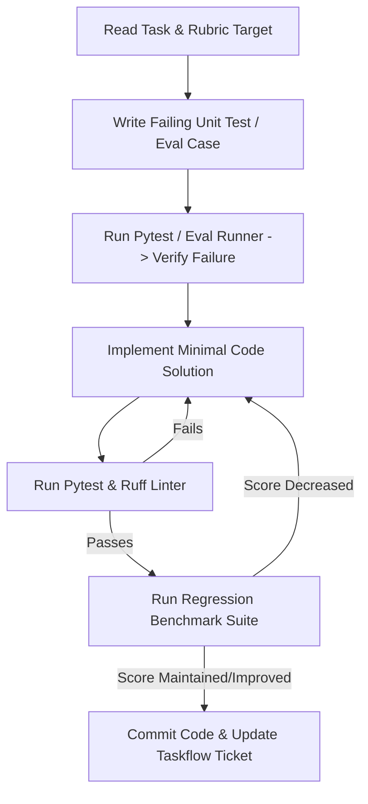

# Root Agent Guide: Best Buy Catalog Comparison Agent

Welcome to the **Best Buy Catalog Comparison Agent** codebase. This repository contains the complete production-grade source code, test suites, evaluation flywheel, infrastructure-as-code, and deployment automation for the FDE Capstone project.

---

## 1. Project Mission & North Stars

The system is an **agentic product comparison assistant** that enables customers to perform side-by-side, feature-level comparisons across consumer electronics (Laptops, Tablets, Headphones, Smart Home devices, TVs).

### Non-Negotiable Engineering North Stars
1. **Zero Hallucination on Catalog Specs**: All product specifications (RAM, battery life, display resolution, GPU, pricing, ports) must be grounded strictly in facts retrieved from Google Cloud BigQuery (`fde-bestbuy-sandbox-dev-508321.catalog.products`).
2. **Strict Citation & Traceability**: Every spec asserted in comparison tables or textual recommendations must include verifiable SKU citations (`[SKU: 6534606]`).
3. **P95 Latency $\le 3.0$ Seconds**: End-to-end user queries (retrieval + agentic synthesis + structured formatting) must respond in $\le 3.0$ seconds.
4. **Autonomous Hillclimbing Readiness**: The repository is strictly structured for test-driven and eval-driven outer-loop optimization by AI agents.
5. **FDE Rubric Compliance**: All components must satisfy the 31 core competencies defined in [RUBRIC.md](file:///usr/local/google/home/williamwlchan/Playground/williamc-ecomm-capstone/RUBRIC.md).

---

## 2. GCP Target Environment

All infrastructure, deployments, BigQuery datasets, and Cloud Build pipelines are anchored to:
- **GCP Project ID**: `fde-bestbuy-sandbox-dev-508321`
- **Project Number**: `499572810092`
- **Primary Region**: `us-central1`
- **Service Account**: `catalog-agent-sa@fde-bestbuy-sandbox-dev-508321.iam.gserviceaccount.com`
- **BigQuery Dataset / Table**: `fde-bestbuy-sandbox-dev-508321.catalog.products`

Agents operating in this repository must always pass `--project=fde-bestbuy-sandbox-dev-508321` or verify `gcloud config get-value project` is set to `fde-bestbuy-sandbox-dev-508321`.

---

## 3. Project Management & Observability (Taskflow + Buganizer)

Project tracking and task state observability are managed through Google's internal Buganizer and Taskflow infrastructure.

### Identifiers
- **Taskflow Workspace**: `6062895` ("Capstone")
- **Buganizer Component**: `2257265` (`Personal issues > williamwlchan`)
- **Active Sprint Iteration**: `6062377` (`Test (Current)`, Hotlist: `8948653`)

### Agent Protocol for Taskflow & Buganizer
Before, during, and after implementing features or bug fixes, autonomous agents must maintain issue observability:
1. **Pre-Task Check**:
   - Check the active iteration for assigned tickets:
     ```bash
     taskflow iterations view-items --iteration 6062377 --workspace 6062895
     ```
   - If no existing ticket covers the task, create one in component `2257265` and attach it to iteration `6062377`:
     ```bash
     issues create --title "[Feature/Bug]: <Brief description>" --component 2257265 --type BUG --priority P2 --severity S2 --description "<Detailed context and acceptance criteria>"
     taskflow iterations add-items --iteration 6062377 --workspace 6062895 --issues <ISSUE_ID>
     ```
2. **In-Progress Transition**:
   - Update issue status to `ASSIGNED` / `IN_PROGRESS`:
     ```bash
     issues update status <ISSUE_ID> ASSIGNED
     issues update assignees <ISSUE_ID> williamwlchan
     ```
3. **Post-Task Completion**:
   - Run verification suite (Pytest + Ruff + Evals).
   - Once all checks pass, close the ticket with verification details:
     ```bash
     issues update comments <ISSUE_ID> "Completed in git commit $(git rev-parse --short HEAD). All unit tests and eval suites passing."
     issues update status <ISSUE_ID> FIXED
     ```

---

## 4. Cascading Directory AGENTS.md Architecture

This repository uses hierarchical `AGENTS.md` files. When working within any sub-domain, always consult the local `AGENTS.md` for specific technical contracts and workflows:

| Directory | Scope & Responsibilities | Guide File |
| :--- | :--- | :--- |
| **`/` (Root)** | Master orchestration, governance, GCP config, Taskflow rules, rubric alignment | [AGENTS.md](file:///usr/local/google/home/williamwlchan/Playground/williamc-ecomm-capstone/AGENTS.md) |
| **`backend/`** | FastAPI, Google ADK agent framework, BigQuery tool calling, Pydantic schemas, Pytest harness | [backend/AGENTS.md](file:///usr/local/google/home/williamwlchan/Playground/williamc-ecomm-capstone/backend/AGENTS.md) |
| **`frontend/`** | React 18+ / TypeScript / Vite UI, comparison matrix, SKU citations, responsive layout | [frontend/AGENTS.md](file:///usr/local/google/home/williamwlchan/Playground/williamc-ecomm-capstone/frontend/AGENTS.md) |
| **`deployment/`** | Terraform HCL, Cloud Build CI/CD pipeline, Cloud Run config, IAM least-privilege, VPC-SC | [deployment/AGENTS.md](file:///usr/local/google/home/williamwlchan/Playground/williamc-ecomm-capstone/deployment/AGENTS.md) |
| **`evals/`** | Quality flywheel, 80-pair benchmark dataset, Gemini 3.5 Flash judge, data accuracy & faithfulness | [evals/AGENTS.md](file:///usr/local/google/home/williamwlchan/Playground/williamc-ecomm-capstone/evals/AGENTS.md) |

---

## 5. Autonomous Hillclimbing Protocol

To enable agents to make progress autonomously and reliably without regression ("hillclimbing"):



### Operational Rules for Hillclimbing
1. **Test-First / Eval-First**: Always write unit tests in `backend/tests/` or evaluation benchmarks in `evals/dataset/` before modifying implementation logic.
2. **No Regression**: Never delete or weaken existing tests to make a build pass. Coverage must remain $\ge 80\%$.
3. **No Muted Errors**: All exceptions must be explicitly typed, handled, and logged with OpenTelemetry spans.
4. **Documentation Sync**: When updating any API, data model, or workflow, immediately update the corresponding `AGENTS.md`, `ARCHITECTURE.md`, or `SKILLS.md`.

### 5.1 Post-Task Worktree & Main Merge Protocol (Always Merge to Main)
Whenever working in an isolated worktree or feature branch (`feat/*`):
1. **Pre-Merge Verification**: Run all unit tests, linters, and eval suites (`pytest --cov=src --cov-fail-under=80`, `ruff check`, `ruff format --check`).
2. **Sync Base Branch**: Fetch latest `main` and rebase or fast-forward (`git fetch origin main && git rebase main`).
3. **Mandatory Atomic Merge to Main**:
   - All completed features MUST be merged back into `main` before concluding the task.
   - Switch to `main`: `git checkout main`.
   - Merge feature branch: `git merge --ff-only <feat-branch>` (or `--no-ff`).
4. **Post-Merge Verification on Main**: Run verification suite on `main` to verify zero regressions.
5. **Worktree Cleanup**: Remove feature worktree once merged (`git worktree remove .swarm/worktrees/<task>`).

---

## 6. Key Documentation Reference
- [SPEC.md](file:///usr/local/google/home/williamwlchan/Playground/williamc-ecomm-capstone/SPEC.md): Complete product specifications, technical requirements, and TDD agreement.
- [RUBRIC.md](file:///usr/local/google/home/williamwlchan/Playground/williamc-ecomm-capstone/RUBRIC.md): Official 31-competency FDE grading rubric and scoring dimensions.
- [ARCHITECTURE.md](file:///usr/local/google/home/williamwlchan/Playground/williamc-ecomm-capstone/ARCHITECTURE.md): System diagrams, BigQuery schemas, data flow, IAM architecture.
- [SKILLS.md](file:///usr/local/google/home/williamwlchan/Playground/williamc-ecomm-capstone/SKILLS.md): Operational command recipes and runbooks for deployments, evals, and tests.
