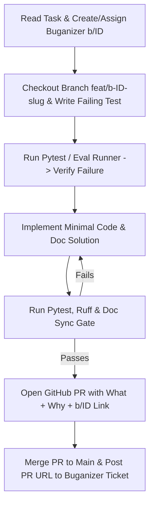

# Root Agent Guide: TechBuy Retailers Catalog Comparison Agent

Welcome to the **TechBuy Retailers Catalog Comparison Agent** codebase. This repository contains the complete production-grade source code, test suites, evaluation flywheel, infrastructure-as-code, and deployment automation for the FDE Capstone project.

---

## 1. Project Mission & North Stars

The system is an **agentic product comparison assistant** that enables customers to perform side-by-side, feature-level comparisons across consumer electronics (Laptops, Tablets, Headphones, Smart Home devices, TVs).

### Non-Negotiable Engineering North Stars
1. **Zero Hallucination on Catalog Specs**: All product specifications (RAM, battery life, display resolution, GPU, pricing, ports) must be grounded strictly in facts retrieved from Google Cloud BigQuery (`fde-bestbuy-sandbox-dev-508321.catalog.products`).
2. **Strict Citation & Traceability**: Every spec asserted in comparison tables or textual recommendations must include verifiable SKU citations (`[SKU: 6534606]`).
3. **P95 Latency $\le 3.0$ Seconds**: End-to-end user queries (retrieval + agentic synthesis + structured formatting) must respond in $\le 3.0$ seconds.
4. **Autonomous Hillclimbing Readiness**: The repository is strictly structured for test-driven and eval-driven outer-loop optimization by AI agents.
5. **FDE Rubric Compliance**: All components must satisfy the 31 core competencies defined in [RUBRIC.md](file:///usr/local/google/home/williamwlchan/Playground/williamc-ecomm-capstone/RUBRIC.md).

---

## 2. GCP Target Environment

All infrastructure, deployments, BigQuery datasets, and Cloud Build pipelines are anchored to:
- **GCP Project ID**: `fde-bestbuy-sandbox-dev-508321`
- **Project Number**: `499572810092`
- **Primary Region**: `us-central1`
- **Service Account**: `catalog-agent-sa@fde-bestbuy-sandbox-dev-508321.iam.gserviceaccount.com`
- **BigQuery Dataset / Table**: `fde-bestbuy-sandbox-dev-508321.catalog.products`

Agents operating in this repository must always pass `--project=fde-bestbuy-sandbox-dev-508321` or verify `gcloud config get-value project` is set to `fde-bestbuy-sandbox-dev-508321`.

---

## 3. Project Management, GitHub PRs & Observability (Taskflow + Buganizer + GitHub)

Project tracking, pull request reviews, and task state observability are managed across Google's internal **Buganizer + Taskflow** infrastructure and the **GitHub Repository** (`willie3838/williamc-ecomm-capstone`).

### Identifiers
- **GitHub Repository**: [`willie3838/williamc-ecomm-capstone`](https://github.com/willie3838/williamc-ecomm-capstone)
- **Taskflow Workspace**: `6062895` ("Capstone")
- **Buganizer Component**: `2257265` (`Personal issues > williamwlchan`)
- **Active Sprint Iteration**: `6062377` (`Test (Current)`, Hotlist: `8948653`)

### Mandatory Triple-Track Protocol (Buganizer + Taskflow + GitHub PR)
Every feature implementation, architectural change, or bug fix MUST maintain full bidirectional traceability between Buganizer/Taskflow and GitHub Pull Requests:

1. **Pre-Task Check & Ticket Creation**:
   - Check the active iteration for assigned tickets:
     ```bash
     taskflow iterations view-items --iteration 6062377 --workspace 6062895
     ```
   - If no existing ticket covers the task, create one in component `2257265` and attach it to iteration `6062377` (Hotlist `8948653`):
     ```bash
     /google/bin/releases/issues-cli/issues create --title "[Feature/Bug]: <Brief description>" --component_id 2257265 --assignee williamwlchan --status ASSIGNED --hotlists 8948653 --type BUG --priority P2 --severity S2 --description "<Detailed context and acceptance criteria>"
     ```
2. **In-Progress Transition & Feature Branch**:
   - Ensure issue status is `ASSIGNED`:
     ```bash
     /google/bin/releases/issues-cli/issues update status --issue_id <ISSUE_ID> --status ASSIGNED
     ```
   - Create a dedicated feature branch referencing the Buganizer issue ID:
     ```bash
     git checkout -b feat/b-<ISSUE_ID>-<short-slug>
     ```
3. **GitHub Pull Request Creation (`What + Why + Buganizer Link`)**:
   - Push the feature branch to `origin` and open a GitHub Pull Request (`gh pr create`).
   - **Mandatory PR Title Format**: `[b/<ISSUE_ID>] <type>(<scope>): <concise summary>`
   - **Mandatory PR Description Structure**: Every PR description MUST explicitly document **What Was Implemented**, **Why (Problem Context & Rationale)**, and the **Buganizer & Taskflow Link**:
     ```markdown
     ## What Was Implemented
     - <Concrete summary of code, architecture, test, and documentation changes>

     ## Why (Problem Context & Design Rationale)
     - **Root Cause / Motivation**: <Why this change was needed>
     - **Design Decisions**: <Why this specific technical approach was selected>

     ## Buganizer & Taskflow Tracking
     - **Buganizer Ticket**: Fixes b/<ISSUE_ID> (https://b.corp.google.com/issues/<ISSUE_ID>)
     - **Taskflow Workspace**: `6062895` (Iteration: `6062377`)
     ```
4. **PR Merge & Bidirectional Buganizer Closure (`Buganizer -> PR Link`)**:
   - After passing pre-merge verification (Pytest + Ruff + Doc Sync Gate), merge the PR into `main` (`gh pr merge --merge --delete-branch`).
   - Close the Buganizer ticket (`FIXED`) with a comment that explicitly links the **GitHub PR URL**, **merge commit SHA**, and **What + Why summary**:
     ```bash
     /google/bin/releases/issues-cli/issues comment --issue_id <ISSUE_ID> --comment "Completed and merged in GitHub PR <PR_URL> (commit $(git rev-parse --short HEAD)).\n\nWhat was implemented: <Summary>\nWhy: <Rationale>\nAll unit tests, doc-sync gates, and eval suites passing."
     /google/bin/releases/issues-cli/issues update status --issue_id <ISSUE_ID> --status FIXED
     ```

---

## 4. Cascading Directory AGENTS.md Architecture

This repository uses hierarchical `AGENTS.md` files. When working within any sub-domain, always consult the local `AGENTS.md` for specific technical contracts and workflows:

| Directory | Scope & Responsibilities | Guide File |
| :--- | :--- | :--- |
| **`/` (Root)** | Master orchestration, governance, GCP config, Taskflow/PR rules, rubric alignment | [AGENTS.md](file:///usr/local/google/home/williamwlchan/Playground/williamc-ecomm-capstone/AGENTS.md) |
| **`backend/`** | FastAPI, Google ADK agent framework, BigQuery tool calling, Pydantic schemas, Pytest harness | [backend/AGENTS.md](file:///usr/local/google/home/williamwlchan/Playground/williamc-ecomm-capstone/backend/AGENTS.md) |
| **`frontend/`** | React 18+ / TypeScript / Vite UI, comparison matrix, SKU citations, responsive layout | [frontend/AGENTS.md](file:///usr/local/google/home/williamwlchan/Playground/williamc-ecomm-capstone/frontend/AGENTS.md) |
| **`deployment/`** | Terraform HCL, Cloud Build CI/CD pipeline, Cloud Run config, IAM least-privilege, VPC-SC | [deployment/AGENTS.md](file:///usr/local/google/home/williamwlchan/Playground/williamc-ecomm-capstone/deployment/AGENTS.md) |
| **`evals/`** | Quality flywheel, 80-pair benchmark dataset, Gemini 3.5 Flash judge, data accuracy & faithfulness | [evals/AGENTS.md](file:///usr/local/google/home/williamwlchan/Playground/williamc-ecomm-capstone/evals/AGENTS.md) |

---

## 5. Autonomous Hillclimbing Protocol

To enable agents to make progress autonomously and reliably without regression ("hillclimbing"):



### Operational Rules for Hillclimbing
1. **Test-First / Eval-First**: Always write unit tests in `backend/tests/` or evaluation benchmarks in `evals/dataset/` before modifying implementation logic.
2. **No Regression**: Never delete or weaken existing tests to make a build pass. Coverage must remain $\ge 80\%$.
3. **No Muted Errors**: All exceptions must be explicitly typed, handled, and logged with OpenTelemetry spans.
4. **Documentation Sync**: When updating any API, data model, or workflow, immediately update the corresponding `AGENTS.md`, `ARCHITECTURE.md`, or `SKILLS.md`.

### 5.1 Feature Branch, GitHub Pull Request & Main Merge Protocol
Whenever implementing any change (in main workspace or an isolated worktree `feat/*`):
1. **Pre-PR Verification**: Run all unit tests, linters, doc-sync gates, and eval suites (`pytest --cov=src --cov-fail-under=80`, `ruff check`, `ruff format --check`).
2. **Push Feature Branch & Create GitHub PR**:
   ```bash
   git push -u origin feat/b-<ISSUE_ID>-<short-slug>
   gh pr create \
     --repo willie3838/williamc-ecomm-capstone \
     --base main \
     --head feat/b-<ISSUE_ID>-<short-slug> \
     --title "[b/<ISSUE_ID>] feat: <Brief description>" \
     --body "## What Was Implemented
   - <Details of implementation>

   ## Why (Problem Context & Rationale)
   - <Motivation and architectural rationale>

   ## Buganizer & Taskflow Tracking
   - **Buganizer Ticket**: Fixes b/<ISSUE_ID> (https://b.corp.google.com/issues/<ISSUE_ID>)
   - **Taskflow Workspace**: 6062895 (Iteration: 6062377)"
   ```
3. **Mandatory Atomic PR Merge to Main**:
   - Merge the Pull Request into `main`:
     ```bash
     gh pr merge --merge --delete-branch
     git checkout main && git pull origin main
     ```
4. **Post-Merge Verification & Buganizer Closure**:
   - Run verification suite on `main` to verify zero regressions.
   - Update Buganizer issue `b/<ISSUE_ID>` with the merged GitHub PR URL and commit hash, and mark status `FIXED`.
5. **Worktree Cleanup**: Remove feature worktree once merged (`git worktree remove .swarm/worktrees/<task>`).

### 5.2 Architectural Synchronization & Multi-Pane Adversarial Rubric Panel Gate
Any architectural or system design change (adding or modifying services, database schemas, IAM roles, CI/CD pipelines, security controls, or agent workflows) MUST:
1. **Immediately Update `ARCHITECTURE.md`**: Synchronize all architecture diagrams (Mermaid), sequence diagrams, data flows, ADRs, security perimeters (VPC-SC), and Total Cost of Ownership (TCO) justifications.
2. **Execute Multi-Pane Adversarial Rubric Panel**: Launch the 4-pane tmux FDE Review Panel (`Panel-Chair` + `Panelist-AI-ML` + `Panelist-Sec-Infra` + `Panelist-SRE-CTO`) or synthesize panel consensus to verify harsh Staff/Principal calibration (`Score 2 = Competent Field-Ready FDE`, `Score 3 = Rare Expert Mastery`):
   ```bash
   # Spawn the 4-pane tmux deliberation panel:
   python3 skills/rubric-audit/scripts/launch_review_panel.py --wait-and-close
   # Or verify/synthesize panel consensus:
   python3 skills/rubric-audit/scripts/audit_rubric.py --synthesize-panel logs/panel_deliberation --strict
   ```
3. **Zero Regressions Standard**: Merging to `main` is prohibited if any single competency scores `0` (disqualifying failure) or if section averages fall below `2.00` (FDE Baseline Pass), and any `Score 3` claim must pass programmatic anti-inflation checks (`apply_strict_expert_calibration`).


### 5.3 Documentation Synchronization Enforcement Policy (Zero Un-documented Changes)
**Strict Enforcement Rule**:
> **Any code change without a corresponding documentation change fails.**
> If code files in `backend/`, `frontend/`, `deployment/`, or `evals/` are modified, documentation (`ARCHITECTURE.md`, `SPEC.md`, `RUBRIC.md`, `AGENTS.md`, or directory `AGENTS.md`) MUST be updated in the same change.

**Bypass Mechanism**:
If a code change intentionally does not require documentation updates (e.g. pure refactor or internal tweak), the author or agent **must explicitly pass the `--no-doc` flag**:
- **Pytest**:
  ```bash
  pytest --no-doc
  ```
- **Environment Variable**:
  ```bash
  NO_DOC=1 pytest
  ```
- **Git Commit Tag / Pre-commit**:
  ```bash
  NO_DOC=1 git commit -m "refactor: internal cleanups [no-doc]"
  ```
This is verified both statically in unit tests (`backend/tests/test_docs_sync.py`) and by the pre-commit / CI gate.

---

## 6. Key Documentation Reference
- [SPEC.md](file:///usr/local/google/home/williamwlchan/Playground/williamc-ecomm-capstone/SPEC.md): Complete product specifications, technical requirements, and TDD agreement.
- [RUBRIC.md](file:///usr/local/google/home/williamwlchan/Playground/williamc-ecomm-capstone/RUBRIC.md): Official 31-competency FDE grading rubric and scoring dimensions.
- [ARCHITECTURE.md](file:///usr/local/google/home/williamwlchan/Playground/williamc-ecomm-capstone/ARCHITECTURE.md): System diagrams, BigQuery schemas, data flow, IAM architecture.
- [SKILLS.md](file:///usr/local/google/home/williamwlchan/Playground/williamc-ecomm-capstone/SKILLS.md): Operational command recipes and runbooks for deployments, evals, and tests.
