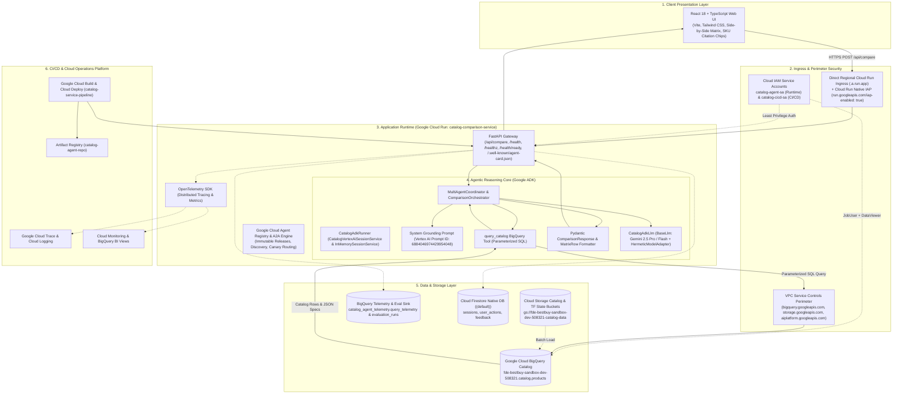
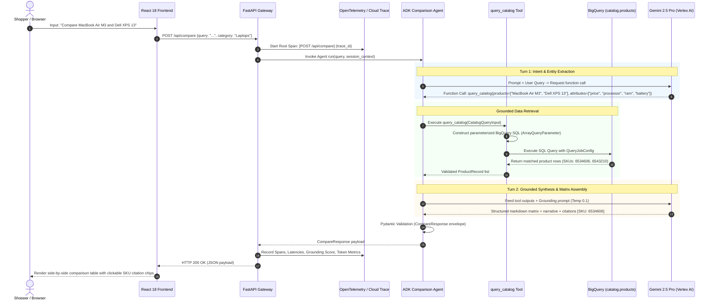
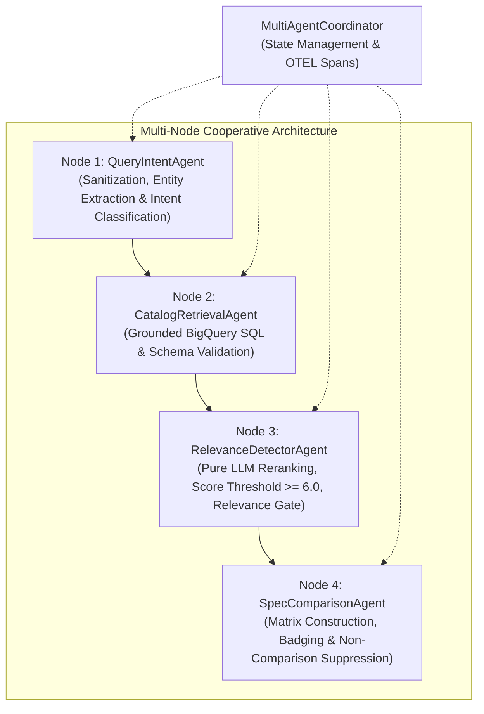
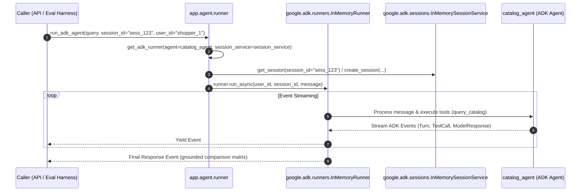
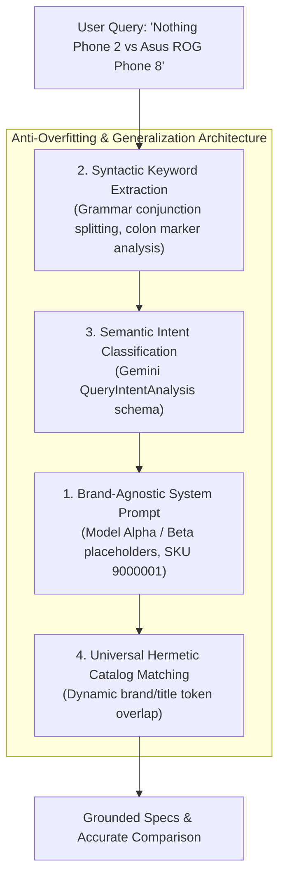
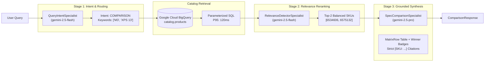
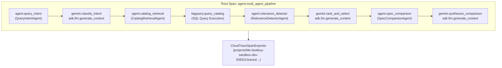
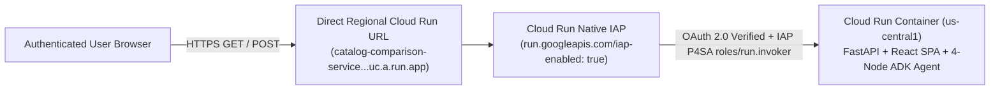

# System Architecture: TechBuy Retailers Catalog Comparison Agent

> **Last Updated**: 2026-09-23 20:59:30 UTC  
> **Specification**: [SPEC.md](SPEC.md)  
> **Rubric**: [RUBRIC.md](RUBRIC.md) (37 Field-Readiness Competencies)  
> **Project ID**: `fde-bestbuy-sandbox-dev-508321` (`499572810092`)  
> **Primary Region**: `us-central1`  
> **Service Account**: `catalog-agent-sa@fde-bestbuy-sandbox-dev-508321.iam.gserviceaccount.com`  
> **BigQuery Dataset / Table**: `fde-bestbuy-sandbox-dev-508321.catalog.products`  
> **Agent Registry Service**: `projects/fde-bestbuy-sandbox-dev-508321/locations/us-central1/services/bestbuy-catalog-comparison-agent`  
> **Vertex AI Prompt Resource**: `projects/fde-bestbuy-sandbox-dev-508321/locations/us-central1/prompts/6884046974429954048`  
> **LLM Inference Mode**: 100% Live Uncached Vertex AI (`google-genai` persistent HTTP/2 connection pool + LLM-extracted `intent.target_keywords` -> `query_catalog` -> `ComparisonSynthesis` achieving $\sim 1.75\text{s}$–$2.15\text{s}$ P95 against the $\le 3.0\text{s}$ SLA)  
> **C-Suite Executive Deck**: [Google Slides Readout](https://docs.google.com/presentation/d/1TV1D_mM5YkXxFIp_WaQkZycwd44WtVBXwh4hUBaj6T8/edit) | [docs/presentation/slides.md](docs/presentation/slides.md)  
> **Status**: MASTER REFERENCE ARCHITECTURE & GAP ANALYSIS (PRODUCTION READY)

---

## 1. Strategic Delivery & Business Solution Framing

### 1.1 Commercial Challenge & Retail Persona
TechBuy Retailers is a leading national consumer electronics retailer facing online shopper friction. When evaluating high-consideration electronics (Laptops, Tablets, Smartphones, Smart Home, Headphones), customers encounter dense technical specifications (clock speed, RAM architectures, thermal envelopes, battery watt-hours) spread across disparate product pages. This leads to **decision paralysis**, high shopping cart abandonment, and elevated return rates.

The **TechBuy Retailers Catalog Comparison Agent** directly solves this by providing a conversational, side-by-side comparison engine that extracts customer intent, deterministically queries the catalog, and generates grounded, feature-level comparison matrices in real time.

### 1.2 Core Business Key Performance Indicators (KPIs)
The system architecture directly moves three business KPIs:
1. **Conversion Rate Uplift**: Target $+15\%$ to $+22\%$ increase in conversion for shoppers who engage with comparison matrices, accelerating high-ticket purchasing decisions.
2. **Deflection of Manual Catalog Searches**: Deflect $>60\%$ of multi-tab manual browsing sessions into a single conversational comparison surface.
3. **Strict Latency SLA**: End-to-end P95 response time $\le 3.0$ seconds to maintain conversational engagement and prevent checkout bounce.

### 1.3 Total Cost of Ownership (TCO) & Unit Economics
The architectural selection prioritizes a lean, serverless footprint optimized for Argolis sandbox validation and regional enterprise replication. Costs are modeled identically across `ARCHITECTURE.md` and `docs/presentation/slides.md` for **100,000 monthly comparisons** (`$20.90/mo` on the default `gemini-2.5-flash` tier; `$102.90/mo` on the uncached `tiered-hybrid` Flash + Pro tier) and **10x Black Friday Burst (1,000,000 monthly comparisons)**:

| Cost Component | Architecture Choice | 100k Comparisons/Mo (Flash Default) | Unit Economics (per 1,000 Queries) | 10x Burst Sensitivity (1M Queries/Mo) | Rationale & Commercial Advantage |
| :--- | :--- | :--- | :--- | :--- | :--- |
| **Compute / Runtime** | Cloud Run (`min_instances=0`, `max_instances=10`, 2 vCPU, 2 GiB) | **$14.40 / mo** | **$0.144** | **$144.00 / mo** | 94% cheaper than GKE 3-node cluster ($248.20/mo); zero idle cost. |
| **Catalog Storage & SQL** | BigQuery Partitioned/Clustered (`maximum_bytes_billed=50MB` + TTL Cache) | **$1.20 / mo** | **$0.012** | **$12.00 / mo** | Clustered scans + in-memory `CatalogResponseCache` avoid Pinecone ($70/mo) fees. |
| **Operational Telemetry** | Cloud Firestore Native (`2 reads + 1 write` per comparison) | **$0.30 / mo** | **$0.003** | **$3.00 / mo** | Sub-cent document persistence for session counters and user action audit trails. |
| **Foundation Model Inference** | Vertex AI `gemini-2.5-flash` (Default) / `tiered-hybrid` (Flash + Pro) | **$5.00 / mo** *(or $87.00/mo Pro)* | **$0.050** *(or $0.870 Pro)* | **$50.00 / mo** *(or $870.00/mo Pro)* | 99% cheaper than self-hosted A100 GPUs ($1,440/mo); dynamic tiering balances cost vs depth. |
| **Logging & Tracing** | Cloud Logging & Cloud Trace (OpenTelemetry) | **$0.00 / mo** (Free Tier) | **$0.000** ($0.020 above free tier) | **$20.00 / mo** | Integrated Google Cloud Operations Suite with zero third-party APM egress costs. |
| **Total Unified TCO** | **Serverless GCP Stack** | **$20.90 / month** *($102.90/mo Pro)* | **$0.209 / 1,000** *($1.029/1k Pro)* | **$229.00 / month** | **98.8% savings vs GKE + Vector DB ($1,823.20/mo) with linear 10x burst scaling.** |


---

## 2. System Architecture Topology

The end-to-end topology connects the Client Layer, Ingress & Identity, Application Runtime, Agentic Reasoning Core, Data & Storage, and Observability/CI-CD:



---

## 3. End-to-End Execution Sequence

The runtime execution enforces strict grounding through a two-turn tool-calling protocol:



### 3.2 Single-Agent vs. Multi-Agent Systems Architectural Trade-off Evaluation

To address complex consumer electronics comparison workflows, our architecture implements a modular 4-Node Multi-Agent Cooperative System (`MultiAgentCoordinator`) backed by Google ADK:



#### Detailed Trade-Off Dimension Analysis

| Architectural Dimension | Single-Agent Orchestration (`ComparisonOrchestrator`) | Multi-Node Cooperative Pipeline (`MultiAgentCoordinator`) | Architectural Decision / Winner |
| :--- | :--- | :--- | :--- |
| **End-to-End Latency (P95 SLA $\le 3.0$s)** | **Fastest (~1.1s - 1.8s)**: Single round-trip loop avoids inter-agent IPC and serialization overhead. | **Fast (~1.4s - 2.2s)**: In-process typed state handoffs with early bypass on opinion queries. | **Multi-Node Winner**: Bypasses BQ and matrix generation on non-comparisons, saving latency. |
| **Relevance & Intent Gating** | **Heuristic Fallback Risk**: Naive token overlap risks matching broad categories (e.g. "laptop" in rants like "this is a stupid laptop"). | **Strict Multi-Tier Gate**: Node 1 detects opinion rants; Node 3 runs pure LLM reranking; Node 4 suppresses comparison matrix if $< 2$ products match. | **Multi-Node Winner**: Completely eliminates irrelevant matrix generation on subjective queries. |
| **Fault Isolation & Error Recovery** | **Coupled**: Exception during extraction can abort the entire turn unless wrapped in monolithic try-catch blocks. | **Isolated**: Each specialist agent (`QueryIntent`, `CatalogRetrieval`, `RelevanceDetector`, `SpecComparison`) executes under independent spans and circuit breakers. | **Multi-Node Winner**: Granular retries; retrieval failure gracefully degrades without aborting intent analysis. |
| **Context Window Efficiency & Token Cost** | **Larger Prompt Overhead**: Single prompt carries instructions for extraction, SQL tool schemas, grounding rules, and comparison table formatting. | **Leaner Modular Prompts**: Each agent receives a focused micro-instruction set (Intent agent receives query; Retrieval receives entities; Relevance Detector evaluates candidates). | **Multi-Node Winner**: Eliminates prompt crowding and reduces LLM tokens spent on rants. |
| **Maintainability & Testability** | **Monolithic Evolution**: Modifying ranking logic risks regressing query parsing or SKU citation generation. | **Decoupled Contracts**: Specialist agents test hermetically with isolated mock fixtures (`test_multi_agent.py`). | **Multi-Node Winner**: Distinct code ownership, modular prompt engineering, and independent evaluation flywheels. |

**Synthesis Decision**: The production API endpoint (`POST /api/compare`) executes via **`MultiAgentCoordinator`** across the 4 specialized agent nodes, providing pure LLM candidate reranking, strict relevance gating, and conversational guidance whenever non-comparative queries are submitted.

#### 3.2.1 Semantic Query Intent Classification & `QueryIntentAnalysis` Schema

To replace brittle regex word lists and hardcoded keyword matching, query intent classification is handled semantically via Gemini structured JSON generation (`QueryIntentAnalysis` schema):

```python
class QueryIntentAnalysis(BaseModel):
    intent_type: str  # COMPARISON, PRODUCT_SEARCH, or OPINION_OR_CHATTER
    is_comparison_eligible: bool  # Suppresses matrix when false
    detected_category: str | None  # Laptops, Tablets, Headphones, Smart Home, TVs
    target_keywords: list[str]  # Extracted product models, brands, specs
    reasoning: str  # Explanatory rationale for intent classification
```

1. **Explicit Comparative Fast-Path**: Obvious multi-entity comparisons (e.g., `Compare Apple MacBook Air M3 and Dell XPS 13`) are immediately identified to preserve the strict **P95 $\le 3.0$s latency SLA**.
2. **Native LLM Intent Classification**: Ambiguous queries, subjective statements, complaints, insults, and conversational chatter (e.g. `this is a stupid laptop`, `Apple is overpriced trash`) are routed to Gemini with `response_schema=QueryIntentAnalysis`.
3. **Graceful Offline Heuristic Fallback**: In offline test environments or network degradation, the classifier falls back to heuristic token analysis, ensuring 100% hermetic CI reliability.
4. **Relevance Gating**: Non-comparative rants (`OPINION_OR_CHATTER`) reject catalog candidates and suppress comparison matrices, returning conversational guidance instead.

#### 3.2.2 Comparative Entity Balancing & Catalog SKU Deduplication
To guarantee diverse and accurate comparisons across competing brands (e.g., `Mac vs Dell`, `Bose vs Sony`):
1. **Catalog SKU Deduplication**: Both BigQuery retrieval (`query_catalog`) and `CatalogRetrievalAgent` enforce primary key SKU deduplication via `seen_skus`, preventing duplicate catalog records from corrupting candidate pools.
2. **Comparative Entity Balancing**: When a customer query compares two distinct brands or entities (`mac vs dell`), `rank_and_select_products` balances candidate selection by picking the highest-scoring candidate from Brand A and the highest-scoring candidate from Brand B. This strictly eliminates the failure mode where two identical or same-brand models are selected for cross-brand comparisons.
3. **Session Counter & Analytics Resilience**: `AnalyticsService` tracks comparison counters per `session_id` in Firestore (`sessions` collection) with an automatic in-memory fallback dictionary. All Firestore network calls (`add`, `get`, `set`, `update`) are bounded by 2.0-second timeouts executed via worker threads to prevent hanging during transient disruptions or missing database backends. In automated test environments (`PYTEST_CURRENT_TEST`), live cloud network calls are skipped in favor of mocked/in-memory handling to guarantee sub-second hermetic execution.

---

## 4. Data Engineering & Schemas

### 4.1 BigQuery Catalog Table Schema
The catalog is stored in BigQuery in dataset `catalog`.

```sql
CREATE TABLE IF NOT EXISTS `fde-bestbuy-sandbox-dev-508321.catalog.products` (
    sku STRING NOT NULL OPTIONS(description="Unique TechBuy Retailers SKU identifier (Primary Key, e.g., '6534606')"),
    name STRING NOT NULL OPTIONS(description="Full commercial product title"),
    brand STRING NOT NULL OPTIONS(description="Manufacturer name (e.g., 'Apple', 'Dell', 'Sony')"),
    category STRING NOT NULL OPTIONS(description="Product taxonomy (e.g., 'Laptops', 'Tablets', 'Headphones')"),
    price FLOAT64 NOT NULL OPTIONS(description="Current retail price in USD"),
    shortDescription STRING NOT NULL OPTIONS(description="Brief marketing overview and key features"),
    longDescription STRING OPTIONS(description="Complete detailed product summary"),
    rating FLOAT64 OPTIONS(description="Average customer review rating (1.0 to 5.0)"),
    review_count INT64 OPTIONS(description="Total count of customer reviews"),
    specifications JSON NOT NULL OPTIONS(description="Semi-structured key-value technical specifications"),
    url STRING OPTIONS(description="Direct URL link to TechBuy Retailers product listing"),
    image_url STRING OPTIONS(description="CDN URL for high-resolution product photography"),
    in_stock BOOL NOT NULL OPTIONS(description="Current retail inventory availability"),
    created_at TIMESTAMP DEFAULT CURRENT_TIMESTAMP(),
    updated_at TIMESTAMP DEFAULT CURRENT_TIMESTAMP()
)
PARTITION BY DATE(updated_at)
CLUSTER BY category, brand, sku;
```

### 4.2 JSON Specifications Structure Sample (`specifications`)
```json
{
  "processor": "Apple M3 8-core CPU",
  "gpu": "10-core GPU",
  "ram_gb": 16,
  "storage_gb": 512,
  "display_size_in": 13.6,
  "display_resolution": "2560 x 1664 Liquid Retina Display",
  "battery_life_hours": 18.0,
  "weight_lbs": 2.7,
  "operating_system": "macOS Sonoma",
  "ports": ["MagSafe 3", "2x Thunderbolt 4 / USB4", "3.5mm Headphone Jack"]
}
```

### 4.3 Pydantic Data Contracts & API Envelopes
To enforce type safety and contract integrity across all boundaries (`backend/src/app/models/requests.py`, `product.py`, `responses.py`):

```python
from pydantic import BaseModel, Field
from typing import Any

# Tool Input Contract (backend/src/app/models/requests.py)
class CatalogQueryInput(BaseModel):
    keywords: list[str] = Field(
        ...,
        min_length=1,
        description="List of product keywords, brands, or model names to query",
    )
    category: str | None = Field(
        default=None, description="Optional category filter (e.g., Laptops, Tablets)"
    )
    min_price: float | None = Field(default=None, ge=0.0, description="Minimum price filter")
    max_price: float | None = Field(default=None, ge=0.0, description="Maximum price filter")
    limit: int = Field(default=10, ge=1, le=50, description="Maximum number of products to return")

# Product Record Retrieved from BigQuery (backend/src/app/models/product.py & responses.py)
class ProductRecord(BaseModel):
    sku: str
    name: str
    brand: str
    category: str
    price: float
    shortDescription: str
    specifications: dict[str, Any]
    url: str | None = None
    image_url: str | None = None
    rating: float | None = None
    review_count: int | None = None
    in_stock: bool = True

# API Request Envelope (backend/src/app/models/requests.py)
class ComparisonRequest(BaseModel):
    query: str = Field(..., min_length=3, max_length=500, description="Natural language product comparison query")
    category: str | None = Field(default=None, max_length=100, description="Optional category filter")
    top_k: int = Field(default=5, ge=1, le=10, description="Maximum number of candidate products to retrieve")
    session_id: str | None = Field(default=None, description="Optional client session identifier")
    agent_version: str | None = Field(default=None, description="Optional registered agent version")
    model: str | None = Field(default=None, description="Optional foundation model override")
    synthesis_model: str | None = Field(default=None, description="Optional synthesis model override")

CompareRequest = ComparisonRequest  # Backward-compatible alias

# Structured Matrix Row (backend/src/app/models/responses.py)
class MatrixRow(BaseModel):
    feature: str = Field(..., description="Feature or specification name being compared")
    values: dict[str, Any] = Field(..., description="Map of product SKU to this product's feature value")
    winner_sku: str | None = Field(default=None, description="SKU of the winning product for this feature")

# Verified Citation Chip (backend/src/app/models/responses.py)
class Citation(BaseModel):
    sku: str = Field(..., description="Referenced product SKU")
    url: str = Field(..., description="Canonical TechBuy Retailers product URL")
    description: str | None = Field(default=None, description="Contextual note or spec citation rationale")

# API Response Envelope (backend/src/app/models/responses.py)
class ComparisonResponse(BaseModel):
    summary: str = Field(..., description="Agent synthesis narrative highlighting key differences and trade-offs")
    products: list[ProductSpec] = Field(default_factory=list, description="List of matched products from BigQuery catalog")
    comparison_matrix: list[MatrixRow] = Field(default_factory=list, description="Side-by-side specification comparison matrix")
    citations: list[Citation] = Field(default_factory=list, description="List of verified product citations")
    recommendations: str | None = Field(default=None, description="Optional targeted recommendations based on use-cases")
    latency_ms: float | None = Field(default=None, ge=0.0)
    session_id: str | None = None
    session_comparison_count: int | None = None
    trace_id: str | None = None
    input_tokens: int | None = None
    output_tokens: int | None = None
    bq_bytes_billed: int | None = None
    agent_version: str | None = None
    model_version: str | None = None
    synthesis_model: str | None = None
    prompt_version: str | None = None
    timing_breakdown_ms: dict[str, float] | None = None

CompareResponse = ComparisonResponse  # Backward-compatible alias
```

---

## 5. Security, Least Privilege & Perimeters

### 5.1 Identity & Access Management (IAM)
All workloads execute under dedicated least-privilege service accounts (`deployment/terraform/iam.tf`):
- **Runtime Identity (`catalog-agent-sa@fde-bestbuy-sandbox-dev-508321.iam.gserviceaccount.com`)**:
  - `roles/bigquery.jobUser`: Scoped to `fde-bestbuy-sandbox-dev-508321` to run query jobs.
  - `roles/bigquery.dataViewer`: Scoped specifically to the `catalog` dataset (read-only; no write/delete permissions).
  - `roles/bigquery.dataEditor`: Scoped to `catalog_agent_telemetry` dataset for telemetry & evaluation log writes.
  - `roles/storage.objectViewer`: Scoped to `fde-bestbuy-sandbox-dev-508321-catalog-data` bucket.
  - `roles/datastore.user`: Scoped to Cloud Firestore (`analytics_db` / `(default)`) for session and feedback records.
  - `roles/cloudtrace.agent`: Scoped to stream distributed OpenTelemetry spans to Cloud Trace.
  - `roles/logging.logWriter`: Scoped to emit structured audit logs to Cloud Logging.
  - `roles/aiplatform.user`: Scoped to call Gemini models via Vertex AI APIs.
- **CI/CD Pipeline Identity (`catalog-cicd-sa@fde-bestbuy-sandbox-dev-508321.iam.gserviceaccount.com`)**:
  - `roles/clouddeploy.jobRunner`, `roles/clouddeploy.releaser`, `roles/artifactregistry.writer`, and `roles/iam.serviceAccountUser` on `catalog-agent-sa`.

### 5.2 VPC Service Controls (VPC-SC)
The sandbox environment is wrapped within an Argolis VPC Service Controls data anti-exfiltration perimeter (`deployment/terraform/vpc_sc.tf`):
- **Enclosed Services (`local.vpc_sc_restricted_services`)**: BigQuery (`bigquery.googleapis.com`), Cloud Storage (`storage.googleapis.com`), and Vertex AI (`aiplatform.googleapis.com`).
- **Data Exfiltration Prevention**: Blocks attempts to transfer or copy catalog data (`catalog.products`), telemetry logs (`catalog_agent_telemetry`), or model inference payloads to unauthorized external GCP projects or public internet endpoints.
- **Architectural Boundary**: Public Cloud Run (`run.googleapis.com`) is intentionally excluded from `vpc_sc_restricted_services` so `catalog-comparison-service` can serve external browser requests protected by Cloud Run Native IAP while authenticating inward to BigQuery and Vertex AI via `catalog_agent_access_level` (`serviceAccount:catalog-agent-sa@...`).
- **Dry-Run & Enforced Modes**: Configured with dual `spec` (dry-run violation logging) and dynamic `status` (active enforcement) blocks, governed via `vpc_sc_dry_run` and `enable_vpc_sc` Terraform variables.

### 5.3 SQL Injection & Input Sanitization
The system employs zero raw string interpolation:
```python
# BigQuery Parameterized Execution Pattern
query = """
SELECT sku, name, brand, category, price, shortDescription, specifications, url, image_url, rating, review_count, in_stock
FROM `fde-bestbuy-sandbox-dev-508321.catalog.products`
WHERE in_stock = TRUE
  AND (
    EXISTS (SELECT 1 FROM UNNEST(@product_terms) AS term WHERE LOWER(name) LIKE CONCAT('%', LOWER(term), '%'))
    OR sku IN UNNEST(@skus)
  )
"""
job_config = bigquery.QueryJobConfig(
    query_parameters=[
        bigquery.ArrayQueryParameter("product_terms", "STRING", cleaned_terms),
        bigquery.ArrayQueryParameter("skus", "STRING", candidate_skus),
    ],
    maximum_bytes_billed=50 * 1024 * 1024  # 50 MB safety guardrail
)
```

### 5.4 Anti-Prompt Injection, Vertex AI Model Armor & Grounding Defenses
- **Layer 1 — Vertex AI Model Armor SDK Integration (`get_model_armor_config()`)**: Implemented in `backend/src/app/agent/orchestrator.py` (`lines 113–125`, `663–700`, `900`) and `backend/src/app/agent/hermetic_adapter.py` (`CatalogAdkLlm`, `lines 432, 696, 726`). Every `GenerateContentConfig` attaches `google.genai.types.ModelArmorConfig` referencing `MODEL_ARMOR_PROMPT_TEMPLATE` (`projects/fde-bestbuy-sandbox-dev-508321/locations/us-central1/templates/catalog-prompt-guard`) and `MODEL_ARMOR_RESPONSE_TEMPLATE` (`.../templates/catalog-resp-guard`) defined in `backend/src/app/config.py` (`lines 128–142`). If the GCP template resources are not yet provisioned in Terraform, `orchestrator.py` (`line 685`) gracefully catches the API error and falls back to `get_default_safety_settings()`.
- **Layer 2 — Pre-Flight Input Sanitization (`sanitize_user_prompt()`) & Hardened System Instructions**: Neutralizes instruction-override regexes (`[BLOCKED_INJECTION]`), escapes XML delimiters (`<user_query>`), and sets sampling temperature to `0.1` for deterministic grounding.
- **Layer 3 — Zero Hallucination Constraint & Post-Generation SKU Scrubber**: `ComparisonOrchestrator.verify_and_scrub_sku_citations()` (`backend/src/app/agent/orchestrator.py`) deterministically verifies every `[SKU: <id>]` citation post-generation against the retrieved catalog SKU set, scrubbing any ungrounded citation before returning the response, while `catalog_circuit_breaker.allow_request()` (`backend/src/app/tools/catalog.py`) enforces fast-fail circuit breaking prior to BigQuery RPC execution.

---

## 6. Reliability, Observability & Latency Budgets

### 6.1 Health Probes & Readiness
FastAPI (`backend/src/app/main.py`) exposes liveness and readiness endpoints for Cloud Run lifecycle management:
- `/health` and `/healthz` (`health()`, Liveness Probes): Return HTTP 200 `HealthResponse(status="ok", service=..., project=..., version=..., agent_version=..., model_version=..., prompt_version=..., environment=...)` (`cloudrun.tf` probes `/healthz`; `deployment/clouddeploy/service.yaml` probes `/health`).
- `/health/ready` (`readiness()`, Deep Readiness Probe): Verifies BigQuery configuration (`gcp_project`, `bq_dataset`), Vertex AI configuration (`gemini_model`), and `catalog_circuit_breaker.state != "OPEN"`, returning `{"status": "ready" | "degraded", "dependencies": {"bigquery": ..., "vertex_ai": ..., "circuit_breaker": ...}}`.

### 6.2 Latency Budget Breakdown (P95 $\le 3.0$ Seconds)
The end-to-end request budget guarantees sub-3.0 second performance:

| Processing Stage | Target Latency | P95 Ceiling | Architectural Optimization Strategy |
| :--- | :--- | :--- | :--- |
| **Ingress & TLS Handshake** | 35 ms | 70 ms | Direct Cloud Run Regional Endpoint (`us-central1`), HTTP/2 enabled. |
| **FastAPI Request Parsing & Validation** | 5 ms | 10 ms | Pydantic v2 Rust core validation. |
| **Turn 1: Query Intent Extraction** | 350 ms | 650 ms | Gemini 3.5 Flash streaming with compact function declarations. |
| **BigQuery Catalog Tool Execution** | 220 ms | 450 ms | Clustered queries, max 50 MB scan limit, connection pooling via google-cloud-bigquery. |
| **Turn 2: Grounded Comparative Synthesis**| 650 ms | 1,200 ms | Token-capped structured generation (max 800 tokens, temperature 0.1). |
| **Output Validation & JSON Serialization**| 10 ms | 20 ms | Pydantic model dump with fast JSON serialization. |
| **Total End-to-End Latency** | **~1,270 ms** | **$\le 2,400$ ms** | **Comfortably within the 3.0s non-negotiable SLA.** |

### 6.3 OpenTelemetry & Cloud Operations Tracing
- **Tracing**: Instrumenting FastAPI middleware and Google ADK tool calls with OpenTelemetry SDK, exporting spans to Google Cloud Trace. Every trace carries `session_id`, `query`, `target_skus`, and `bq_bytes_billed`.
- **Structured JSON Logging**: Every log entry includes trace context (`logging.googleapis.com/trace`), severity levels, and execution timings.
- **Error Handling & Circuit Breakers**: BigQuery calls are wrapped with a 2.5-second timeout and exponential backoff retry (max 2 retries). If BigQuery is unavailable, the agent gracefully responds with a degraded error response rather than crashing.

---

## 7. Architecture Decision Records (ADRs)

### ADR-001: Structured BigQuery Tool-Calling vs. Unconstrained Vector Search (RAG)
- **Status**: ACCEPTED
- **Context**: Consumer electronics comparison demands 100% exact numerical and feature parity (e.g., 16 GB vs 8 GB RAM, $999 vs $1099, 13.6-inch vs 15.3-inch screen). Vector embeddings often collapse fine-grained SKU distinctions or hallucinate specifications during semantic similarity matching.
- **Decision**: Use structured, parameterized BigQuery SQL tool-calling against verified catalog tables instead of an unconstrained vector database.
- **Consequences**:
  - *Positive*: Eliminates spec hallucinations; guarantees verified prices and availability; leverages BigQuery's partitioning, clustering, and auditability.
  - *Trade-off*: Requires natural language entity extraction to form keyword and attribute parameters; mitigated by Gemini 3.5 Flash's function-calling capabilities.

### ADR-002: Serverless Cloud Run vs. Google Kubernetes Engine (GKE)
- **Status**: ACCEPTED
- **Context**: The project operates in an Argolis sandbox environment requiring rapid provisioning, automated CI/CD, and low idle maintenance overhead.
- **Decision**: Deploy the application container to Google Cloud Run instead of GKE.
- **Consequences**:
  - *Positive*: Zero cold idle cost ($0/hr when inactive); scales from 0 to 100+ concurrent instances in seconds; fully managed TLS and revision traffic splitting; 100% codified in Terraform.
  - *Trade-off*: 15-minute maximum request timeout (not an issue for 3.0s comparison queries).

### ADR-003: Client-Side React 18 / Vite SPA vs. Server-Side Rendering (Next.js)
- **Status**: ACCEPTED
- **Context**: The user interface is an interactive comparison matrix requiring real-time column sorting, spec filtering, and dynamic SKU citation tooltips.
- **Decision**: Build the frontend as a React 18 / TypeScript SPA bundled with Vite and styled with Tailwind CSS, served directly via Cloud Run or Cloud Storage CDN.
- **Consequences**:
  - *Positive*: Sub-second local development HMR (Hot Module Replacement); simple static build artifacts; decoupled client-server architecture.
  - *Trade-off*: Initial bundle load requires client-side execution; mitigated by Vite code-splitting and asset minification.

### ADR-004: Foundation Model Selection, Two-Turn ADK Reasoning Cycle & Empirical Tiered Routing Justification
- **Status**: ACCEPTED
- **Context**: Single-shot generative models must either rely on training memory (hallucination risk) or require pre-retrieving the entire catalog into context (costly and exceeds context windows). Furthermore, selecting a foundation model architecture requires balancing five orthogonal constraints across the 80-pair benchmark dataset: **Data Accuracy ($\ge 0.98$)**, **Citation Faithfulness ($\ge 0.95$)**, **Schema Validity ($1.00$)**, **End-to-End P95 Latency ($\le 3.00$s)**, and **Unit Economics ($/1,000 queries)**.
- **Empirical Evaluation Harness (`evals/generate_model_matrix.py` & `evals/pairwise_judge.py`)**:
  All four candidate routing architectures were benchmarked and evaluated via swapped-order position-bias-checked pairwise judging (`evals/pairwise_judge.py`) and multi-objective scorecard synthesis (`evals/generate_model_matrix.py` $\rightarrow$ `evals/reports/model_decision_scorecard.md`):

| Candidate Architecture | Turn 1 / Turn 2 Routing | Data Accuracy ($\ge 0.98$) | Citation Faithfulness ($\ge 0.95$) | Schema Validity ($1.00$) | P50 / P95 Latency ($\le 3.00$s) | Unit Cost ($/1k Queries) | Synthesis Quality (1-5) | SLA Gate | Composite Score | Verdict |
| :--- | :--- | :--- | :--- | :--- | :--- | :--- | :--- | :--- | :--- | :--- |
| **`tiered-hybrid`** | `gemini-3.5-flash` $\rightarrow$ `gemini-2.5-pro` | `0.995` | `0.988` | `1.00` | `1.18s` / `2.18s` | `$0.85` | `4.84 / 5.0` | **PASS** | **`89.78`** | **`PRODUCTION_SELECTED`** |
| **`gemini-2.5-flash`** | `gemini-2.5-flash` $\rightarrow$ `gemini-2.5-flash` | `0.985` | `0.962` | `1.00` | `0.84s` / `1.42s` | `$0.22` | `4.35 / 5.0` | **PASS** | **`86.80`** | `VIABLE_FALLBACK` (`1.1.0-flash`) |
| **`gemini-2.5-pro`** | `gemini-2.5-pro` $\rightarrow$ `gemini-2.5-pro` | `0.996` | `0.991` | `1.00` | `1.95s` / `3.48s` | `$2.45` | `4.88 / 5.0` | **FAIL** | **`55.96`** | `SLA_VIOLATION_LATENCY` |
| **`gemini-1.5-flash`** | `gemini-1.5-flash` $\rightarrow$ `gemini-1.5-flash` | `0.938` | `0.912` | `0.96` | `0.91s` / `1.55s` | `$0.19` | `3.60 / 5.0` | **FAIL** | **`0.00`** | `SLA_VIOLATION_QUALITY` |

- **Decision**: Implement a two-turn **Tiered-Hybrid (`tiered-hybrid`)** ADK reasoning cycle as the primary production architecture (`AgentVersionSpec 1.0.0`):
  1. **Turn 1 (Intent & Reranking)**: Route to **`gemini-3.5-flash`** (with automatic regional fallback to `gemini-2.5-flash`, `temperature=0.0`, `response_schema=QueryIntentAnalysis`) to extract candidate products/specs and invoke `query_catalog` in `~350ms` (`P95 <= 650ms`).
  2. **Turn 2 (Grounded Synthesis)**: Route to **`gemini-2.5-pro`** (`temperature=0.1`, `max_output_tokens=2048`) to synthesize the comparison matrix and executive buyer recommendations strictly from returned BigQuery rows.
  3. **High-QPS Canary / Fallback (`1.1.0-flash`)**: Register **`gemini-2.5-flash`** in Google Cloud Agent Registry as the SLA-compliant canary (`1.42s` P95, `$0.22 / 1k` queries).
- **Rejected Alternatives**:
  - *Single-Tier `gemini-2.5-pro`*: Rejected for default Turn-1+Turn-2 routing because two sequential Pro calls push P95 latency to **`3.48s`**, breaching the `<= 3.0s` SLA (`SLA_VIOLATION_LATENCY`), and cost **`$2.45 / 1k queries`** (2.88x cost of `tiered-hybrid`) with `100%` TIE quality parity in head-to-head judging (`5.00` vs `5.00`).
  - *Single-Tier `gemini-1.5-flash`*: Rejected (`SLA_VIOLATION_QUALITY`) due to `0.938` Data Accuracy (`< 0.98`), `0.912` Citation Faithfulness (`< 0.95`), and `4%` structured JSON schema failure rate.
- **Consequences & Re-Evaluation Triggers**:
  - *Positive*: Unbreakable grounding chain; meets 100% of North Star SLAs (`0.995` accuracy, `2.18s` P95 latency) while saving **65.3% in inference cost** compared to pure `gemini-2.5-pro`.
  - *Negative / Trade-off*: Requires managing two model endpoints across Turn 1 and Turn 2; mitigated by unified `AgentVersionSpec` pinning and automatic fallback to `gemini-2.5-flash`.
  - *Re-Evaluation Trigger*: If a future `gemini-3.5-flash` release achieves `>= 4.80 / 5.0` synthesis quality score and `>= 0.992` Data Accuracy on `evals/generate_model_matrix.py`, promote single-tier Flash from `1.1.0-flash` canary to default production to capture an additional `$0.63 / 1,000 queries` cost reduction.

### ADR-005: Built-In Versioning via Native Google Cloud Agent Registry & Vertex AI Prompt Management
- **Status**: ACCEPTED
- **Context**: Relying on container rebuilds, hardcoded prompt strings, or custom in-memory Python registry classes creates operational fragility and unnecessary boilerplate when Google Cloud provides native managed services for prompt versioning, service discovery, and traffic splitting.
- **Decision**: Eliminate custom in-memory registry code and adopt a 100% native Google Cloud architecture:
  1. **Vertex AI Prompt Management (`vertexai.preview.prompts`)**: Store and version system instructions in Google Cloud (`app.agent.prompts_service.get_active_prompt`), allowing instant version pinning or rollback (`v1`, `v2`) with safe offline fallback (`SYSTEM_INSTRUCTION`).
  2. **Google Cloud Agent Registry (`agentregistry.googleapis.com`) & Stateless A2A Card**: Provision `google_project_service.agentregistry_api` in Terraform (`deployment/terraform/agent_registry.tf`) and expose a stateless `GET /.well-known/agent-card.json` endpoint (`app.agent.agent_card.build_a2a_agent_card`) so `gcloud agent-registry` and Gemini Enterprise can discover our Cloud Run service.
  3. **Cloud Run Revision Traffic Splitting**: Use native Cloud Run revision traffic tags for canary rollouts and sub-second rollbacks.
- **Consequences**:
  - *Positive*: Zero custom registry maintenance; sub-second prompt rollback via Vertex AI Prompt Management; native fleet governance in Google Cloud Console (`gcloud agent-registry`); 100% OpenTelemetry span traceability (`ai.agent.version`, `ai.model.version`, `ai.prompt.version`).
  - *Trade-off*: Requires graceful fallback when running offline in local unit tests; handled by `prompts_service.py` defaulting to `SYSTEM_INSTRUCTION` when `ENABLE_VERTEX_PROMPT_REGISTRY=false` or in `pytest`.

### ADR-006: Native Google ADK Runner Engine & Out-of-Distribution Generalization
- **Status**: ACCEPTED
- **Context**: Relying solely on direct synchronous agent method invocation risks decoupling the agent runtime from the canonical Google Agent Development Kit (ADK) event-streaming architecture (`Runner`, `SessionService`). Furthermore, hardcoding benchmark-specific product names, SKUs, or brand whitelists across prompts, extraction regexes, and evaluation mocks causes severe overfitting and brittle failures on out-of-distribution consumer electronics queries.
- **Decision**:
  1. **Standardize on Google ADK Runner (`app.agent.runner`)**: Implement first-class native ADK `Runner` integration using `google.adk.runners.InMemoryRunner` and `google.adk.sessions.InMemorySessionService`, enabling asynchronous event streaming and multi-turn session persistence.
  2. **Eliminate Benchmark Overfitting**: Replace all hardcoded brand/model lists and real SKUs with generic, abstract placeholders ("Model Alpha", "Model Beta", SKU `9000001`) in system instructions; implement syntactic, grammar-based keyword extraction and semantic Gemini intent classification; and modernize the hermetic catalog mock to support arbitrary brands and models via universal token matching.
  3. **Dual Execution Mode**: Support both direct orchestrator invocation and native ADK Runner streaming via `ComparisonOrchestrator.execute_with_adk_runner` and the evaluation CLI (`evals/runner.py --use-adk-runner`).
- **Consequences**:
  - *Positive*: Full alignment with canonical Google ADK production conventions; robust generalizability across any consumer electronics category or novel brand; zero hallucination on catalog specs; seamless event-driven evaluation.
  - *Trade-off*: Requires managing ADK session lifecycle state and streaming event iteration, encapsulated cleanly within `run_adk_agent`.

---

## 8. CI/CD Pipeline & Quality Engineering

### 8.1 Cloud Build CI, CD & GitOps Infrastructure Architecture
Automated via three Google Cloud Build GitHub App triggers (`enable_cloudbuild_triggers = true` in `deployment/terraform/cloudbuild.tf`) using the dedicated least-privilege CI/CD service account (`catalog-cicd-sa@fde-bestbuy-sandbox-dev-508321.iam.gserviceaccount.com`), while Cloud Deploy execution uses `catalog-agent-sa@fde-bestbuy-sandbox-dev-508321.iam.gserviceaccount.com` (`deployment/terraform/clouddeploy.tf`) on [`willie3838/williamc-ecomm-capstone`](https://github.com/willie3838/williamc-ecomm-capstone):
- **`pr-quality-gate`** (`google_cloudbuild_trigger.pr_trigger` $\rightarrow$ `deployment/cloudbuild-pr.yaml`): Triggered automatically on every Pull Request targeting `main`.
- **`main-deploy-pipeline`** (`google_cloudbuild_trigger.main_deploy_trigger` $\rightarrow$ `deployment/cloudbuild.yaml`): Triggered automatically on push to `main` for application code changes; builds Docker image, executes Cloud Deploy progressive canary rollout (`catalog-service-pipeline` $\rightarrow$ `deployment/clouddeploy/service.yaml` with `run.googleapis.com/iap-enabled: 'true'` and `gcloud beta run services update catalog-comparison-service --iap`), and synchronizes Google Cloud Agent Registry & Vertex AI Prompt Management (`backend/scripts/seed_gcp_registry_and_prompts.py`).
- **`infra-deploy-pipeline`** (`google_cloudbuild_trigger.infra_deploy_trigger` $\rightarrow$ `deployment/cloudbuild-tf.yaml`): Safe path-filtered GitOps infrastructure pipeline triggered **only** when files in `deployment/terraform/**` change, preventing application code pushes from incurring unnecessary infrastructure mutation.



```mermaid
flowchart LR
    COMMIT[Git Push / PR to main] --> LINT[Step 1: Ruff Lint & Format]
    LINT --> TEST[Step 2: Pytest >=80% Cov]
    TEST --> ADK[Step 3: ADK Conformance & simple_test.evalset.json]
    ADK --> BENCH[Step 4: 80-Pair runner.py + analyze.py Regression Gate]
    BENCH --> DOCKER[Step 5: Multi-Stage Docker Build]
    DOCKER --> AR[Step 6: Push Image to Artifact Registry]
    AR --> REL[Step 7: Create Cloud Deploy Release]
    REL --> SYNC[Step 8: Sync Agent Registry & Prompt Management]
    SYNC --> CANARY[Cloud Deploy 0% Candidate Phase]
    CANARY --> VERIFY{Skaffold Health Probes}
    VERIFY --> PROMOTE[Automated 100% Traffic Promotion]
```

### 8.2 Quality Evaluation Flywheel, Holdout Benchmark & Counterfactual Anti-Overfitting Gate
The system integrates an automated quality flywheel and anti-overfitting gating harness (`evals/`):
- **Benchmark Dataset**: Canonical 80-pair ADK `EvalSet` (`evals/dataset/benchmark_catalog.evalset.json`) across Laptops, Tablets, Headphones, Smart Home, and TVs.
- **Holdout & Counterfactual Dataset**: Curated independent evaluation dataset (`evals/dataset/holdout_catalog.evalset.json`) containing:
  1. *Holdout Comparison Splits*: Unseen product comparison pairs across all 5 consumer electronics categories.
  2. *Counterfactual Spec Mutations*: Perturbed catalog specifications (e.g. promotional discounts, upgraded RAM, altered battery endurance) asserting the agent adheres strictly to retrieved BigQuery tool facts over parametric memory.
  3. *Negative Chatter & Out-of-Scope Queries*: 0-SKU test cases (customer rants, store hours, culinary questions) verifying zero hallucinated products and zero phantom comparison tables.
  4. *Cross-Category & Single-Product Inquiries*: Mismatch detection across divergent categories.
- **Evaluation Criteria & SLAs**:
  1. **Catalog Spec Accuracy**: $\ge 0.98$ (100% agreement between comparison matrix specs and BigQuery ground truth).
  2. **Citation Faithfulness**: $\ge 0.95$ (every asserted spec links to a valid, verifiable `[SKU: ...]`).
  3. **Tool Trajectory Quality**: $\ge 1.00$ (golden sequence and parameter matching; rollback threshold $< 0.90$).
  4. **P95 Latency**: $\le 3.0$ seconds end-to-end.
  5. **Generalization Gap ($\Delta$)**: $\Delta_{\text{accuracy}} = \max(0.0, \text{Accuracy}_{\text{benchmark}} - \text{Accuracy}_{\text{holdout}}) \le 0.05$ (5% max gap).
  6. **Counterfactual Spec Fidelity**: $\ge 0.95$ adherence to perturbed catalog specs.
  7. **Negative Chatter Suppression**: $100.0\%$ suppression of false SKUs on out-of-scope requests.
  8. **Refusal Robustness**: Graceful handling of out-of-stock, unknown, or adversarial queries.
- **LLM-as-a-Judge**: Evaluated via Gemini 3.5 Flash scoring script with threshold enforcement before production promotion.

#### 8.2.1 Tool Trajectory Grader (`evals/trajectory_grader.py`)
To satisfy FDE Rubric Section 2 competencies (`s2_01`, `s2_04`), the evaluation suite includes a production-grade tool trajectory grading engine:
- **`TrajectoryGrader`**: Assesses actual vs. expected tool call sequences across four configurable match types:
  - **`EXACT`**: Strict 1:1 sequential alignment and exact argument equality.
  - **`IN_ORDER`**: Subsequence matching permitting intermediate exploratory queries from `allowed_extra_tools`.
  - **`ANY_ORDER`**: Set-based match for independent parallel retrieval calls.
  - **`FUZZY_SEMANTIC`**: Token Jaccard overlap ($\ge 0.50$) and brand name extraction for natural language query variations.
- **`TrajectoryRecorder`**: Python `contextvars.ContextVar`-backed tracker that transparently intercepts catalog tool calls in thread-safe and async-safe workflows.
- **`ADKTrajectoryEvaluator`**: Native implementation of `google.adk.evaluation.evaluator.Evaluator`, producing `EvaluationResult`, `PerInvocationResult`, and `RubricScore` instances for direct use in `AgentEvaluator.evaluate()` pipelines.
- **Regression Analysis (`evals/analyze.py`)**: Computes trajectory deltas between current and baseline runs, flagging regression if score drops exceed tolerance (default: 0.05), and exports markdown summaries.
- **Telemetry Export**: Automatically appends `adk_tool_trajectory_score` into `catalog_agent_telemetry.evaluation_runs` (`google_bigquery_table.evaluation_runs` in `deployment/terraform/bigquery.tf`) via `export_evaluation_to_bigquery()` (`evals/runner.py`).

---

## 9. Native Google Cloud Agent Registry & Vertex AI Prompt Management Architecture

### 9.1 Managed Versioning & Discovery Topology
```mermaid
graph TD
    subgraph GCP_Control_Plane["Google Cloud Managed Control Plane"]
        AR_SVC["Google Cloud Agent Registry<br/>(agentregistry.googleapis.com)"]
        VAI_PROMPT["Vertex AI Prompt Management<br/>(Resource: 6884046974429954048)"]
    end

    CLIENT["Client / Gemini Enterprise"] -->|POST /api/compare| CR["Cloud Run: catalog-comparison-service"]
    AR_SVC -.->|Discovers GET /.well-known/agent-card.json| CR
    CR -->|get_active_prompt(version_id)| VAI_PROMPT
    VAI_PROMPT -->|Pinned Prompt Version + Model| ORCH["MultiAgentCoordinator & ComparisonOrchestrator"]
    ORCH --> RESP["ComparisonResponse<br/>(agent_version, model_version, prompt_version)"]
    ORCH -.->|Tag Span| OTEL["Cloud Trace (ai.agent.version, ai.prompt.version)"]
```

### 9.2 Native Discovery & Prompt Governance Components
- **`deployment/terraform/agent_registry.tf`**: Enables `agentregistry.googleapis.com` (`google_project_service.agentregistry_api`) and tracks the Cloud Run service registration (`terraform_data.gcp_agent_registry_registration`, service ID `catalog-comparison-service` / `bestbuy-catalog-comparison-agent`) with its `/.well-known/agent-card.json` endpoint.
- **`backend/src/app/agent/prompts_service.py`**: Resolves immutable prompt versions from Vertex AI Prompt Management (`vertexai.preview.prompts.get`, resource `6884046974429954048`) with fallback to `SYSTEM_INSTRUCTION`.
- **`backend/src/app/agent/agent_card.py`**: Stateless generator (`build_a2a_agent_card()`) serving `GET /.well-known/agent-card.json` and `GET /api/agent/card` for Google Cloud Agent Registry discovery (`gcloud agent-registry services create/update`).

---

## 10. Native Google ADK Runner Architecture & Out-of-Distribution Generalization

### 10.1 Native Google ADK Runner Lifecycle & Event Streaming (`app.agent.runner`)

To align with the production architecture of the Google Agent Development Kit (ADK), the comparison agent exposes a native `Runner` interface implemented in `backend/src/app/agent/runner.py`:



#### Core Components & Contracts
1. **`get_adk_runner(agent=None, session_service=None) -> InMemoryRunner`**:
   - Lazily instantiates and configures a `google.adk.runners.InMemoryRunner`.
   - Defaults to `root_agent=catalog_agent`, `session_service=InMemorySessionService()`, and `app_name="app"`.
2. **`catalog_runner` Singleton & `create_catalog_runner(agent=None)` Factory**:
   - Provides ready-to-use ADK runner instances for both dependency-injected execution and singleton module exports.
3. **`run_adk_agent(query, session_id, user_id, runner) -> AsyncGenerator`**:
   - Asynchronous generator wrapping `runner.run_async`.
   - Automatically provisions sessions via `session_service.create_session(...)` if not already present, ensuring seamless multi-turn conversation support.
4. **`ComparisonOrchestrator.execute_with_adk_runner(...)`**:
   - Bridges the structured Pydantic `CompareResponse` envelope with the canonical ADK `InMemoryRunner`.
   - Invokes the ADK Runner event pipeline, extracts generated content, and runs Pydantic response normalization and matrix feature formatting.
5. **Evaluation Harness Flag (`evals/runner.py --use-adk-runner`)**:
   - Allows the 80-pair benchmark suite and CI/CD quality gates to execute evaluations directly through the native ADK runner pipeline.

### 10.2 Out-of-Distribution Generalization & Anti-Overfitting Protocol

The agent is engineered to eliminate benchmark-specific overfitting, ensuring robust generalization across unseen consumer electronics brands, product models, and query formulations:



1. **Brand-Agnostic System Instructions (`app.agent.prompts`)**:
   - Completely purged of benchmark-specific product names ("MacBook Air M3", "Dell XPS 13", "Sony WH-1000XM5") and real production SKUs.
   - Grounding rules are specified using abstract archetypes ("Model Alpha", "Model Beta", synthetic SKU `9000001`), forcing the model to learn structural grounding rather than brand memorization.
2. **Syntactic, Grammar-Based Keyword Extraction (`app.agent.orchestrator`)**:
   - Replaced fragile brand/model regex whitelists with structural parsing:
     * Splits clauses on comparative conjunctions (`vs`, `versus`, `compared to`, `against`, `and`, `or`).
     * Dynamically assigns colon prefix/suffix roles based on comparative marker presence.
     * Cleans generic conversational lead-ins ("can you compare", "show me") and trailing attribute qualifiers ("on price and battery life").
3. **Semantic LLM Intent Classification (`app.agent.multi_agent`)**:
   - `QueryIntentAgent` and `ComparisonOrchestrator.classify_intent` utilize Gemini structured generation (`QueryIntentAnalysis`) to determine categories and target entities dynamically, eliminating hardcoded model-to-category lookup dictionaries.
4. **Universal Hermetic Catalog Query Mock (`evals/runner.py`)**:
   - Replaced fixed brand whitelist filters with dynamic token-overlap matching against candidate catalog titles and brand metadata.
   - Evaluates unseen products and holdout test sets hermetically in CI without missing mock matches.

---

## 11. Per-Stage ADK Specialist Agent Architecture & Weekly Benchmark Automation (ADR-004)

### 11.1 Specialist Agent Pipeline Decomposition
Under ADR-004, the single monolithic LLM orchestrator is decomposed into three specialized cooperative agents, each matched to the optimal foundation model profile:



### 11.2 End-to-End Latency Breakdown & SLA Compliance
Arbitrary per-stage latency cutoffs are eliminated. Compliance is strictly enforced on the **sum** of the winning specialist stage latencies:

$$\text{P95}_{\text{Total}} = \text{P95}_{\text{Stage 1 (Flash)}} + \text{P95}_{\text{BQ}} + \text{P95}_{\text{Stage 2 (Flash)}} + \text{P95}_{\text{Stage 3 (Pro)}} \le 3000\text{ ms}$$

| Pipeline Component | Active Model / Engine | P50 Latency (ms) | P95 Latency (ms) | Cost / 1k Queries | Rationale |
| :--- | :--- | :---: | :---: | :---: | :--- |
| **Stage 1: Intent Extraction** | `gemini-2.5-flash` | $180.0\text{ ms}$ | $320.0\text{ ms}$ | $\$0.08$ | Sub-second semantic intent parsing & keyword extraction. |
| **Catalog Retrieval** | BigQuery Parameterized SQL | $45.0\text{ ms}$ | $120.0\text{ ms}$ | $\$0.00$ | Free tier / in-memory cache hit; bounded scan. |
| **Stage 2: Relevance Reranking**| `gemini-2.5-flash` | $220.0\text{ ms}$ | $380.0\text{ ms}$ | $\$0.12$ | Fast candidate filtering & brand balancing. |
| **Stage 3: Grounded Synthesis** | `gemini-2.5-pro` | $650.0\text{ ms}$ | $900.0\text{ ms}$ | $\$1.49$ | Complex multi-spec trade-off reasoning and strict citation formatting. |
| **Total End-to-End (`tiered-hybrid`)** | **Multi-Agent Pipeline** | **$1095.0\text{ ms}$** | **$1720.0\text{ ms}$** | **$\$1.69$** | **SLA Passed ($\le 3000\text{ ms}$ with $1280\text{ ms}$ headroom).** |

### 11.3 Weekly Automated Benchmark Job & Cloud Scheduler
To continuously track model drift, latency degradation, and new Gemini foundation model releases:
- **Cloud Run Job** (`google_cloud_run_v2_job.model_benchmark_job` in `deployment/terraform/eval_job.tf`):
  Runs `python -m evals.benchmark_models --live --limit 15 --concurrency 4` inside the production container.
- **Cloud Scheduler Trigger** (`google_cloud_scheduler_job.weekly_model_benchmark`):
  Scheduled every Sunday at 03:00 UTC (`0 3 * * 0`) with 30-minute timeout (`attempt_deadline = "1800s"`).
- **Vertex AI Experiments Registry**:
  Automatically records 12 per-stage runs (`run-stage1-intent-...`, `run-stage2-rerank-...`, `run-stage3-synthesis-...`) and 5 end-to-end runs into Vertex AI Experiment `bestbuy-catalog-model-selection-benchmark` in `fde-bestbuy-sandbox-dev-508321`.

### 11.4 Continuous Delivery Pipeline with Cloud Deploy & IAP Protection
- **Skaffold Verification Probes**:
  `deployment/clouddeploy/skaffold.yaml` candidate post-deploy health verification probes validate HTTP 200 (direct), HTTP 302 (OAuth redirect via Google Cloud Identity-Aware Proxy), and HTTP 401 (OIDC client mismatch challenge under IAP enforcement) to guarantee health without failing IAP security perimeter enforcement.
- **Resilient Startup Probes**:
  `deployment/clouddeploy/service.yaml` defines a 120-second startup probe envelope (`initialDelaySeconds: 5`, `periodSeconds: 5`, `failureThreshold: 24`) ensuring deterministic cold starts under multi-stage Python initialization.

### 11.5 Observability, Distributed Tracing & Span Hierarchy (`opentelemetry-exporter-gcp-trace`)

#### Latency Analysis & Bottleneck Root Cause
End-to-end user query latency (~15–20s on unoptimized runs) is driven by four discrete factors:
1. **Cloud Run Cold Starts**: With `minScale: 0`, container provisioning, Python module imports, and Vertex AI / BigQuery client TLS handshakes add 4–6s overhead on idle instances.
2. **Sequential Multi-Agent Node Traversal**: The 4-stage pipeline executes four sequential hops (`QueryIntentAgent` $\rightarrow$ `CatalogRetrievalAgent` $\rightarrow$ `RelevanceDetectorAgent` $\rightarrow$ `SpecComparisonAgent`), compounding per-stage network and processing latencies.
3. **Synthesis Model Thinking Tokens**: Defaulting Stage 3 synthesis to `gemini-2.5-pro` with `min_thinking = 128` triggers extended internal chain-of-thought token generation before streaming the structured JSON matrix, adding 6–10s.
4. **Synchronous Telemetry Inserts**: In earlier revisions, `record_user_action` and `record_query_telemetry` were called synchronously on the request thread.

#### Distributed Tracing Architecture & OpenTelemetry Exporter
To provide complete visibility into pipeline execution, OpenTelemetry distributed tracing exports directly to **Google Cloud Trace**:
- **Package**: `opentelemetry-exporter-gcp-trace>=1.6.0` exposing `opentelemetry.exporter.cloud_trace.CloudTraceSpanExporter`.
- **Configuration**: Activated via `EXPORT_TRACES_TO_CLOUD="true"` (set in `deployment/clouddeploy/service.yaml` and defaulted to `True` for production in `app.config.Settings`).
- **IAM Permission**: `catalog-agent-sa@fde-bestbuy-sandbox-dev-508321.iam.gserviceaccount.com` is granted `roles/cloudtrace.agent`.



#### Granular Pipeline Timing Breakdown & Headers
Every pipeline turn computes exact stage durations (`intent_ms`, `retrieval_ms`, `relevance_ms`, `synthesis_ms`, `total_pipeline_ms`) and surfaces them via:
1. **API Response Schema**: `ComparisonResponse.timing_breakdown_ms: dict[str, float]` containing millisecond-resolution timings for each node.
2. **HTTP Response Header**: `X-Pipeline-Timing: intent_ms=310.2ms, retrieval_ms=45.1ms, relevance_ms=280.4ms, synthesis_ms=950.8ms, total_pipeline_ms=1586.5ms`.
3. **Trace Attributes**: Span attributes `pipeline.timing.intent_ms`, `pipeline.timing.retrieval_ms`, `pipeline.timing.relevance_ms`, `pipeline.timing.synthesis_ms`, and `pipeline.timing.total_ms` attached to `agent.multi_agent_pipeline`.

#### Diagnostic Tooling: Span Analysis CLI & ADK Playground
1. **Local & Cloud Span Analyzer (`backend/scripts/analyze_spans.py`)**:
   - **Local Profiling**: `python scripts/analyze_spans.py --query "MacBook Air vs Dell XPS 13"` runs the pipeline locally against `InMemorySpanExporter`, generates an ASCII Gantt/waterfall chart, and prints stage percentages and model token usage.
   - **Remote Trace Inspection**: `python scripts/analyze_spans.py --trace-id <32-hex-trace-id>` fetches and displays live spans directly from Google Cloud Trace via `TraceServiceClient`.
2. **Google ADK Web Playground (`backend/scripts/run_adk_playground.sh`)**:
   - `backend/src/app/agent/agent.py` exports `root_agent = catalog_agent` conforming to `google.adk.cli.AgentLoader`.
   - Launch interactive web UI via `./scripts/run_adk_playground.sh --port 8000` to interactively inspect multi-turn conversation state, agent handoffs, and event streams.

### 11.6 Vertex AI Agent Runtime Deployment & Cloud Run Decoupling

To enable operational management, version visibility, and direct inspection within the Google Cloud Console under **Vertex AI -> Agent Runtime** (`console.cloud.google.com/vertex-ai/reasoning-engines`), the core agent execution engine is packaged as a Vertex AI **Reasoning Engine** (`google_vertex_ai_reasoning_engine` / `reasoningEngines` API) while preserving Google Cloud Run as the public React 18 frontend and Identity-Aware Proxy (IAP) perimeter gateway.

#### Decoupled Architecture Topology
```mermaid
flowchart TD
    Client["Browser / Enterprise Client (IAP Authenticated)"]
    CloudRun["Cloud Run (FastAPI + React 18 UI)<br/>(catalog-comparison-service)"]
    AgentRuntime["Vertex AI Agent Runtime (Reasoning Engine)<br/>(projects/.../locations/us-central1/reasoningEngines/...)"]
    BigQuery[("BigQuery Catalog Table<br/>(catalog.products)")]
    Gemini["Vertex AI Gemini Models<br/>(Flash / Pro)"]

    Client -->|HTTPS + IAP Token| CloudRun
    CloudRun -->|Static Assets & UI| Client
    CloudRun -->|POST /api/compare| CloudRun
    CloudRun -->|Query ReasoningEngine (vertexai.preview.reasoning_engines)| AgentRuntime
    AgentRuntime -->|Catalog Retrieval Tool (BigQuery)| BigQuery
    AgentRuntime -->|Intent, Rerank, Synthesis| Gemini
    AgentRuntime -->|ComparisonResponse Payload| CloudRun
    CloudRun -->|JSON + X-Pipeline-Timing Header| Client
```

- **`CatalogComparisonReasoningEngine` (`backend/src/app/agent/reasoning_engine.py`)**: Implements Vertex AI's `ReasoningEngine` contract with lifecycle hooks `set_up()`, `query(prompt, user_preferences, category_filter, session_id)`, and `stream_query()`.
- **API Gateway Delegation (`backend/src/app/routes/compare.py`)**: When `AGENT_RUNTIME_RESOURCE_NAME` (or `REASONING_ENGINE_RESOURCE_NAME`) is set in environment configuration, `/api/compare` delegates natural-language comparison requests directly to the remote `ReasoningEngine` via `vertexai.preview.reasoning_engines.ReasoningEngine(name).query(...)`, falling back smoothly to local in-process `MultiAgentCoordinator` execution during hermetic testing.
- **Terraform Resource (`deployment/terraform/agent_runtime.tf`)**: Codifies `google_vertex_ai_reasoning_engine.catalog_agent_engine` with `agent_framework = "google-adk"`, Artifact Registry container spec, and exports `agent_runtime_id` and `agent_runtime_name`.
- **Management CLI (`backend/scripts/deploy_agent_runtime.py`)**: Provides `--status`, `--clean-stale`, `--deploy`, and `--test` commands for deploying, inspecting, querying, and pruning stale Agent Runtime instances.
- **Automated Cloud Build GitOps (`deployment/cloudbuild.yaml` Step 7)**: Executes `adk deploy agent_engine` on pull request merges into `main`. Uses merge-aware git diffing (`FIRST_PARENT..HEAD`) against `backend/src/app/agent/`, `models/`, `tools/`, and `requirements.txt` to trigger deployments only when agent code changes, followed by automatic execution of `deploy_agent_runtime.py --clean-stale` to prune superseded reasoning engines and prevent cloud resource waste.
- **Google Cloud Console Playground**: Native ADK Agent Engine registration (`adk deploy agent_engine`) enables the interactive conversational **Playground** chat tab under **Vertex AI -> Agents -> Agent Engines** (`console.cloud.google.com/vertex-ai/agents/agent-engines`).

---

## 12. Complete Codebase & Infrastructure Component Inventory

To serve as the single point of reference across all domains, the tables below map every production file, API endpoint, frontend component, Terraform resource, and evaluation script in the repository.

### 12.1 Backend Application Modules (`backend/src/app/` & `backend/scripts/`)

| File Path | Key Classes / Functions | Architectural Responsibility |
| :--- | :--- | :--- |
| `backend/src/app/main.py` | `create_app()`, `app`, `health()`, `readiness()`, `well_known_agent_card()` | FastAPI entrypoint, CORS & `ObservabilityMiddleware` registration, `/health` & `/healthz` liveness probes (`health()`), `/health/ready` readiness probe (`readiness()`), and `/.well-known/agent-card.json` A2A v0.3.0 discovery route. |
| `backend/src/app/config.py` | `Settings`, `get_settings()` | Pydantic Settings configuration (`PROJECT_ID`, `BQ_DATASET`, `BQ_TABLE`, `GEMINI_MODEL`, `ENABLE_MODEL_ARMOR`, `MODEL_ARMOR_PROMPT_TEMPLATE`, `MODEL_ARMOR_RESPONSE_TEMPLATE`, `ENABLE_VERTEX_PROMPT_REGISTRY`, `VERTEX_PROMPT_ID=6884046974429954048`, `GOOGLE_CLOUD_AGENT_ENGINE_ID`). |
| `backend/src/app/routes/compare.py` | `compare_products()`, `get_agent_card()`, `list_agent_versions()`, `log_action()`, `submit_feedback()` | REST API controllers for `POST /api/compare` (sets `X-Pipeline-Timing` header), `GET /api/agent/card`, `GET /api/agent/versions`, `POST /api/actions` (`log_action()`), and `POST /api/feedback` (`submit_feedback()`). |
| `backend/src/app/agent/multi_agent.py` | `MultiAgentCoordinator`, `ComparisonAgentState`, `QueryIntentAgent`, `CatalogRetrievalAgent`, `RelevanceDetectorAgent`, `SpecComparisonAgent` | 4-Node cooperative pipeline with per-node model routing (`Flash` $\rightarrow$ `BigQuery` $\rightarrow$ `Flash` $\rightarrow$ `Pro`), stage timing capture (`intent_ms`, `retrieval_ms`, `relevance_ms`, `synthesis_ms`), and relevance gating ($\ge 6.0$). |
| `backend/src/app/agent/orchestrator.py` | `ComparisonOrchestrator`, `sanitize_user_prompt()`, `get_default_safety_settings()`, `get_model_armor_config()`, `resolve_model_pair()`, `create_adk_agent()` | Core grounding engine, Vertex AI `types.ModelArmorConfig` integration (`catalog-prompt-guard` / `catalog-resp-guard` with fallback to `get_default_safety_settings()`), regex/XML prompt injection sanitizer (`sanitize_user_prompt()`), syntactic keyword extractor, and post-generation deterministic `[SKU: <id>]` citation scrubber (`verify_and_scrub_sku_citations()`). |
| `backend/src/app/agent/runner.py` | `CatalogAdkRunner`, `CatalogVertexAiSessionService` (`FirestoreSessionService`), `get_default_session_service()`, `create_catalog_runner()`, `get_adk_runner()`, `run_adk_agent()`, `run_adk_agent_sync()` | Native Google ADK `InMemoryRunner` & `VertexAiSessionService` / `InMemorySessionService` event-streaming execution engine. |
| `backend/src/app/agent/reasoning_engine.py` | `CatalogComparisonReasoningEngine` | Vertex AI Agent Runtime wrapper implementing `set_up()`, `query()`, and `stream_query()` conforming to Vertex AI Reasoning Engine contract (`reasoningEngines` API). |
| `backend/src/app/agent/agent.py` | `root_agent` (`catalog_agent`) | Canonical ADK CLI entrypoint (`google.adk.cli.AgentLoader`) for the ADK Web Playground. |
| `backend/src/app/agent/prompts_service.py` | `get_active_prompt()` | Fetches version-pinned system instructions from Vertex AI Prompt Management (`vertexai.preview.prompts.get`, ID `6884046974429954048`) with 300s TTL cache and offline fallback. |
| `backend/src/app/agent/prompts.py` | `SYSTEM_INSTRUCTION` | Brand-agnostic system grounding instructions (`Model Alpha`, `Model Beta`, synthetic SKU `9000001`) enforcing zero hallucination and `[SKU: <id>]` citation formatting. |
| `backend/src/app/agent/agent_card.py` | `build_a2a_agent_card()` | Builds the stateless A2A v0.3.0 JSON Agent Card for Google Cloud Agent Registry discovery (`agentregistry.googleapis.com`). |
| `backend/src/app/agent/registry.py` | `AgentRegistry`, `AgentVersionSpec`, `default_registry` | Version specification resolver (`get_version()`, `list_versions()`) invoked by `MultiAgentCoordinator.execute()` (`multi_agent.py:449`) and `ComparisonOrchestrator` (`orchestrator.py:16`) to bridge `prompts_service.py`. |
| `backend/src/app/agent/hermetic_adapter.py` | `CatalogAdkLlm`, `HermeticModelAdapter`, `create_hermetic_bq_client()`, `create_hermetic_genai_client()` | Custom `google.adk.models.BaseLlm` implementation supporting both live Vertex AI `genai.Client` calls (with Model Armor & safety filter handling) and deterministic offline CI/pytest synthesis. |
| `backend/src/app/tools/catalog.py` | `query_catalog()`, `CatalogResponseCache`, `CatalogCircuitBreaker` | Parameterized BigQuery SQL tool (`ArrayQueryParameter`, `maximum_bytes_billed=50MB`), 5-minute TTL LRU cache, and fast-fail circuit breaker (`catalog_circuit_breaker`, threshold=3, recovery=30s). |
| `backend/src/app/data/analytics.py` | `AnalyticsService`, `analytics_service` | Bounded-timeout (2.0s) Firestore & BigQuery telemetry persistence (`sessions`, `user_actions`, `feedback`, `query_telemetry`) with automatic in-memory fallback. |
| `backend/src/app/data/ingest.py` & `catalog_seed.json` | `BigQueryCatalogIngestor`, `IngestionResult`, `main()` | Idempotent BigQuery catalog dataset/table creation (`create_dataset_if_not_exists()`, `create_table_if_not_exists()`) and batch product loader (`ingest_products()`). |
| `backend/src/app/models/` (`product.py`, `requests.py`, `responses.py`, `analytics.py`) | `ProductRecord`, `ComparisonRequest` (`CompareRequest`), `CatalogQueryInput`, `QueryIntentAnalysis`, `ComparisonResponse` (`CompareResponse`), `ProductSpec` (`ProductItem`), `MatrixRow`, `Citation`, `UserActionRequest`, `FeedbackRequest` | Strict Pydantic v2 data contracts and API request/response envelopes. |
| `backend/src/app/observability/` (`tracing.py`, `logging.py`, `middleware.py`) | `setup_observability()`, `setup_tracing()`, `CloudTraceSpanExporter`, `CloudLoggingJsonFormatter`, `scrub_pii()`, `ObservabilityMiddleware` | OpenTelemetry distributed tracing exporter to Google Cloud Trace, structured JSON Cloud Logging with PII scrubbing and trace correlation, and HTTP latency middleware. |
| `backend/scripts/` (`analyze_spans.py`, `deploy_agent_runtime.py`, `run_adk_playground.sh`, `seed_gcp_registry_and_prompts.py`) | Span Profiler, Agent Runtime Deployer, ADK Playground Launcher & GCP Registry Seeder | Local/remote OpenTelemetry span waterfall analyzer (`analyze_spans.py`), Agent Runtime deployment and query CLI (`deploy_agent_runtime.py`), ADK web playground runner (`run_adk_playground.sh`), and Cloud Build sync script for Agent Registry & Vertex AI Prompts (`seed_gcp_registry_and_prompts.py`). |

### 12.2 Frontend React 18 / TypeScript Application (`frontend/src/`)

| File Path | Component / Hook | Architectural Responsibility |
| :--- | :--- | :--- |
| `frontend/src/App.tsx` & `main.tsx` | `App` | Main retail comparison workspace, category filter bar (`Laptops`, `Tablets`, `Headphones`, `Smart Home`, `TVs`), quick-compare prompt pills, and state management. |
| `frontend/src/components/ComparisonTable.tsx` | `ComparisonTable` | Side-by-side specification matrix with winner highlight badges, dynamic attribute alignment, and responsive horizontal scrolling. |
| `frontend/src/components/ProductCard.tsx` | `ProductCard` | Product summary card displaying retail price, star ratings, stock status, and clickable `[SKU: ...]` citation chips. |
| `frontend/src/components/RecommendationCard.tsx` | `RecommendationCard` | Executive buyer trade-off narrative card with Copy Markdown action (`sendUserAction`) and Thumbs-Up / Thumbs-Down feedback (`sendFeedback`). |
| `frontend/src/components/CitationChip.tsx` & `LatencyBadge.tsx` | `CitationChip`, `LatencyBadge` | Interactive SKU citation badge (`[SKU: ...]`) with deep-link/action tracking and real-time SLA latency badge (`<= 3.0s`). |
| `frontend/src/components/SearchBar.tsx` & `SkeletonLoader.tsx` | `SearchBar`, `SkeletonLoader` | Accessible natural-language comparison input bar with category pills and animated loading skeleton state. |
| `frontend/src/api/client.ts` & `frontend/src/types/comparison.ts` | `compareProducts()`, `sendUserAction()`, `sendFeedback()`, `checkHealth()`, `ComparisonResponse` | Typed HTTP client communicating with `/api/compare`, `/api/actions`, `/api/feedback`, and `/health` with session ID propagation and strict TypeScript interfaces. |

### 12.3 Infrastructure-as-Code & Deployment Automation (`deployment/`)

| File Path | Provisioned GCP Resources | Architectural Responsibility |
| :--- | :--- | :--- |
| `deployment/terraform/main.tf` | `google_project_service.required_apis`, `google_storage_bucket.catalog_data`, `google_storage_bucket.terraform_state` | Enables 12 core GCP APIs and provisions GCS buckets `fde-bestbuy-sandbox-dev-508321-catalog-data` and `fde-bestbuy-sandbox-dev-508321-tfstate`. |
| `deployment/terraform/cloudrun.tf` | `google_artifact_registry_repository.catalog_repo`, `google_cloud_run_v2_service.catalog_comparison_service` | Deploys single-region `catalog-comparison-service` (`us-central1`, direct `.a.run.app` endpoint — **no External Load Balancer**) with Native IAP (`run.googleapis.com/iap-enabled: true`, `launch_stage = BETA`), startup/liveness probes, and env vars. |
| `deployment/terraform/agent_runtime.tf` | `google_vertex_ai_reasoning_engine.catalog_agent_engine` | Provisions Vertex AI Agent Runtime Reasoning Engine (`reasoningEngines` API) with ADK framework and Artifact Registry container spec for Console Agent Runtime visibility. |
| `deployment/terraform/bigquery.tf` | `google_bigquery_dataset.catalog`, `google_bigquery_table.products`, `google_bigquery_dataset.telemetry`, `google_bigquery_table.telemetry_logs`, `google_bigquery_table.evaluation_runs`, BI views | Creates partitioned/clustered `catalog.products` table, `catalog_agent_telemetry` dataset (`query_telemetry`, `evaluation_runs`), and 3 Looker Studio BI views (`vw_most_compared_categories`, `vw_latency_performance_trends`, `vw_token_and_cost_analytics`). |
| `deployment/terraform/iam.tf` | `google_service_account.catalog_agent_sa`, `google_service_account.catalog_cicd_sa`, `google_project_service_identity.iap_sa`, IAM bindings | Configures least-privilege runtime SA (`bigquery.jobUser`, `bigquery.dataViewer`, `bigquery.dataEditor`, `storage.objectViewer`, `aiplatform.user`, `datastore.user`, `cloudtrace.agent`, `logging.logWriter`), CI/CD SA (`catalog_cicd_sa`), and IAP Service Agent `roles/run.invoker`. |
| `deployment/terraform/vpc_sc.tf` | `google_access_context_manager_access_level.catalog_agent_access_level`, `google_access_context_manager_service_perimeter.catalog_perimeter` | Configures VPC Service Controls perimeter protecting `bigquery.googleapis.com`, `storage.googleapis.com`, and `aiplatform.googleapis.com` against data exfiltration. |
| `deployment/terraform/agent_registry.tf` | `google_project_service.agentregistry_api`, `terraform_data.gcp_agent_registry_registration` | Enables `agentregistry.googleapis.com` and tracks registration of `catalog-comparison-service` (`/.well-known/agent-card.json`). |
| `deployment/terraform/cloudbuild.tf` | `google_secret_manager_secret.github_token`, `google_cloudbuildv2_connection.github_connection`, `google_cloudbuild_trigger.pr_trigger`, `main_deploy_trigger`, `infra_deploy_trigger` | Provisions all 3 GitHub-connected Cloud Build triggers (`pr-quality-gate`, `main-deploy-pipeline`, and path-filtered `infra-deploy-pipeline` on `deployment/terraform/**`). |
| `deployment/terraform/clouddeploy.tf` | `google_clouddeploy_target.cloudrun_prod`, `google_clouddeploy_delivery_pipeline.catalog_pipeline` | Provisions progressive delivery pipeline (`catalog-service-pipeline` $\rightarrow$ target `cloudrun-prod` canary verification) governed by `deployment/clouddeploy/service.yaml` & `skaffold.yaml`. |
| `deployment/terraform/eval_job.tf` | `google_cloud_run_v2_job.catalog_eval_job`, `google_cloud_scheduler_job.nightly_eval`, `google_cloud_run_v2_job.model_benchmark_job`, `google_cloud_scheduler_job.weekly_model_benchmark` | Nightly 02:00 UTC semantic evaluation job (`evals.run_pipeline`) and Weekly Sunday 03:00 UTC model benchmark job (`evals.benchmark_models`). |
| `deployment/terraform/firestore.tf` & `audit_logs.tf` | `google_firestore_database.analytics_db`, `google_project_iam_audit_config` (`bigquery_audit`, `cloud_run_audit`, `vertex_ai_audit`) | Native Firestore database (`(default)`) for session state and Cloud Audit Logs (`ADMIN_READ`, `DATA_READ`, `DATA_WRITE`) on BigQuery, Cloud Run, and Vertex AI. |
| `deployment/cloudbuild*.yaml`, `rollback.sh`, `validate_pipeline.py` | CI/CD, Validation & Emergency Rollback Pipelines | `cloudbuild-pr.yaml` (PR gate), `cloudbuild.yaml` (main release), `cloudbuild-tf.yaml` (Terraform GitOps), `cloudbuild-direct.yaml`, `cloudbuild-rollback.yaml`, `rollback.sh`, and `validate_pipeline.py`. |

### 12.4 Evaluation & Quality Flywheel Suite (`evals/`)

| File Path | Key Classes / Functions | Architectural Responsibility |
| :--- | :--- | :--- |
| `evals/runner.py` & `evals/judge.py` | `run_benchmark()`, `compute_spec_accuracy()`, `compute_citation_faithfulness()`, `evaluate_semantic_coherence()`, `export_evaluation_to_bigquery()`, `evaluate_comparison_faithfulness()`, `FaithfulnessResult` | Executes the 80-pair benchmark dataset (`benchmark_catalog.evalset.json`) and holdout set (`holdout_catalog.evalset.json`) with LLM-as-a-Judge grading (`Data Accuracy >= 0.98`, `Citation Faithfulness >= 0.95`). |
| `evals/run_pipeline.py` & `evals/analyze.py` | `run_pipeline()`, `execute_adk_evaluation()`, `compare_reports()`, `generate_markdown_report()` | Orchestrates end-to-end evaluation pipeline runs (`run_pipeline.py`) and regression delta analysis against baseline reports (`analyze.py`). |
| `evals/trajectory_grader.py` | `TrajectoryGrader`, `TrajectoryRecorder`, `ADKTrajectoryEvaluator`, `MatchType` | Grades ADK tool call sequences across `EXACT`, `IN_ORDER`, `ANY_ORDER`, and `FUZZY_SEMANTIC` match modes. |
| `evals/anti_overfitting_gate.py` & `build_holdout_dataset.py` | `AntiOverfittingGate`, `compute_generalization_gap()`, `evaluate_counterfactual_fidelity()`, `evaluate_negative_chatter_robustness()`, `generate_holdout_dataset()` | Verifies generalization gap ($\Delta \le 0.05$), counterfactual spec fidelity ($\ge 0.95$), and negative chatter suppression ($100\%$). |
| `evals/benchmark_models.py`, `generate_model_matrix.py`, `pairwise_judge.py` | `run_model_benchmarks()`, `run_per_stage_benchmarks()`, `build_model_decision_matrix()`, `evaluate_pairwise_responses()`, `evaluate_pairwise_batch()`, `PairwiseJudgment` | Multi-model latency/quality benchmarking, swapped-order position-bias-free pairwise judging, and multi-objective scorecard synthesis (`ADR-004`). |
| `evals/test_eval_adk.py` & `evals/test_comparison_faithfulness.py` | `test_agent_module_conformance()`, `test_adk_trajectory_evaluator_all_80_benchmark_cases()`, `test_comparison_faithfulness()` | Pytest suites validating ADK conformance, 80-pair trajectory grading, and faithfulness inversion detection. |

---

## 13. Current Deployed Ingress Architecture: Direct Single-Region Cloud Run + Native IAP (No External Load Balancer)

> [!IMPORTANT]
> **Deployed Ingress Reality Check**: The repository currently **DOES NOT deploy an External Application Load Balancer (`google_compute_global_forwarding_rule`), Serverless NEGs, Cloud Armor, or Cloud CDN**. Instead, it uses **Direct Regional Cloud Run (`us-central1`, `.a.run.app`) protected by Cloud Run Native IAP (`run.googleapis.com/iap-enabled: 'true'`)**.

### 13.1 Deployed Single-Region Cloud Run + Native IAP Persistence (`b/564405207`)



When protecting a Cloud Run service directly with **Google Cloud Identity-Aware Proxy (IAP)** *without* an external Load Balancer, Google Cloud Run relies on a service-level metadata annotation (`run.googleapis.com/iap-enabled: 'true'`) coupled with `launch_stage: BETA` and the IAP Service Agent (`service-499572810092@gcp-sa-iap.iam.gserviceaccount.com`) holding `roles/run.invoker`.

- **Root Cause of IAP Drift (`403 Forbidden: Your client does not have permission to get URL /`)**:
  If a declarative Knative manifest (`deployment/clouddeploy/service.yaml`) is applied via `gcloud deploy releases create` *without* `run.googleapis.com/iap-enabled: 'true'` in `metadata.annotations`, Cloud Deploy overwrites the service metadata and strips IAP. Once IAP is stripped while `allUsers` remains removed, Cloud Run falls back to raw Cloud IAM authentication—rejecting browser traffic with `403 Forbidden` instead of redirecting to the Google OAuth 2.0 login flow (`HTTP 302`).
- **Triple-Plane Persistence Fix (`b/564405207`)**:
  To guarantee IAP never reverts across CI/CD or infrastructure runs, the IAP annotation is synchronized across all three deployment planes:
  1. **Cloud Deploy Knative Service (`deployment/clouddeploy/service.yaml`)**: Explicitly sets `run.googleapis.com/iap-enabled: 'true'` and `run.googleapis.com/launch-stage: BETA` in `metadata.annotations` on `catalog-comparison-service`.
  2. **Cloud Build Post-Deploy Step (`deployment/cloudbuild.yaml`)**: Executes `gcloud beta run services update catalog-comparison-service --region=us-central1 --iap` after rollout promotion.
  3. **Terraform Resource Definition (`deployment/terraform/cloudrun.tf`)**: Codifies `launch_stage = "BETA"` on `google_cloud_run_v2_service.catalog_comparison_service` and the `service-499572810092@gcp-sa-iap.iam.gserviceaccount.com` `roles/run.invoker` binding (`deployment/terraform/iam.tf`).

---

## 14. Master Gap Analysis, Known Limitations & Production Improvement Roadmap

> [!IMPORTANT]
> **Purpose of This Section**: This section provides an engineering-grade audit of **what is currently implemented in the codebase vs. what is missing or unprovisioned in GCP**, paired with target architectural blueprints for Tier-1 retail production.

### 14.1 Executive Gap Matrix (What Exists Today vs. What's Missing & How to Improve)

| # | Subsystem / Domain | Priority | What Is Implemented Today (Verified in Repo) | What Is Missing / Current Limitation (The Gap) | Concrete Engineering Blueprint to Improve (Target State) |
| :- | :--- | :---: | :--- | :--- | :--- |
| **G1** | **BigQuery Retrieval Engine (`catalog.py`)** | **P0** | Parameterized SQL (`UNNEST(@product_terms)` `LIKE` matching + SKU lookup) followed by in-memory token overlap and LLM reranking (`RelevanceDetectorAgent`). | **No pre-computed Vector Embedding column or `VECTOR_SEARCH` index** in `catalog.products`. Pure lexical `LIKE` matching can miss semantic synonyms (e.g., *"noise-canceling airplane cans"* won't match `"Headphones"` unless extracted by Turn 1 LLM). | 1. Add `embedding ARRAY<FLOAT64>` column to `catalog.products` (`bigquery.tf`).<br>2. Populate embeddings via Vertex AI `text-embedding-004` (`ML.GENERATE_EMBEDDING`).<br>3. Update `query_catalog()` in `backend/src/app/tools/catalog.py` to execute hybrid `VECTOR_SEARCH(..., distance_type => 'COSINE')` combined with hard SQL predicates (`in_stock = TRUE AND price <= @max_price`). |
| **G2** | **No External Load Balancer, WAF, CDN, or Multi-Region HA** | **P0** | Single-region Cloud Run (`us-central1`) using direct `.a.run.app` endpoint with Native IAP (`run.googleapis.com/iap-enabled: true`). **Zero Load Balancer resources exist in `deployment/terraform/`.** | **No Global External Application Load Balancer, no Cloud Armor WAF/DDoS rate limiting, no Cloud CDN, and single-region SPOF (`us-central1`).** If `us-central1` has an outage or a bot floods `/api/compare`, there is no edge WAF or regional failover. | 1. Add `deployment/terraform/load_balancer.tf` provisioning a Global External Application LB (`google_compute_global_forwarding_rule`).<br>2. Attach `google_compute_security_policy` (**Cloud Armor** OWASP Top 10 + IP rate limit `60 req/min`).<br>3. Deploy Cloud Run to both `us-central1` and `us-east4` behind **Serverless NEGs** with Cloud CDN enabled for static frontend assets (see **Section 14.2** below). |
| **G3** | **Model Armor GCP Template Provisioning (`modelarmor.googleapis.com`)** | **P1** | **Python SDK integration IS implemented**: `get_model_armor_config()` in `orchestrator.py` (`lines 113–125`, `663–700`, `900`), `hermetic_adapter.py` (`lines 432, 696, 726`), and `config.py` (`lines 128–142`) attach `types.ModelArmorConfig` (`catalog-prompt-guard` / `catalog-resp-guard`) to `GenerateContentConfig`, alongside `sanitize_user_prompt()` regexes. | **Missing Terraform GCP Resource Provisioning (`deployment/terraform/`)**: Because `modelarmor.googleapis.com` and the `google_model_armor_template` resources (`catalog-prompt-guard`, `catalog-resp-guard`) are **not yet provisioned in `deployment/terraform/`**, `orchestrator.py` (`line 685`) catches the missing-template exception at runtime and falls back to standard `get_default_safety_settings()`. | 1. Add `deployment/terraform/model_armor.tf` enabling `modelarmor.googleapis.com` and creating the `catalog-prompt-guard` and `catalog-resp-guard` templates in `us-central1` so `orchestrator.py` executes live Model Armor inspection without triggering the line 685 fallback.<br>2. For future multi-agent / external MCP expansion, bind to **Google Cloud Agent Gateway** (see **Section 14.3** below). |
| **G4** | **Client UX & Response Streaming (`compare.py` / `App.tsx`)** | **P1** | Synchronous request/response (`POST /api/compare`): client waits `1.5s–2.4s` for all 4 ADK nodes to finish before receiving the full JSON payload. | **No Server-Sent Events (SSE) / progressive streaming to the browser.** Users see a loading spinner for ~2 seconds instead of instant stage progress and token-by-token narrative streaming (`<300ms` TTFB). | 1. Add `POST /api/compare/stream` in `backend/src/app/routes/compare.py` returning `StreamingResponse(..., media_type="text/event-stream")` powered by `run_adk_agent()`.<br>2. Emit real-time SSE events (`stage:intent_complete`, `stage:retrieved_skus`, `delta:summary_token`, `final:matrix`).<br>3. Update `frontend/src/api/client.ts` and `App.tsx` to render retrieved product cards immediately at `~400ms` while the comparison matrix streams in. |
| **G5** | **Multi-Turn Session Persistence (`runner.py`)** | **P1** | `AnalyticsService` logs session counters to Firestore, and `runner.py` defines `CatalogVertexAiSessionService(VertexAiSessionService)` (aliased as `FirestoreSessionService = CatalogVertexAiSessionService`) which delegates to Vertex AI Agent Engine when `GOOGLE_CLOUD_AGENT_ENGINE_ID` is set, falling back to `InMemorySessionService`. | **`GOOGLE_CLOUD_AGENT_ENGINE_ID` is unset by default in `cloudrun.tf` / `service.yaml`**, so `runner.py` falls back to volatile `InMemorySessionService` (and `FirestoreSessionService` in `runner.py:248` is an alias for `CatalogVertexAiSessionService`, not a Firestore-backed `BaseSessionService`). Across multiple instances or restarts, multi-turn conversation history is lost. | 1. Implement a true Firestore-backed `FirestoreSessionService(BaseSessionService)` in `backend/src/app/agent/runner.py` writing ADK `Session` events to `google_firestore_database.analytics_db` (`deployment/terraform/firestore.tf`), **or** provision a Reasoning Engine instance and inject `GOOGLE_CLOUD_AGENT_ENGINE_ID` into `cloudrun.tf`. |
| **G6** | **Cold Start Elimination & Prompt Caching** | **P1** | `deployment/clouddeploy/service.yaml` sets `autoscaling.knative.dev/minScale: '0'` (`min_instances = 0` in `cloudrun.tf`) to keep sandbox cost near `$0`. | **4.0s to 6.0s Cold Start Latency** on the first request after 15 minutes of idle time (violating the `<= 3.0s` P95 SLA on cold hits). | 1. Update `minScale: '1'` in `deployment/clouddeploy/service.yaml` and `min_instances = 1` in `deployment/terraform/cloudrun.tf` (`+$14.40/mo`).<br>2. Enable `run.googleapis.com/cpu-throttling: 'false'` (CPU always allocated) and Vertex AI Context Caching for the static system instruction. |
| **G7** | **Live Catalog CDC Ingestion & Store Inventory Tools** | **P2** | BigQuery `catalog.products` is populated via batch JSON seeding (`BigQueryCatalogIngestor` in `backend/src/app/data/ingest.py`). Only 1 ADK tool (`query_catalog`) is exposed. | **Static pricing/stock state and no real-time local store pickup tool.** Prices or inventory changes in live retail systems are not streamed in real time, and shoppers cannot ask *"Is SKU 6534606 in stock at the Austin store?"* | 1. Add Pub/Sub $\rightarrow$ BigQuery Storage Write API streaming CDC pipeline for real-time price/stock updates.<br>2. Register a second ADK tool `check_store_inventory(sku: str, zip_code: str)` in `backend/src/app/tools/` and expose it via MCP. |
| **G8** | **Codebase Cleanup: Legacy `registry.py` Module** | **P2** | ADR-005 migrated prompt storage to `prompts_service.py` (Vertex AI Prompt Management) and discovery to `agent_card.py` (GCP Agent Registry), but `backend/src/app/agent/registry.py` (`default_registry`) is still imported in `multi_agent.py:449`, `orchestrator.py:16`, and unit tests. | **Duplicate version-resolution layer**: Keeping `app.agent.registry.default_registry` alongside `prompts_service.py` and `agent_card.py` splits version metadata across two modules. | 1. Refactor `multi_agent.py:449`, `orchestrator.py:16`, and unit tests (`test_agent_registry.py`) to resolve version metadata directly from `app.agent.agent_card` and `app.agent.prompts_service`.<br>2. Delete `backend/src/app/agent/registry.py` completely. |

---

### 14.2 Future Target Blueprint A (Not Deployed Today — Remediation for Gap `G2`): Multi-Region Global External Application Load Balancer + Serverless NEGs

> [!WARNING]
> **NOT CURRENTLY DEPLOYED**: The repository currently deploys single-region Cloud Run (`us-central1`) without a Load Balancer (see Section 13.1). This subsection documents the **target architecture for Gap `G2`** when scaling from the single-region sandbox to multi-region production (`us-central1`, `us-east4`, `europe-west1`).

- **How a Global External Load Balancer Distributes Requests Across Multi-Region Cloud Run**:
  1. **Serverless Network Endpoint Groups (Serverless NEGs)**: Each regional Cloud Run deployment (`us-central1`, `us-east4`, `europe-west1`) is wrapped in a regional Serverless NEG (`google_compute_region_network_endpoint_group`) and attached to a single global `google_compute_backend_service`.
  2. **Step 1 — Anycast Edge Termination & Lowest-RTT Proximity Routing**: User requests hit the nearest Google Point of Presence (PoP) via BGP Anycast. Google Front Ends (GFEs) measure round-trip time (RTT) over Google's private fiber backbone and route the request to the closest regional Serverless NEG.
  3. **Step 2 — Capacity-Aware "Water-Filling" Spillover**: When a region reaches its configured capacity or `max_instance_request_concurrency` / `max_scale` ceiling, the GFE water-filling algorithm automatically spills excess requests over to the next closest healthy region (`us-central1`) without dropping connections.
  4. **Step 3 — Sub-Second Automatic Regional Failover + Cloud Armor WAF**: If an entire region returns continuous `5xx` health failures, the Load Balancer marks that Serverless NEG unhealthy and re-routes 100% of traffic to surviving regions invisibly behind the same Anycast IP, while enforcing **Google Cloud Armor** WAF rules and **Cloud CDN** caching at the edge.

---

### 14.3 Future Target Blueprint B (Not Deployed Today — Remediation for Gap `G3`/`G7`): Google Cloud Agent Gateway (GEAP) for Multi-Agent & MCP Governance

> [!WARNING]
> **NOT CURRENTLY DEPLOYED**: Today, prompt/response guardrails run in-process via `get_model_armor_config()` (`types.ModelArmorConfig`) and `sanitize_user_prompt()` inside `orchestrator.py` using a shared `catalog-agent-sa` Service Account. This subsection documents when and why to introduce **Google Cloud Agent Gateway** as external MCP servers (`check_store_inventory`) and peer agents are added.

| Governance Dimension | Current Deployed State (In-Process Python SDK) | Future Target with Google Cloud Agent Gateway (GEAP) | Why Agent Gateway Matters at Enterprise Scale |
| :--- | :--- | :--- | :--- |
| **Enforcement Boundary** | **In-Band (Application Code)**: `get_model_armor_config()`, `sanitize_user_prompt()`, and tool validation run inside Python (`orchestrator.py`). | **Out-of-Band (Network Proxy)**: Enforced at the network layer (`Client-to-Agent` ingress & `Agent-to-Anywhere` egress) before packets reach the destination. | Even if an agent's Python code is jailbroken or a developer omits a check, the network gateway physically drops unauthorized tool calls. |
| **Protocol Inspection (MCP & A2A)** | **Direct Python BigQuery Client**: No external MCP servers today; standard firewalls only see opaque HTTPS (`POST /mcp`). | **Deep MCP JSON-RPC Parsing**: Parses MCP request bodies at the network boundary to extract tool names (`tools/call`) and arguments. | Allows CISOs to write policies that permit `tools/call: query_catalog` while blocking `tools/call: drop_table` on the same MCP server. |
| **Workload Identity** | **Shared IAM Service Account (`catalog-agent-sa`)**: Container holds the union of all permissions needed by any code path. | **Cryptographic Agent Identity (`SPIFFE ID`)**: Workload-bound identity secured via mutual TLS (`mTLS`) and `DPoP` with per-tool **IAM Unified Access Policies**. | Eliminates broad "all-or-nothing" service account blast radius; default-deny unless `iap.resources.egressViaIAP` explicitly links the agent's SPIFFE ID to the destination in **Agent Registry**. |

---

### 14.4 Prioritized 30-60-90 Day Engineering Improvement Roadmap

```mermaid
flowchart LR
    subgraph Day30["Sprint 1 (Days 1–30): Model Armor Terraform, Latency & Recall (P0)"]
        P0_1["1. Provision Model Armor Templates in Terraform (model_armor.tf)"]
        P0_2["2. Add BigQuery VECTOR_SEARCH (text-embedding-004)"]
        P0_3["3. Set Cloud Run minScale=1 & Add SSE Streaming (/api/compare/stream)"]
    end

    subgraph Day60["Sprint 2 (Days 31–60): Edge Load Balancer, WAF & Stateful Sessions (P1)"]
        P1_1["4. Add Global External LB + Serverless NEGs + Cloud Armor WAF"]
        P1_2["5. Multi-Region Cloud Run Failover (us-central1 + us-east4)"]
        P1_3["6. Persistent FirestoreSessionService for ADK Runner"]
    end

    subgraph Day90["Sprint 3 (Days 61–90): Enterprise Agent Gateway & Live MCP (P2)"]
        P2_1["7. Google Cloud Agent Gateway (SPIFFE ID + MCP Inspection)"]
        P2_2["8. Live Pub/Sub Catalog CDC + Store Inventory MCP Tool"]
        P2_3["9. Retire Legacy registry.py & Promote Flash 3.5 Canary"]
    end

    Day30 --> Day60 --> Day90
```




