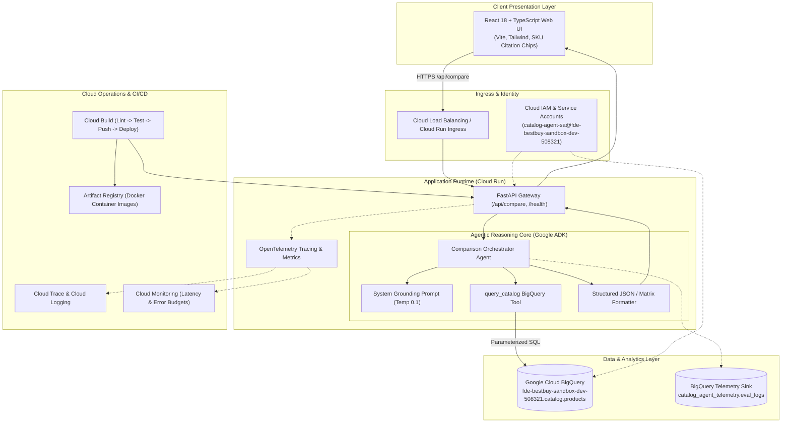
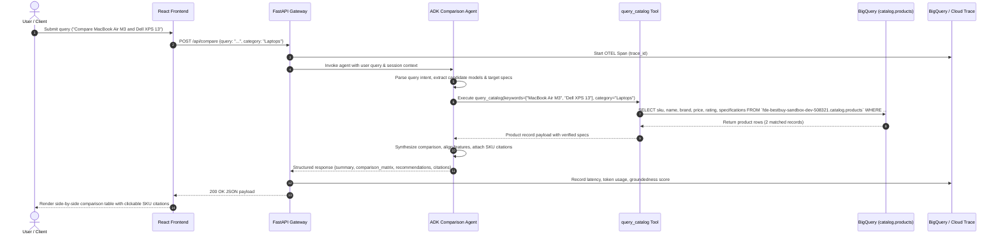

# System Architecture: Best Buy Catalog Comparison Agent

This document provides the comprehensive technical architecture, data model, component specifications, security boundaries, and operational characteristics for the **Best Buy Catalog Comparison Agent**.

---

## 1. High-Level System Architecture



---

## 2. End-to-End Execution Sequence



---

## 3. Data Engineering & BigQuery Schema

The core product catalog is housed in Google Cloud BigQuery in project `fde-bestbuy-sandbox-dev-508321`.

### BigQuery Table: `catalog.products`

```sql
CREATE TABLE IF NOT EXISTS `fde-bestbuy-sandbox-dev-508321.catalog.products` (
    sku STRING NOT NULL OPTIONS(description="Unique Best Buy product identifier (e.g., '6534606')"),
    name STRING NOT NULL OPTIONS(description="Full commercial product title"),
    brand STRING NOT NULL OPTIONS(description="Manufacturer name (e.g., 'Apple', 'Dell', 'Sony')"),
    category STRING NOT NULL OPTIONS(description="Product taxonomy category (e.g., 'Laptops', 'Tablets', 'Headphones')"),
    price FLOAT64 NOT NULL OPTIONS(description="Current retail price in USD"),
    rating FLOAT64 OPTIONS(description="Customer review rating (1.0 - 5.0)"),
    review_count INT64 OPTIONS(description="Total customer reviews recorded"),
    specifications JSON NOT NULL OPTIONS(description="Detailed key-value technical specifications"),
    url STRING OPTIONS(description="Direct URL to Best Buy product listing"),
    image_url STRING OPTIONS(description="CDN URL for high-resolution product image"),
    in_stock BOOL NOT NULL OPTIONS(description="Inventory availability flag"),
    created_at TIMESTAMP DEFAULT CURRENT_TIMESTAMP(),
    updated_at TIMESTAMP DEFAULT CURRENT_TIMESTAMP()
)
PARTITION BY DATE(updated_at)
CLUSTER BY category, brand, sku;
```

### JSON Specifications Schema Sample (`specifications` column):
```json
{
  "processor": "Apple M3 8-core",
  "ram_gb": 16,
  "storage_gb": 512,
  "display_size_in": 13.6,
  "display_resolution": "2560 x 1664 Liquid Retina",
  "battery_life_hours": 18.0,
  "weight_lbs": 2.7,
  "ports": ["MagSafe 3", "2x Thunderbolt 4", "3.5mm headphone jack"]
}
```

---

## 4. Agentic Architecture & Grounding Contract

The agentic core is built with the **Google Agent Development Kit (ADK)**.

### Grounding Rules & Anti-Hallucination Guarantees
1. **Tool-First Retrieval**: The agent is strictly prohibited from guessing or fabricating hardware specs from pre-training memory. Every technical claim must originate from a `query_catalog` tool result.
2. **Deterministic Citation Syntax**: For every row in the comparison matrix or recommendation, the agent must output an inline citation tag: `[SKU: <sku_id>]`.
3. **Pydantic Tool Input/Output Validation**: All parameters to tools and agent returns pass through strict Pydantic schemas, enforcing compile-time type safety.
4. **Sampling Temperature**: Locked to `0.1` to maximize factual determinism and eliminate conversational drift.

---

## 5. Latency Budget & SLAs

Target P95 end-to-end response time: **$\le 3.0$ seconds**.

| Processing Stage | Target Latency | P95 Ceiling | Optimization Strategy |
| :--- | :--- | :--- | :--- |
| Network Ingress / TLS Termination | 30 ms | 60 ms | Cloud Run co-located in `us-central1` |
| FastAPI Request Validation | 5 ms | 10 ms | Pydantic v2 compiled C-extensions |
| Agent Model First Turn (Query Parsing) | 350 ms | 600 ms | Gemini 3.5 Flash streaming & optimized system prompt |
| BigQuery Tool Execution | 250 ms | 500 ms | Clustered queries, parameterized indexed lookups, query cache |
| Agent Model Second Turn (Synthesis) | 600 ms | 1,200 ms | Strict structured output decoding, token limit cap (800 tokens) |
| JSON Serialization & Egress | 10 ms | 20 ms | Orjson fast serializer |
| **Total End-to-End** | **~1,245 ms** | **$\le 2,390$ ms** | **Well within the 3.0s budget** |

---

## 6. Security, Identity & Compliance

- **Google Cloud Project**: `fde-bestbuy-sandbox-dev-508321` (Organization-managed sandbox).
- **Service Account**: `catalog-agent-sa@fde-bestbuy-sandbox-dev-508321.iam.gserviceaccount.com`.
- **Least-Privilege Roles**:
  - `roles/bigquery.jobUser`: Grants permission to run query jobs.
  - `roles/bigquery.dataViewer`: Read-only access to `catalog.products`.
  - `roles/cloudtrace.agent`: Permission to stream OpenTelemetry trace spans.
  - `roles/logging.logWriter`: Permission to write structured JSON logs.
- **SQL Injection Prevention**: All BigQuery interactions use parameterized queries via the Google Cloud Python SDK (`ScalarQueryParameter`, `ArrayQueryParameter`). Raw string formatting in SQL is strictly forbidden.
- **VPC-SC Compatibility**: Designed to operate inside a Google Cloud VPC Service Controls perimeter without external network egress dependencies.

---

## 7. CI/CD & Deployment Pipeline

Continuous Integration and Continuous Deployment are managed by **Google Cloud Build** and **Terraform**:

```mermaid
flowchart LR
    COMMIT[Git Commit to main] --> LINT[Ruff Linter & Formatter]
    LINT --> TEST[Pytest Coverage >= 80%]
    TEST --> EVAL[Evaluation Smoke Test]
    EVAL --> DOCKER[Cloud Build Docker Image]
    DOCKER --> AR[Push to Artifact Registry]
    AR --> TF[Terraform Apply Infrastructure]
    TF --> RUN[Deploy to Cloud Run in us-central1]
    RUN --> SMOKE[Post-Deploy Live Health Probe]
```


