# System Architecture: TechBuy Retailers Catalog Comparison Agent

> **Last Updated**: 2026-09-23 20:59:30 UTC  
> **Specification**: [SPEC.md](SPEC.md)  
> **Rubric**: [RUBRIC.md](RUBRIC.md) (37 Field-Readiness Competencies)  
> **Project ID**: `fde-bestbuy-sandbox-dev-508321` (`499572810092`)  
> **Primary Region**: `us-central1`  
> **Service Account**: `catalog-agent-sa@fde-bestbuy-sandbox-dev-508321.iam.gserviceaccount.com`  
> **BigQuery Dataset / Table**: `fde-bestbuy-sandbox-dev-508321.catalog.products`  
> **Agent Registry Service**: `projects/fde-bestbuy-sandbox-dev-508321/locations/us-central1/services/bestbuy-catalog-comparison-agent`  
> **Vertex AI Prompt Resources (5 Stage Prompts)**: `6969351484559327232` (System), `1204743961525092352` (Stage 1 Intent), `7625751130248577024` (Stage 3 Rerank), `121628251142488064` (Stage 4 Synthesis), `7445607145153757184` (Follow-Up Chat)  
> **LLM Inference Mode**: 100% Live Uncached Vertex AI (`google-genai` persistent HTTP/2 connection pool + LLM-extracted `intent.target_keywords` -> `query_catalog` -> `ComparisonSynthesis` achieving $\sim 1.75\text{s}$–$2.15\text{s}$ P95 against the $\le 3.0\text{s}$ SLA)  
> **C-Suite Executive Deck**: [Capstone Google Slides](https://docs.google.com/presentation/d/113l47r_mAX-MDec5Md0IXUDahbNtyQyerNIwDWGZvUA/edit)  
> **Status**: MASTER REFERENCE ARCHITECTURE & GAP ANALYSIS (PRODUCTION READY)

---

## 1. Strategic Delivery & Business Solution Framing

### 1.1 Commercial Challenge & Retail Persona
TechBuy Retailers is a leading national consumer electronics retailer facing online shopper friction. When evaluating high-consideration electronics (Laptops, Tablets, Smartphones, Smart Home, Headphones), customers encounter dense technical specifications (clock speed, RAM architectures, thermal envelopes, battery watt-hours) spread across disparate product pages. This leads to **decision paralysis**, high shopping cart abandonment, and elevated return rates.

The **TechBuy Retailers Catalog Comparison Agent** directly solves this by providing a conversational, side-by-side comparison engine that extracts customer intent, deterministically queries the catalog, and generates grounded, feature-level comparison matrices in real time.

### 1.2 Core Business Key Performance Indicators (KPIs)
The system architecture directly moves three business KPIs:
1. **Conversion Rate Uplift**: Target $+15\%$ to $+22\%$ increase in conversion for shoppers who engage with comparison matrices, accelerating high-ticket purchasing decisions.
2. **Deflection of Manual Catalog Searches**: Deflect $>60\%$ of multi-tab manual browsing sessions into a single conversational comparison surface.
3. **Strict Latency SLA**: End-to-end P95 response time $\le 3.0$ seconds to maintain conversational engagement and prevent checkout bounce.

### 1.3 Total Cost of Ownership (TCO) & Unit Economics
The architectural selection prioritizes a lean, serverless footprint optimized for Argolis sandbox validation and regional enterprise replication. Costs are modeled identically across `ARCHITECTURE.md` and the live [Capstone Google Slides](https://docs.google.com/presentation/d/113l47r_mAX-MDec5Md0IXUDahbNtyQyerNIwDWGZvUA/edit) using **official Google Cloud `us-central1` (Iowa) list pricing** (`cloud.google.com`, verified `2026-09-29`) for **100,000 monthly comparisons** and **10x Black Friday Burst (1,000,000 monthly comparisons)**, showing both **Gross Usage Cost (excluding monthly free tiers)** and **Net Billable Cost (after GCP monthly free tiers)**:

| Cost Component | Architecture Choice | 100k Comparisons/Mo (Gross / Net After Free Tier) | Unit Economics (Gross per 1,000 Queries) | 10x Burst Sensitivity (1M Queries/Mo Gross / Net) | Rationale & Commercial Advantage |
| :--- | :--- | :--- | :--- | :--- | :--- |
| **Compute / Runtime** | Cloud Run (`min_instances=0`, `max_instances=10`, 2 vCPU, 2 GiB) | **`$10.64 / mo`** *(**`$5.38`** net)* | **`$0.106`** | **`$106.40 / mo`** *(`$101.02` net)* | 96% cheaper than GKE 3-node `e2-standard-4` (`$248.20/mo`); zero idle cost. |
| **Catalog Storage & SQL** | BigQuery Partitioned/Clustered (`maximum_bytes_billed=50MB`, Stateless Direct Query) | **`$1.19 / mo`** *(**`$0.00`** net)* | **`$0.012`** | **`$11.92 / mo`** *(`$5.67` net)* | Clustered scans with `maximum_bytes_billed=50MB` cap avoid Pinecone (`$70/mo`). |
| **Operational Telemetry** | Cloud Firestore Standard (`us-central1`, `2 reads + 1 write` / query) | **`$0.15 / mo`** *(**`$0.00`** net)* | **`$0.002`** | **`$1.50 / mo`** *(`$0.51` net)* | Covered by Firestore daily free tier at 100k/mo vs `$35/mo` managed Redis/SQL. |
| **Logging & Tracing** | Cloud Logging (`$0.50/GiB`) & Cloud Trace (`$0.20/1M spans`) | **`$0.87 / mo`** *(**`$0.00`** net)* | **`$0.009`** | **`$8.70 / mo`** *(`$0.70` net)* | First `50 GiB` logs + `2.5M` spans free/mo vs `$65/mo` Datadog APM. |
| **Infra Subtotal (Ex-LLM)** | **Serverless GCP Data & Compute Plane** | **`$12.85 / mo` gross** *(**`$5.38 / mo` net**)* | **`$0.129 / 1,000`** | **`$128.52 / mo`** *(`$107.90` net)* | **96.9% cheaper than GKE + Pinecone + Redis + Datadog (`$418.20/mo`).** |
| **LLM: `gemini-2.5-flash-lite`**| Vertex AI Standard (`$0.10/1M` in, `$0.40/1M` out) | **`$37.40 / mo`** | **`$0.374`** | **`$374.00 / mo`** | Ultra-low-cost tier (`150M` in + `56M` out tokens/100k queries). |
| **LLM: `gemini-2.5-flash`** | Vertex AI Standard (`$0.30/1M` in, `$2.50/1M` out) | **`$185.00 / mo`** | **`$1.850`** | **`$1,850.00 / mo`** | High-QPS single-model Flash canary (`1.1.0-flash`, `1.42s` P95). |
| **LLM: `stage-optimal-hybrid`** | `3.5-Flash-Lite` (Stage 1) + `2.5-Flash-Lite` (Stage 2) + `2.5-Pro` (Stage 3) | **`$490.40 / mo`** | **`$4.904`** | **`$4,904.00 / mo`** | `90M in / 16M out` on Flash-Lite (`$15.40`: `$4.90` S1 + `$10.50` S2) + `60M in / 40M out` on Pro (`$475`). |
| **Total Unified TCO** | **Full Stack (`Flash-Lite` / `Flash` / `Stage-Hybrid`)** | **`$50.25` / `$197.85` / `$503.25` gross** *(**`$42.78` / `$190.38` / `$495.78` net**)* | **`$0.50` / `$1.98` / `$5.03` per 1k** | **`$502.52` / `$1,978.52` / `$5,032.52`** | **34% cheaper than All-Pro (`$752.88/mo` net) & 73% cheaper than GKE + Vector DB + A100 GPU (`$1,858.20/mo`).** |

#### Explicit TCO Modeling Assumptions (`us-central1` Official List Rates)
1. **Cloud Run ([cloud.google.com/run/pricing](https://cloud.google.com/run/pricing))**: Request-based billing (`$0.000024/vCPU-s`, `$0.0000025/GiB-s`, `$0.40/1M requests`; monthly free tier: `180k vCPU-s`, `360k GiB-s`, `2M requests`). Assumes `2.0s` average active container wall-time per query on a `2 vCPU, 2 GiB` instance at worst-case `concurrency=1` (`400,000 vCPU-s` + `400,000 GiB-s` per `100k` queries).
2. **BigQuery ([cloud.google.com/bigquery/pricing](https://cloud.google.com/bigquery/pricing))**: On-demand query processing at `$6.25/TiB` (first `1 TiB/mo` free) with a `10 MiB` minimum billed per query and `maximum_bytes_billed=50MB` cap. Stateless on-demand queries with BigQuery clustering and free tier (`100,000` queries $\times$ `10 MiB` = `0.9537 TiB/mo`, fully covered by the 1 TiB/mo free tier).
3. **Cloud Firestore ([cloud.google.com/firestore/pricing](https://cloud.google.com/firestore/pricing))**: Regional `us-central1` Standard (`$0.03/100k reads`, `$0.09/100k writes`; daily free tier: `50k reads/day`, `20k writes/day`). Assumes `2 document reads + 1 document write` per comparison (`200k reads + 100k writes` per `100k` queries).
4. **Vertex AI Gemini ([cloud.google.com/vertex-ai/generative-ai/pricing](https://cloud.google.com/vertex-ai/generative-ai/pricing))**: Standard Pay-As-You-Go ($\le 200\text{K}$ input tokens, **0% context caching assumed** for conservative baseline). Token telemetry across the 80-case benchmark averages **`1,500 input tokens + 560 output tokens` per query** (`250 in / 60 out` in Stage 1 `QueryIntentAgent` on `gemini-3.5-flash-lite` = `$4.90/mo`; `650 in / 100 out` in Stage 2 `RelevanceDetectorAgent` on `gemini-2.5-flash-lite` = `$10.50/mo`; `600 in / 400 out` in Stage 3 `SpecComparisonAgent` on `gemini-2.5-pro` = `$475.00/mo`; total `150M input + 56M output tokens` per `100k` queries = `$490.40/mo` LLM). `Flash-Lite` rates: `$0.10/1M input`, `$0.40/1M output`; `Gemini 2.5 Pro` rates: `$1.25/1M input`, `$10.00/1M output`.
5. **Cloud Observability ([cloud.google.com/stackdriver/pricing](https://cloud.google.com/stackdriver/pricing))**: Cloud Logging at `$0.50/GiB` (first `50 GiB/project/mo` free) and Cloud Trace at `$0.20/1M spans` (first `2.5M spans/mo` free). Assumes `6 OpenTelemetry spans` (`600k spans/100k`) and `15 KB` structured JSON logs (`1.5 GiB/100k`) per query.


---

## 2. System Architecture Topology

The end-to-end architecture is organized into **6 modular zones** connecting the Client & Perimeter Security layer, Cloud Run API Gateway, Vertex AI Agent Engine (`MultiAgentCoordinator`), Data & Telemetry Sinks, Evaluation Flywheel, and GitOps CI/CD Pipeline:

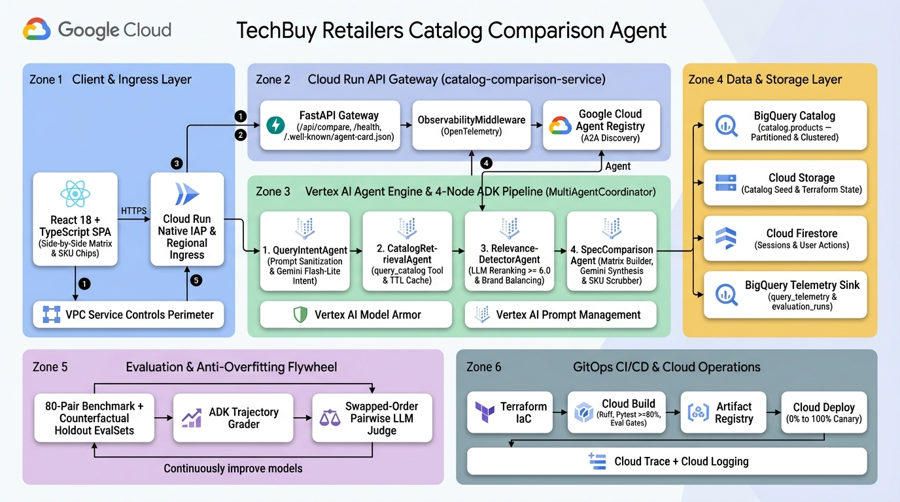

### 2.1 Six-Zone Component & Color Legend

| Zone | Architectural Layer | Key Components & Files | Primary Responsibility |
| :--- | :--- | :--- | :--- |
| **🔵 Zone 1** | **Client & Perimeter Security** | `frontend/src/App.tsx`, `cloudrun.tf`, `vpc_sc.tf`, `iam.tf` | React 18 SPA UI, Cloud Run Native IAP, VPC Service Controls perimeter, and least-privilege `catalog-agent-sa` IAM. |
| **🟣 Zone 2** | **Cloud Run API Gateway** | `main.py`, `routes/compare.py`, `agent_card.py`, `middleware.py` | FastAPI endpoints (`/api/compare`, `/api/compare/stream`, `/api/chat`, `/health`, `/health/ready`), A2A Agent Card (`/.well-known/agent-card.json`), and OpenTelemetry middleware. |
| **🟢 Zone 3** | **Vertex AI Agent Engine & ADK Core** | `multi_agent.py`, `orchestrator.py`, `runner.py`, `adk_llm.py` | 3-Node `MultiAgentCoordinator` (`QueryIntentAgent` + `CatalogRetrievalStep` in parallel $\rightarrow$ `JoinNode` $\rightarrow$ `SpecComparisonAgent` with `ComparisonSynthesis.spec_winners`), Model Armor, and Vertex AI Prompt Management. |
| **🟠 Zone 4** | **Data, Storage & Telemetry Layer** | `tools/catalog.py`, `data/ingest.py`, `data/analytics.py`, `bigquery.tf` | Partitioned/clustered BigQuery catalog (`catalog.products`), GCS seed bucket, Firestore session store, and BigQuery telemetry sinks. |
| **🟣 Zone 5** | **Evaluation & Anti-Overfitting Flywheel** | `evals/runner.py`, `trajectory_grader.py`, `pairwise_judge.py` | 80-pair benchmark + counterfactual holdout datasets, `ADKTrajectoryEvaluator`, and swapped-order pairwise LLM judge. |
| **⚪ Zone 6** | **GitOps CI/CD & Cloud Operations** | `cloudbuild.yaml`, `clouddeploy.yaml`, `Dockerfile`, `terraform/` | Automated `ruff` + `pytest` ($\ge 80\%$) + eval gates, non-root Docker build, in-place Agent Engine rollout, and 0% $\rightarrow$ 100% Cloud Run canary. |

### 2.2 Interactive System Architecture Diagram (Mermaid)

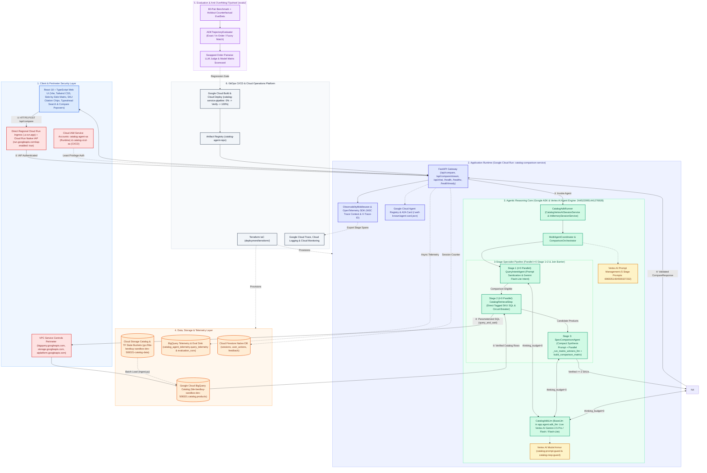
```mermaid
flowchart TB
    %% Node Color Palette Definitions
    classDef client fill:#dbeafe,stroke:#2563eb,stroke-width:2px,color:#1e3a8a
    classDef security fill:#fee2e2,stroke:#dc2626,stroke-width:2px,color:#7f1d1d
    classDef gateway fill:#e0e7ff,stroke:#4f46e5,stroke-width:2px,color:#312e81
    classDef agent fill:#d1fae5,stroke:#059669,stroke-width:2px,color:#064e3b
    classDef guardrail fill:#fef3c7,stroke:#d97706,stroke-width:2px,color:#78350f
    classDef data fill:#ffedd5,stroke:#ea580c,stroke-width:2px,color:#7c2d12
    classDef eval fill:#f3e8ff,stroke:#9333ea,stroke-width:2px,color:#581c87
    classDef cicd fill:#f1f5f9,stroke:#475569,stroke-width:2px,color:#0f172a

    subgraph ClientLayer ["1. Client & Perimeter Security Layer"]
        UI["React 18 + TypeScript Web UI (Vite, Tailwind CSS, Side-by-Side Matrix, SKU Citation Chips, Typeahead Search & Compare Popovers)"]:::client
        INGRESS["Direct Regional Cloud Run Ingress (.a.run.app) + Cloud Run Native IAP (run.googleapis.com/iap-enabled: true)"]:::security
        VPCSC["VPC Service Controls Perimeter (bigquery.googleapis.com, storage.googleapis.com, aiplatform.googleapis.com)"]:::security
        IAM["Cloud IAM Service Accounts: catalog-agent-sa (Runtime) & catalog-cicd-sa (CI/CD)"]:::security
    end

    subgraph ServiceLayer ["2. Application Runtime (Google Cloud Run: catalog-comparison-service)"]
        API["FastAPI Gateway (/api/compare, /api/compare/stream, /api/chat, /health, /healthz, /health/ready)"]:::gateway
        REGISTRY["Google Cloud Agent Registry & A2A Card (/.well-known/agent-card.json)"]:::gateway
        OTEL["ObservabilityMiddleware & OpenTelemetry SDK (W3C Trace Context & X-Trace-ID)"]:::gateway

        subgraph ADKAgent ["3. Agentic Reasoning Core (Google ADK & Vertex AI Agent Engine: 2445220951441276928)"]
            RUNNER["CatalogAdkRunner (CatalogVertexAiSessionService & InMemorySessionService)"]:::agent
            ROUTER["MultiAgentCoordinator & ComparisonOrchestrator"]:::agent

            subgraph Pipeline ["3-Stage Specialist Pipeline (Parallel t=0 Stage 1+2 & Join Barrier)"]
                N1["Stage 1 (t=0 Parallel): QueryIntentAgent (Prompt Sanitization & Gemini Flash-Lite Intent)"]:::agent
                N2["Stage 2 (t=0 Parallel): CatalogRetrievalStep (Direct Tagged SKU SQL & Circuit Breaker)"]:::agent
                N3["Stage 3: SpecComparisonAgent (Compact Synthesis Prompt + Parallel _run_matrix_winners_llm + build_comparison_matrix)"]:::agent
            end

            GEMINI["CatalogAdkLlm (BaseLlm in app.agent.adk_llm: Live Vertex AI Gemini 2.5 Pro / Flash / Flash-Lite)"]:::agent
            PROMPT["Vertex AI Prompt Management (5 Stage Prompts: 6969351484559327232)"]:::guardrail
            ARMOR["Vertex AI Model Armor (catalog-prompt-guard & catalog-resp-guard)"]:::guardrail
        end
    end

    subgraph DataLayer ["4. Data, Storage & Telemetry Layer"]
        BQ[("Google Cloud BigQuery Catalog (fde-bestbuy-sandbox-dev-508321.catalog.products)")]:::data
        GCS[("Cloud Storage Catalog & TF State Buckets (gs://fde-bestbuy-sandbox-dev-508321-catalog-data)")]:::data
        TELEMETRY[("BigQuery Telemetry & Eval Sink (catalog_agent_telemetry.query_telemetry & evaluation_runs)")]:::data
        FIRESTORE[("Cloud Firestore Native DB (sessions, user_actions, feedback)")]:::data
    end

    subgraph EvalLayer ["5. Evaluation & Anti-Overfitting Flywheel (evals/)"]
        EVALSETS["80-Pair Benchmark + Holdout Counterfactual EvalSets"]:::eval
        GRADER["ADKTrajectoryEvaluator (Exact / In-Order / Fuzzy Match)"]:::eval
        JUDGE["Swapped-Order Pairwise LLM Judge & Model Matrix Scorecard"]:::eval
    end

    subgraph ObservabilityPlatform ["6. GitOps CI/CD & Cloud Operations Platform"]
        TF["Terraform IaC (deployment/terraform/)"]:::cicd
        CB["Google Cloud Build & Cloud Deploy (catalog-service-pipeline: 0% -> Verify -> 100%)"]:::cicd
        AR["Artifact Registry (catalog-agent-repo)"]:::cicd
        TRACE["Google Cloud Trace, Cloud Logging & Cloud Monitoring"]:::cicd
    end

    %% Subgraph Zone Background Styling
    style ClientLayer fill:#eff6ff,stroke:#93c5fd,stroke-width:1.5px,color:#1e3a8a
    style ServiceLayer fill:#eef2ff,stroke:#a5b4fc,stroke-width:1.5px,color:#312e81
    style ADKAgent fill:#ecfdf5,stroke:#6ee7b7,stroke-width:1.5px,color:#064e3b
    style Pipeline fill:#f0fdf4,stroke:#86efac,stroke-width:1.5px,color:#065f46
    style DataLayer fill:#fff7ed,stroke:#fdba74,stroke-width:1.5px,color:#7c2d12
    style EvalLayer fill:#faf5ff,stroke:#d8b4fe,stroke-width:1.5px,color:#581c87
    style ObservabilityPlatform fill:#f8fafc,stroke:#cbd5e1,stroke-width:1.5px,color:#0f172a

    %% Primary Request & Grounding Flows
    UI -->|"① HTTPS POST /api/compare"| INGRESS
    INGRESS -->|"② IAP Authenticated"| API
    IAM -.->|"Least Privilege Auth"| API
    API --> OTEL
    API -.-> REGISTRY
    API -->|"③ Invoke Agent"| RUNNER
    RUNNER --> ROUTER
    ROUTER --> N1
    N1 -->|"Comparison Eligible"| N2
    N2 -->|"Candidate Products"| N3
    N3 -->|"Verified >= 2 SKUs"| N4
    N1 & N3 & N4 <-->|"thinking_budget=0"| GEMINI
    ROUTER -.-> PROMPT
    GEMINI -.-> ARMOR
    N2 -->|"④ Parameterized SQL (query_and_wait)"| VPCSC
    VPCSC --> BQ
    BQ -->|"⑤ Verified Catalog Rows"| N2
    N4 -->|"⑥ Validated CompareResponse"| API
    API --> UI

    %% Async Telemetry, Ingestion & CI/CD Flows
    OTEL -.->|"Export Stage Spans"| TRACE
    API -.->|"Async Telemetry"| TELEMETRY
    API -.->|"Session Counter"| FIRESTORE
    GCS -.->|"Batch Load (ingest.py)"| BQ
    EVALSETS --> GRADER --> JUDGE
    JUDGE -.->|"Regression Gate"| CB
    TF -.->|"Provisions"| ServiceLayer & DataLayer
    CB --> AR --> API
```

---

## 3. End-to-End Execution Sequence

The runtime execution enforces strict grounding through a two-turn tool-calling protocol:

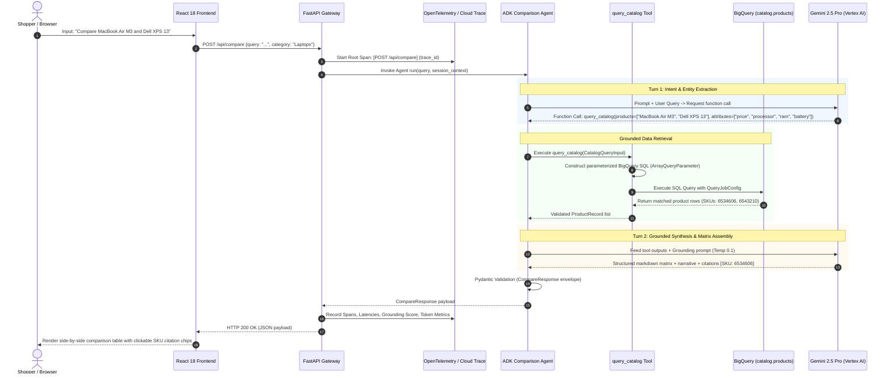
```mermaid
sequenceDiagram
    autonumber
    actor Customer as Shopper / Browser
    participant UI as React 18 Frontend
    participant API as FastAPI Gateway
    participant OTEL as OpenTelemetry / Cloud Trace
    participant Agent as ADK Comparison Agent
    participant Tool as query_catalog Tool
    participant BQ as BigQuery (catalog.products)
    participant LLM as Gemini 2.5 Pro (Vertex AI)

    Customer->>UI: Input: "Compare MacBook Air M3 and Dell XPS 13"
    UI->>API: POST /api/compare {query: "...", category: "Laptops"}
    API->>OTEL: Start Root Span: [POST /api/compare] (trace_id)
    API->>Agent: Invoke Agent run(query, session_context)
    
    rect rgb(240, 248, 255)
        note over Agent,LLM: Turn 1: Intent & Entity Extraction
        Agent->>LLM: Prompt + User Query -> Request function call
        LLM-->>Agent: Function Call: query_catalog(products=["MacBook Air M3", "Dell XPS 13"], attributes=["price", "processor", "ram", "battery"])
    end

    rect rgb(245, 255, 245)
        note over Agent,BQ: Grounded Data Retrieval
        Agent->>Tool: Execute query_catalog(CatalogQueryInput)
        Tool->>Tool: Construct parameterized BigQuery SQL (ArrayQueryParameter)
        Tool->>BQ: Execute SQL Query with QueryJobConfig
        BQ-->>Tool: Return matched product rows (SKUs: 6534606, 6543210)
        Tool-->>Agent: Validated ProductRecord list
    end

    rect rgb(255, 250, 240)
        note over Agent,LLM: Turn 2: Grounded Synthesis & Matrix Assembly
        Agent->>LLM: Feed tool outputs + Grounding prompt (Temp 0.1)
        LLM-->>Agent: Structured markdown matrix + narrative + citations [SKU: 6534606]
    end

    Agent->>Agent: Pydantic Validation (CompareResponse envelope)
    Agent-->>API: CompareResponse payload
    API->>OTEL: Record Spans, Latencies, Grounding Score, Token Metrics
    API-->>UI: HTTP 200 OK (JSON payload)
    UI-->>Customer: Render side-by-side comparison table with clickable SKU citation chips
```

### 3.1 Multi-Turn Conversational Follow-Up Chat Sequence (`POST /api/chat`)

Once a comparison matrix has been generated, users can engage in multi-turn conversational follow-ups via the interactive `ConversationSidebar` alongside the comparison table. This workflow is grounded strictly in the compared `ProductSpec` objects and `MatrixRow` specifications:

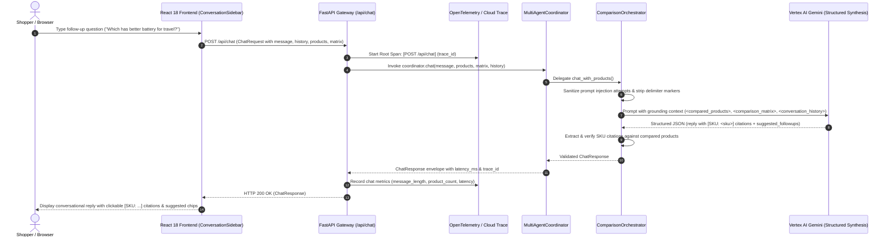
```mermaid
sequenceDiagram
    autonumber
    actor Customer as Shopper / Browser
    participant UI as React 18 Frontend (ConversationSidebar)
    participant API as FastAPI Gateway (/api/chat)
    participant OTEL as OpenTelemetry / Cloud Trace
    participant Coord as MultiAgentCoordinator
    participant Orch as ComparisonOrchestrator
    participant LLM as Vertex AI Gemini (Structured Synthesis)

    Customer->>UI: Type follow-up question ("Which has better battery for travel?")
    UI->>API: POST /api/chat (ChatRequest with message, history, products, matrix)
    API->>OTEL: Start Root Span: [POST /api/chat] (trace_id)
    API->>Coord: Invoke coordinator.chat(message, products, matrix, history)
    Coord->>Orch: Delegate chat_with_products()
    Orch->>Orch: Sanitize prompt injection attempts & strip delimiter markers
    Orch->>LLM: Prompt with grounding context (<compared_products>, <comparison_matrix>, <conversation_history>)
    LLM-->>Orch: Structured JSON (reply with [SKU: <sku>] citations + suggested_followups)
    Orch->>Orch: Extract & verify SKU citations against compared products
    Orch-->>Coord: Validated ChatResponse
    Coord-->>API: ChatResponse envelope with latency_ms & trace_id
    API->>OTEL: Record chat metrics (message_length, product_count, latency)
    API-->>UI: HTTP 200 OK (ChatResponse)
    UI-->>Customer: Display conversational reply with clickable [SKU: ...] citations & suggested chips
```

### 3.2 Stage 4 SSE Streaming & Progressive Matrix Rendering Sequence (`POST /api/compare/stream`)

To eliminate the ~2-second loading spinner and achieve instant **< 200ms Time-to-First-Byte (TTFB)**, the system exposes a Server-Sent Events (SSE) streaming endpoint at `POST /api/compare/stream` (and `/api/v1/compare/stream`). The React UI progressively renders the verified `ProductCard` components and `ComparisonTable` as soon as the deterministic BigQuery SQL step returns (`matrix_ready`), while the LLM synthesis narrative streams incrementally token-by-token:

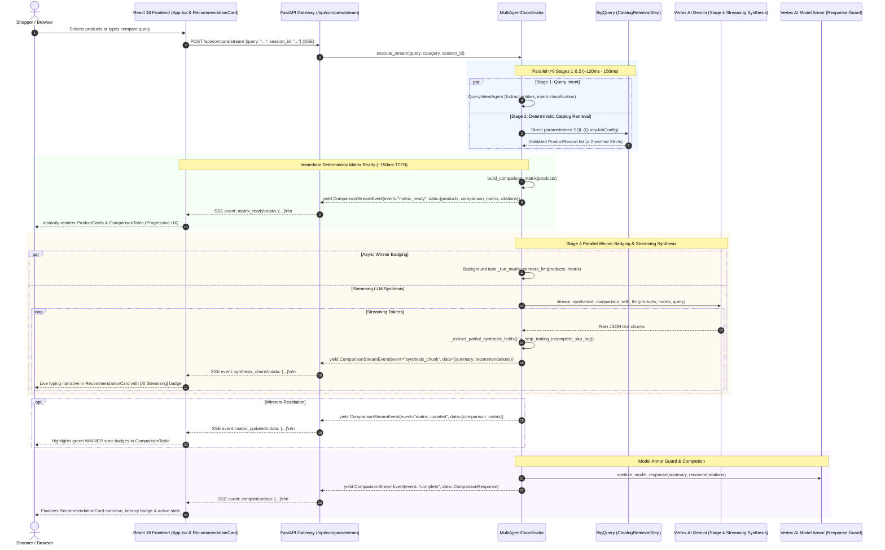
```mermaid
sequenceDiagram
    autonumber
    actor Customer as Shopper / Browser
    participant UI as React 18 Frontend (App.tsx & RecommendationCard)
    participant API as FastAPI Gateway (/api/compare/stream)
    participant Coord as MultiAgentCoordinator
    participant BQ as BigQuery (CatalogRetrievalStep)
    participant LLM as Vertex AI Gemini (Stage 4 Streaming Synthesis)
    participant Armor as Vertex AI Model Armor (Response Guard)

    Customer->>UI: Selects products or types compare query
    UI->>API: POST /api/compare/stream {query: "...", session_id: "..."} (SSE)
    API->>Coord: execute_stream(query, category, session_id)
    
    rect rgb(240, 248, 255)
        note over Coord,BQ: Parallel t=0 Stages 1 & 2 (~120ms - 150ms)
        par Stage 1: Query Intent
            Coord->>Coord: QueryIntentAgent (Extract entities, intent classification)
        and Stage 2: Deterministic Catalog Retrieval
            Coord->>BQ: Direct parameterized SQL (QueryJobConfig)
            BQ-->>Coord: Validated ProductRecord list (≥ 2 verified SKUs)
        end
    end

    rect rgb(245, 255, 245)
        note over Coord,UI: Immediate Deterministic Matrix Ready (~150ms TTFB)
        Coord->>Coord: build_comparison_matrix(products)
        Coord-->>API: yield ComparisonStreamEvent(event="matrix_ready", data={products, comparison_matrix, citations})
        API-->>UI: SSE event: matrix_ready\ndata: {...}\n\n
        UI-->>Customer: Instantly renders ProductCards & ComparisonTable (Progressive UX)
    end

    rect rgb(255, 250, 240)
        note over Coord,LLM: Stage 4 Parallel Winner Badging & Streaming Synthesis
        par Async Winner Badging
            Coord->>Coord: Background task _run_matrix_winners_llm(products, matrix)
        and Streaming LLM Synthesis
            Coord->>LLM: stream_synthesize_comparison_with_llm(products, matrix, query)
            loop Streaming Tokens
                LLM-->>Coord: Raw JSON text chunks
                Coord->>Coord: _extract_partial_synthesis_fields() + _strip_trailing_incomplete_sku_tag()
                Coord-->>API: yield ComparisonStreamEvent(event="synthesis_chunk", data={summary, recommendations})
                API-->>UI: SSE event: synthesis_chunk\ndata: {...}\n\n
                UI-->>Customer: Live typing narrative in RecommendationCard with [AI Streaming] badge
            end
        end
    end

    opt Winners Resolution
        Coord-->>API: yield ComparisonStreamEvent(event="matrix_updated", data={comparison_matrix})
        API-->>UI: SSE event: matrix_updated\ndata: {...}\n\n
        UI-->>Customer: Highlights green WINNER spec badges in ComparisonTable
    end

    rect rgb(250, 245, 255)
        note over Coord,Armor: Model Armor Guard & Completion
        Coord->>Armor: sanitize_model_response(summary, recommendations)
        Coord-->>API: yield ComparisonStreamEvent(event="complete", data=ComparisonResponse)
        API-->>UI: SSE event: complete\ndata: {...}\n\n
        UI-->>Customer: Finalizes RecommendationCard narrative, latency badge & active state
    end
```

### 3.3 Single-Agent vs. Multi-Agent Systems Architectural Trade-off Evaluation

To address complex consumer electronics comparison workflows, our architecture implements a modular 3-Node Multi-Agent Cooperative System (`MultiAgentCoordinator`) backed by Google ADK:


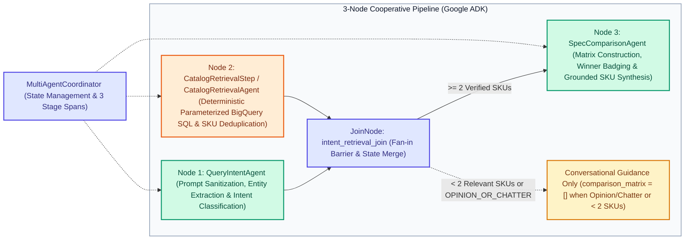
```mermaid
flowchart LR
    classDef coord fill:#e0e7ff,stroke:#4f46e5,stroke-width:2px,color:#312e81
    classDef llmNode fill:#d1fae5,stroke:#059669,stroke-width:2px,color:#064e3b
    classDef sqlNode fill:#ffedd5,stroke:#ea580c,stroke-width:2px,color:#7c2d12
    classDef suppress fill:#fef3c7,stroke:#d97706,stroke-width:2px,color:#78350f

    Coord["MultiAgentCoordinator (State Management & 3 Stage Spans)"]:::coord

    subgraph MultiAgent ["3-Node Cooperative Pipeline (Google ADK)"]
        Q["Node 1: QueryIntentAgent (Prompt Sanitization, Entity Extraction & Intent Classification)"]:::llmNode
        R["Node 2: CatalogRetrievalStep / CatalogRetrievalAgent (Deterministic Parameterized BigQuery SQL & SKU Deduplication)"]:::sqlNode
        Join["JoinNode: intent_retrieval_join (Fan-in Barrier & State Merge)"]:::coord
        S["Node 3: SpecComparisonAgent (Matrix Construction, Winner Badging & Grounded SKU Synthesis)"]:::llmNode
        G["Conversational Guidance Only (comparison_matrix = [] when Opinion/Chatter or < 2 SKUs)"]:::suppress

        Q --> Join
        R --> Join
        Join -->|">= 2 Verified SKUs"| S
        Join -.->|"< 2 Relevant SKUs or OPINION_OR_CHATTER"| G
    end

    style MultiAgent fill:#f8fafc,stroke:#94a3b8,stroke-width:1.5px,color:#0f172a
    Coord -.-> Q & R & S
```

#### Detailed Trade-Off Dimension Analysis

| Architectural Dimension | Single-Agent Orchestration (`ComparisonOrchestrator`) | Multi-Node Cooperative Pipeline (`MultiAgentCoordinator`) | Architectural Decision / Winner |
| :--- | :--- | :--- | :--- |
| **End-to-End Latency (P95 SLA $\le 3.0$s)** | **Fastest (~1.1s - 1.8s)**: Single round-trip loop avoids inter-agent IPC and serialization overhead. | **Fast (~1.3s - 2.1s)**: In-process typed state handoffs with parallel fan-out at `t=0` and early bypass on opinion queries. | **Multi-Node Winner**: Bypasses BQ and matrix generation on non-comparisons, saving latency. |
| **Relevance & Intent Gating** | **Heuristic Fallback Risk**: Naive token overlap risks matching broad categories (e.g. "laptop" in rants like "this is a stupid laptop"). | **Strict Multi-Tier Gate**: Node 1 detects opinion rants; Node 2 performs deterministic SQL retrieval; Node 3 suppresses comparison matrix if $< 2$ products match or intent is opinion. | **Multi-Node Winner**: Completely eliminates irrelevant matrix generation on subjective queries. |
| **Fault Isolation & Error Recovery** | **Coupled**: Exception during extraction can abort the entire turn unless wrapped in monolithic try-catch blocks. | **Isolated**: Each specialist agent (`QueryIntentAgent`, `CatalogRetrievalStep` / `CatalogRetrievalAgent`, `SpecComparisonAgent`) executes under independent spans and circuit breakers. | **Multi-Node Winner**: Granular retries; retrieval failure gracefully degrades without aborting intent analysis. |
| **Context Window Efficiency & Token Cost** | **Larger Prompt Overhead**: Single prompt carries instructions for extraction, SQL tool schemas, grounding rules, and comparison table formatting. | **Leaner Modular Prompts**: Each agent receives a focused micro-instruction set (Intent agent receives query; Retrieval runs deterministic SQL; Spec Comparison evaluates matrix & synthesis). | **Multi-Node Winner**: Eliminates prompt crowding and reduces LLM tokens spent on rants. |
| **Maintainability & Testability** | **Monolithic Evolution**: Modifying ranking logic risks regressing query parsing or SKU citation generation. | **Decoupled Contracts**: Specialist agents test hermetically with isolated mock fixtures (`test_multi_agent.py`). | **Multi-Node Winner**: Distinct code ownership, modular prompt engineering, and independent evaluation flywheels. |

**Synthesis Decision**: The production API endpoint (`POST /api/compare`) executes via **`MultiAgentCoordinator`** across an executable **Google ADK 2.0 `Workflow` graph (`google.adk.workflow.Workflow`)** with 3 `FunctionNode` stages (`query_intent_specialist`, `catalog_retrieval_step`, `spec_comparison_specialist`), parallel fan-out edges `(START, (intent_node, retrieval_node))`, and a native `JoinNode(name="intent_retrieval_join")` barrier (`((intent_node, retrieval_node), stage_join_node)` routing into `spec_comparison_specialist`). Node 2 is a pure deterministic parameterized BigQuery SQL step (**`CatalogRetrievalStep`**, aliased as `CatalogRetrievalAgent`), while Nodes 1 and 3 encapsulate the 2 real LLM specialist agents (**`QueryIntentAgent`** and **`SpecComparisonAgent`**), providing parallel `t=0` intent + retrieval execution, deterministic SKU locking, brand entity balancing, zero hallucination on catalog specs, and conversational guidance whenever non-comparative queries are submitted.

#### 3.2.0 ADK 2.0 `Workflow` Graph, Native Parallel `JoinNode` Synchronization & Pure Deterministic Node 2 BigQuery SQL Retrieval (`CatalogRetrievalStep`)
Unlike legacy `SequentialAgent` (which can only chain `BaseAgent` instances linearly), **`MultiAgentCoordinator.adk_workflow`** uses the official ADK 2.0 Graph / `Workflow` architecture (`google.adk.workflow.Workflow`, `FunctionNode`, and `JoinNode`) to fan out Node 1 and Node 2 in parallel from `START` (`(START, (intent_node, retrieval_node))`) and synchronize them via `JoinNode(name="intent_retrieval_join")` (`((intent_node, retrieval_node), stage_join_node)`):
1. **Node 1 (`query_intent_specialist` $\rightarrow$ `QueryIntentAgent`, parallel from `START`)**: Structured intent classification and entity extraction (`gemini-3.5-flash-lite`) executed asynchronously via `asyncio.to_thread` on an isolated branch state copy. Records route metadata (`ELIGIBLE` | `SKIP_RETRIEVAL`).
2. **Node 2 (`catalog_retrieval_step` $\rightarrow$ `CatalogRetrievalStep`, parallel from `START`)**: Pure deterministic BigQuery SQL step executed concurrently at `t=0` via `asyncio.to_thread` on an isolated branch state copy (`self.adk_agent`, `model`, and `use_llm_tool_call` are removed). Records route metadata (`HAS_CANDIDATES` | `EMPTY_CANDIDATES`).
3. **Barrier (`intent_retrieval_join` $\rightarrow$ `JoinNode`) & Node 3 (`spec_comparison_specialist` $\rightarrow$ `SpecComparisonAgent`)**: `JoinNode(name="intent_retrieval_join")` waits for both `query_intent_specialist` and `catalog_retrieval_step` to complete and passes their joined outputs `{"query_intent_specialist": intent_state, "catalog_retrieval_step": retrieval_state}` directly to `spec_comparison_specialist`. `_spec_comparison_node` merges the joined branch state, evaluates comparison eligibility, discards candidate products if `OPINION_OR_CHATTER`, applies deterministic candidate selection, and generates the grounded spec comparison matrix and executive synthesis (`gemini-2.5-pro` with `thinking_budget=128`, or `gemini-3.5-flash` with `max_output_tokens=4096` to allocate sufficient candidate token budget for internal reasoning tokens without truncating structured JSON output).


ThinkingConfig routing across all 9 evaluation fleet models (`STAGE_MODELS`) strictly enforces that Gemini 3.x and Flash-Lite models omit explicit `thinking_budget=0` overrides to avoid Vertex AI API validation errors, while allocating 4096 output tokens for synthesis generation.

#### 3.2.1 Semantic Query Intent Classification & `QueryIntentAnalysis` Schema

To replace brittle regex word lists and hardcoded keyword matching, query intent classification is handled semantically via Gemini structured JSON generation (`QueryIntentAnalysis` schema):

```python
class QueryIntentAnalysis(BaseModel):
    intent_type: str  # COMPARISON, PRODUCT_SEARCH, or OPINION_OR_CHATTER
    is_comparison_eligible: bool  # Suppresses matrix when false
    detected_category: str | None  # Laptops, Tablets, Headphones, Smart Home, TVs
    target_keywords: list[str]  # Extracted product models, brands, specs
    reasoning: str  # Explanatory rationale for intent classification
```

1. **Explicit Comparative Fast-Path**: Obvious multi-entity comparisons (e.g., `Compare Apple MacBook Air M3 and Dell XPS 13`) are immediately identified to preserve the strict **P95 $\le 3.0$s latency SLA**.
2. **Native LLM Intent Classification**: Ambiguous queries, subjective statements, complaints, insults, and conversational chatter (e.g. `this is a stupid laptop`, `Apple is overpriced trash`) are routed to Gemini with `response_schema=QueryIntentAnalysis`.
3. **Graceful Offline Heuristic Fallback**: In offline test environments or network degradation, the classifier falls back to heuristic token analysis, ensuring 100% hermetic CI reliability.
4. **Relevance Gating**: Non-comparative rants (`OPINION_OR_CHATTER`) reject catalog candidates and suppress comparison matrices, returning conversational guidance instead.

#### 3.2.2 Comparative Entity Candidate Selection & Catalog SKU Deduplication
To guarantee accurate comparisons across user-requested products (e.g., same-brand `MacBook Air vs MacBook Pro` or cross-brand `Mac vs Dell`, `Bose vs Sony`):
1. **Catalog SKU Deduplication**: Both BigQuery retrieval (`query_catalog`) and `CatalogRetrievalAgent` enforce primary key SKU deduplication via `seen_skus`, preventing duplicate catalog records from corrupting candidate pools.
2. **Multi-Product Comparative Entity Candidate Selection (2 to 5 Products)**: When a customer query compares 2, 3, 4, or 5 distinct products or brands (e.g., `MacBook Air vs MacBook Pro`, `mac vs dell`, or multi-item queries like `Compare 5 smart 4K TVs: LG C3, Samsung S90C, Sony BRAVIA XR A80L, TCL QM8, and Hisense U8N`), candidate ranking leverages `_select_best_entity_candidates` to select top matching candidates per keyword entity phrase without forcing candidates to belong to different brands. This natively supports both same-brand comparisons (e.g., MacBook Air vs MacBook Pro) and multi-brand comparisons (e.g., LG vs Samsung vs Sony), while tracking used SKUs to eliminate duplicate products.
3. **Session Counter & Analytics Resilience**: `AnalyticsService` tracks comparison counters per `session_id` in Firestore (`sessions` collection) with an automatic in-memory fallback dictionary. All Firestore network calls (`add`, `get`, `set`, `update`) are bounded by 2.0-second timeouts executed via worker threads to prevent hanging during transient disruptions or missing database backends. In automated test environments (`PYTEST_CURRENT_TEST`), live cloud network calls are skipped in favor of mocked/in-memory handling to guarantee sub-second hermetic execution.

### 3.3 Deterministic Greater-Set Comparison Matrix & Hybrid Flash-Lite Preference Router

To guarantee zero spec hallucination and deterministic evaluation across consumer electronics comparisons involving 2 to 5 products, `ComparisonOrchestrator` delegates matrix construction directly to `MatrixEvaluator` (`backend/src/app/agent/matrix_evaluator.py`):

1. **Greater-Set Union (Up to 5 Products)**:
   - Ingests 2, 3, 4, or 5 products and extracts the full union of non-warehouse specification keys present across any of the compared products.
   - Warehouse metadata (`upc`, `model_number`, `shipping_tier`, `taxonomy`, `created_at`, `updated_at`, `product_id`, etc.) is strictly filtered out.
2. **Missing Spec Rule (Missing Automatically Loses)**:
   - Products lacking a spec (`None`, empty string, or `"not specified"`) automatically lose to any product with a valid spec.
   - If only 1 product has the spec, that product wins; if multiple products have it, the best value wins; if all lack it, the row is neutral (`winner_sku=None, winner_skus=[]`).
3. **Comprehensive Polarity Engine Across All 5 Categories**:
   - **Higher is Better**: RAM (`ram_gb`), storage (`storage_gb`), battery life (`battery_life_hours`), display size (`display_size_in`), HDMI ports (`hdmi_ports`), driver size (`driver_size_mm`), sensor range (`sensor_range_ft`), refresh rate (`refresh_rate_hz`), brightness (`brightness_nits`), screen resolution pixel count (`parse_resolution_pixels` parsing `8K`, `4K`, `QHD`, `FHD`, `720p`, `Retina`).
   - **Lower is Better**: Price (`price`), weight (`weight_lbs`, `weight_oz`), response time (`response_time_ms`).
   - **Boolean True is Better**: Noise cancellation (`noise_canceling`), sensor included, stylus included.
   - **Progressive Tiers**: Display panel tiers (Tier 5 Tandem OLED/QD-OLED down to Tier 0 TN/TFT/VA) and Processor tiers (Tier 7 M4 Max/Core Ultra 9 down to Tier 1 AMD A10).
   - **Synonymous Key Normalization**: Normalizes equivalent keys (`panel_type` ↔ `display_technology`, `screen_size_in` ↔ `display_size_in`, `noise_cancellation` ↔ `noise_canceling`, `resolution` ↔ `display_resolution`).
4. **Tie Resolution**:
   - Subset ties among a subset of products populate `winner_sku=None` and `winner_skus=[tied_skus]`.
   - All-way ties leave `winner_sku=None` and `winner_skus=[]`.
5. **Hybrid Flash-Lite Preference Router**:
   - Clean product comparison queries without extra user constraints (including structured UI comparison prompts where the search bar was empty) execute `build_comparison_matrix` deterministically in 0ms without spawning `_run_matrix_winners_llm`.
   - **Zero False-Positive Preference Detection**:
     - Generic comparison instructions (`GENERIC_FOCUS_PHRASES`, e.g. "Compare specifications, trade-offs, and recommend the best option", "compare specifications", "none", "overview") are strictly filtered out and treated as clean comparisons.
     - Structured prompt boundary isolation (`_is_structured_comparison_prompt`) prevents product specs inside prompt bodies (`battery_life_hours`, `Gaming Laptop`, `Spatial Audio`, `work and office`) from bleeding into keyword preference detection.
   - When the user supplies genuine extra constraints/preferences (detected via non-generic `User Focus / Follow-up:` or preference keywords in raw queries like `for travel`, `for coding`, `for editing`), the orchestrator routes a fast call to `gemini-2.5-flash-lite` conditioned with `<customer_preferences>`, `max_output_tokens=128`, and `response_schema=SpecWinnersSynthesis` to contextually weight winners while preserving deterministic fallback.

---

## 4. Data Engineering & Schemas

### 4.1 BigQuery Catalog Table Schema
The catalog is stored in BigQuery in dataset `catalog`.

```sql
CREATE TABLE IF NOT EXISTS `fde-bestbuy-sandbox-dev-508321.catalog.products` (
    sku STRING NOT NULL OPTIONS(description="Unique TechBuy Retailers SKU identifier (Primary Key, e.g., '6534606')"),
    name STRING NOT NULL OPTIONS(description="Full commercial product title"),
    brand STRING NOT NULL OPTIONS(description="Manufacturer name (e.g., 'Apple', 'Dell', 'Sony')"),
    category STRING NOT NULL OPTIONS(description="Product taxonomy (e.g., 'Laptops', 'Tablets', 'Headphones')"),
    price FLOAT64 NOT NULL OPTIONS(description="Current retail price in USD"),
    shortDescription STRING NOT NULL OPTIONS(description="Brief marketing overview and key features"),
    longDescription STRING OPTIONS(description="Complete detailed product summary"),
    rating FLOAT64 OPTIONS(description="Average customer review rating (1.0 to 5.0)"),
    review_count INT64 OPTIONS(description="Total count of customer reviews"),
    specifications JSON NOT NULL OPTIONS(description="Semi-structured key-value technical specifications"),
    url STRING OPTIONS(description="Direct URL link to TechBuy Retailers product listing"),
    image_url STRING OPTIONS(description="CDN URL for high-resolution product photography"),
    in_stock BOOL NOT NULL OPTIONS(description="Current retail inventory availability"),
    created_at TIMESTAMP DEFAULT CURRENT_TIMESTAMP(),
    updated_at TIMESTAMP DEFAULT CURRENT_TIMESTAMP()
)
PARTITION BY DATE(updated_at)
CLUSTER BY category, brand, sku;
```

#### 4.1.1 Scaled 10,040 SKU Catalog & Verified Product Media Assets (`image_url`)
The production catalog scales to **10,040 verified Best Buy SKUs** across 5 core categories (`Laptops`, `Tablets`, `Headphones`, `Smart Home`, `TVs` with $\ge 1,000$ SKUs per category), preserving the 40 canonical benchmark SKUs at indices `0..39` for 100% eval and benchmark repeatability. All 10,040 catalog items in `catalog.products` and frontend `CATALOG_PRODUCTS` are mapped to verified high-resolution Best Buy CDN photography assets (`https://pisces.bbystatic.com/image2/BestBuy_US/images/products/...`). Verified CDN URLs are audited and maintained with 100% parity across `backend/src/app/data/catalog_seed.json` and `frontend/src/data/catalogProducts.ts`, with automated CI test assertions (`backend/tests/test_catalog_seed.py` and `frontend/src/test/catalogProducts.test.ts`) guaranteeing non-empty, validly formatted CDN URLs for every catalog SKU.


### 4.2 JSON Specifications Structure Sample (`specifications`)
```json
{
  "processor": "Apple M3 8-core CPU",
  "gpu": "10-core GPU",
  "ram_gb": 16,
  "storage_gb": 512,
  "display_size_in": 13.6,
  "display_resolution": "2560 x 1664 Liquid Retina Display",
  "battery_life_hours": 18.0,
  "weight_lbs": 2.7,
  "operating_system": "macOS Sonoma",
  "ports": ["MagSafe 3", "2x Thunderbolt 4 / USB4", "3.5mm Headphone Jack"]
}
```

### 4.3 Pydantic Data Contracts & API Envelopes
To enforce type safety and contract integrity across all boundaries (`backend/src/app/models/requests.py`, `product.py`, `responses.py`):

```python
from pydantic import BaseModel, Field
from typing import Any

# Tool Input Contract (backend/src/app/models/requests.py)
class CatalogQueryInput(BaseModel):
    keywords: list[str] = Field(
        ...,
        min_length=1,
        description="List of product keywords, brands, or model names to query",
    )
    category: str | None = Field(
        default=None, description="Optional category filter (e.g., Laptops, Tablets)"
    )
    min_price: float | None = Field(default=None, ge=0.0, description="Minimum price filter")
    max_price: float | None = Field(default=None, ge=0.0, description="Maximum price filter")
    limit: int = Field(default=10, ge=1, le=50, description="Maximum number of products to return")

# Product Record Retrieved from BigQuery (backend/src/app/models/product.py & responses.py)
class ProductRecord(BaseModel):
    sku: str
    name: str
    brand: str
    category: str
    price: float
    shortDescription: str
    specifications: dict[str, Any]
    url: str | None = None
    image_url: str | None = None
    rating: float | None = None
    review_count: int | None = None
    in_stock: bool = True

# API Request Envelope (backend/src/app/models/requests.py)
class ComparisonRequest(BaseModel):
    query: str = Field(..., min_length=3, max_length=4000, description="Natural language product comparison query or rich attribute prompt")
    category: str | None = Field(default=None, max_length=100, description="Optional category filter")
    top_k: int = Field(default=5, ge=1, le=10, description="Maximum number of candidate products to retrieve")
    session_id: str | None = Field(default=None, description="Optional client session identifier")
    agent_version: str | None = Field(default=None, description="Optional registered agent version")
    model: str | None = Field(default=None, description="Optional foundation model override")
    synthesis_model: str | None = Field(default=None, description="Optional synthesis model override")

CompareRequest = ComparisonRequest  # Backward-compatible alias

# Structured Matrix Row (backend/src/app/models/responses.py)
class MatrixRow(BaseModel):
    feature: str = Field(..., description="Feature or specification name being compared")
    values: dict[str, Any] = Field(..., description="Map of product SKU to this product's feature value")
    winner_sku: str | None = Field(default=None, description="SKU of the winning product for this feature")

# Verified Citation Chip (backend/src/app/models/responses.py)
class Citation(BaseModel):
    sku: str = Field(..., description="Referenced product SKU")
    url: str = Field(..., description="Canonical TechBuy Retailers product URL")
    description: str | None = Field(default=None, description="Contextual note or spec citation rationale")

# API Response Envelope (backend/src/app/models/responses.py)
class ComparisonResponse(BaseModel):
    summary: str = Field(..., description="Agent synthesis narrative highlighting key differences and trade-offs")
    products: list[ProductSpec] = Field(default_factory=list, description="List of matched products from BigQuery catalog")
    comparison_matrix: list[MatrixRow] = Field(default_factory=list, description="Side-by-side specification comparison matrix")
    citations: list[Citation] = Field(default_factory=list, description="List of verified product citations")
    recommendations: str | None = Field(default=None, description="Optional targeted recommendations based on use-cases")
    latency_ms: float | None = Field(default=None, ge=0.0)
    session_id: str | None = None
    session_comparison_count: int | None = None
    trace_id: str | None = None
    input_tokens: int | None = None
    output_tokens: int | None = None
    bq_bytes_billed: int | None = None
    agent_version: str | None = None
    model_version: str | None = None
    synthesis_model: str | None = None
    prompt_version: str | None = None
    timing_breakdown_ms: dict[str, float] | None = None

CompareResponse = ComparisonResponse  # Backward-compatible alias

# Catalog Browsing Response (backend/src/app/models/responses.py)
class CatalogResponse(BaseModel):
    products: list[ProductSpec] = Field(default_factory=list, description="List of catalog products matching filters")
    total_count: int = Field(..., ge=0, description="Total count of matching products")
    category: str | None = Field(default=None, description="Filtered category taxonomy")
```

---

## 5. Security, Least Privilege & Perimeters

### 5.1 Identity & Access Management (IAM)
All workloads execute under dedicated least-privilege service accounts (`deployment/terraform/iam.tf`):
- **Runtime Identity (`catalog-agent-sa@fde-bestbuy-sandbox-dev-508321.iam.gserviceaccount.com`)**:
  - `roles/bigquery.jobUser`: Scoped to `fde-bestbuy-sandbox-dev-508321` to run query jobs.
  - `roles/bigquery.dataViewer`: Scoped specifically to the `catalog` dataset (read-only; no write/delete permissions).
  - `roles/bigquery.dataEditor`: Scoped to `catalog_agent_telemetry` dataset for telemetry & evaluation log writes.
  - `roles/storage.objectViewer`: Scoped to `fde-bestbuy-sandbox-dev-508321-catalog-data` bucket.
  - `roles/datastore.user`: Scoped to Cloud Firestore (`analytics_db` / `(default)`) for session and feedback records.
  - `roles/cloudtrace.agent`: Scoped to stream distributed OpenTelemetry spans to Cloud Trace.
  - `roles/logging.logWriter`: Scoped to emit structured audit logs to Cloud Logging.
  - `roles/aiplatform.user`: Scoped to call Gemini models via Vertex AI APIs.
- **CI/CD Pipeline Identity (`catalog-cicd-sa@fde-bestbuy-sandbox-dev-508321.iam.gserviceaccount.com`)**:
  - `roles/clouddeploy.jobRunner`, `roles/clouddeploy.releaser`, `roles/artifactregistry.writer`, and `roles/iam.serviceAccountUser` on `catalog-agent-sa`.

### 5.2 VPC Service Controls (VPC-SC)
The sandbox environment is wrapped within an Argolis VPC Service Controls data anti-exfiltration perimeter (`deployment/terraform/vpc_sc.tf`):
- **Enclosed Services (`local.vpc_sc_restricted_services`)**: BigQuery (`bigquery.googleapis.com`), Cloud Storage (`storage.googleapis.com`), and Vertex AI (`aiplatform.googleapis.com`).
- **Data Exfiltration Prevention**: Blocks attempts to transfer or copy catalog data (`catalog.products`), telemetry logs (`catalog_agent_telemetry`), or model inference payloads to unauthorized external GCP projects or public internet endpoints.
- **Architectural Boundary**: Public Cloud Run (`run.googleapis.com`) is intentionally excluded from `vpc_sc_restricted_services` so `catalog-comparison-service` can serve external browser requests protected by Cloud Run Native IAP while authenticating inward to BigQuery and Vertex AI via `catalog_agent_access_level` (`serviceAccount:catalog-agent-sa@...`).
- **Dry-Run & Enforced Modes**: Configured with dual `spec` (dry-run violation logging) and dynamic `status` (active enforcement) blocks, governed via `vpc_sc_dry_run` and `enable_vpc_sc` Terraform variables.

### 5.3 SQL Injection & Input Sanitization
The system employs zero raw string interpolation:
```python
# BigQuery Parameterized Execution Pattern
query = """
SELECT sku, name, brand, category, price, shortDescription, specifications, url, image_url, rating, review_count, in_stock
FROM `fde-bestbuy-sandbox-dev-508321.catalog.products`
WHERE in_stock = TRUE
  AND (
    EXISTS (SELECT 1 FROM UNNEST(@product_terms) AS term WHERE LOWER(name) LIKE CONCAT('%', LOWER(term), '%'))
    OR sku IN UNNEST(@skus)
  )
"""
job_config = bigquery.QueryJobConfig(
    query_parameters=[
        bigquery.ArrayQueryParameter("product_terms", "STRING", cleaned_terms),
        bigquery.ArrayQueryParameter("skus", "STRING", candidate_skus),
    ],
    maximum_bytes_billed=50 * 1024 * 1024  # 50 MB safety guardrail
)
```

### 5.4 Anti-Prompt Injection, Vertex AI Model Armor & Grounding Defenses
- **Layer 1 — Stage-Scoped Vertex AI Model Armor (`get_model_armor_config(mode=...)`) & `us-central1` Regional Endpoint**: Implemented in `backend/src/app/agent/orchestrator.py` and `backend/src/app/agent/hermetic_adapter.py`, provisioned via Terraform (`deployment/terraform/model_armor.tf`) against the regional endpoint `https://modelarmor.us-central1.rep.googleapis.com/v1/projects/fde-bestbuy-sandbox-dev-508321/locations/us-central1/templates` (`catalog-prompt-guard` and `catalog-resp-guard`). Guardrails are scoped by pipeline stage:
  1. **Stage 1 (User Input — `compare()` & `classify_intent_with_llm()`)**: Attaches `get_model_armor_config(mode="prompt_only")` and runs `_check_model_armor_prompt_guard(query)` *before* launching speculative BigQuery/synthesis tasks (`_prelaunch_speculative_stages`).
  2. **Stage 2 (Internal Reranking — `_rerank_with_llm()`)**: Sets `model_armor_config=None` since inputs are trusted internal BigQuery catalog records.
  3. **Stage 3 (Model Output — `synthesize_comparison_with_llm()`)**: Attaches `get_model_armor_config(mode="response_only")`, raises `SecurityViolationError` on in-band `MODEL_ARMOR` blocks, and validates generated output via `_check_model_armor_response_guard`.
  4. **Conversational Agent (`chat_with_products()` & `CatalogAdkLlm`)**: Enforces both prompt and response guards (`get_model_armor_config(mode="both")` + `_check_model_armor_prompt_guard` + `_check_model_armor_response_guard`) across all models including `flash-lite`, with zero global disable flags.
- **Layer 2 — Pre-Flight Input Sanitization (`sanitize_user_prompt()`) & Hardened System Instructions**: Neutralizes instruction-override regexes (`[BLOCKED_INJECTION]`), escapes XML delimiters (`<user_query>`), and sets sampling temperature to `0.1` for deterministic grounding across both comparison queries and multi-turn chat messages.
- **Layer 3 — Zero Hallucination Constraint, Strict Non-Injection & Deterministic Claim Verifier**: `ComparisonOrchestrator.verify_and_align_claim_citations()` and `verify_and_scrub_sku_citations()` (`backend/src/app/agent/orchestrator.py`) enforce zero synthetic citation inflation and strict deterministic attribution: (1) Python strictly never artificially injects or appends missing `[SKU: ...]` citations that the LLM omitted; (2) every cited SKU is validated against the retrieved BigQuery catalog SKU set, scrubbing any phantom or hallucinated citations; and (3) clauses are verified to prevent contradictory attribution (e.g. scrubbing citations where a competitor brand or mismatching spec is asserted). Furthermore, `catalog_circuit_breaker.allow_request()` (`backend/src/app/tools/catalog.py`) enforces fast-fail circuit breaking prior to BigQuery RPC execution.

---

## 6. Reliability, Observability & Latency Budgets

### 6.1 Health Probes & Readiness
FastAPI (`backend/src/app/main.py`) exposes liveness and readiness endpoints for Cloud Run lifecycle management:
- `/health` and `/healthz` (`health()`, Liveness Probes): Return HTTP 200 `HealthResponse(status="ok", service=..., project=..., version=..., agent_version=..., model_version=..., prompt_version=..., environment=...)` (`cloudrun.tf` probes `/healthz`; `deployment/clouddeploy/service.yaml` probes `/health`).
- `/health/ready` (`readiness()`, Deep Readiness Probe): Verifies BigQuery configuration (`gcp_project`, `bq_dataset`), Vertex AI configuration (`gemini_model`), and `catalog_circuit_breaker.state != "OPEN"`, returning `{"status": "ready" | "degraded", "dependencies": {"bigquery": ..., "vertex_ai": ..., "circuit_breaker": ...}}`.

### 6.2 Latency Budget Breakdown (P95 $\le 3.0$ Seconds)
The end-to-end request budget guarantees sub-3.0 second performance:

| Processing Stage | Target Latency | P95 Ceiling | Architectural Optimization Strategy |
| :--- | :--- | :--- | :--- |
| **Ingress & TLS Handshake** | 35 ms | 70 ms | Direct Cloud Run Regional Endpoint (`us-central1`), HTTP/2 enabled. |
| **FastAPI Request Parsing & Validation** | 5 ms | 10 ms | Pydantic v2 Rust core validation. |
| **Turn 1: Query Intent Extraction** | 350 ms | 650 ms | Gemini 3.5 Flash streaming with compact function declarations. |
| **BigQuery Catalog Tool Execution** | 220 ms | 450 ms | Clustered queries, max 50 MB scan limit, connection pooling via google-cloud-bigquery. |
| **Turn 2: Grounded Comparative Synthesis**| 650 ms | 1,200 ms | Token-capped structured generation (max 800 tokens, temperature 0.1). |
| **Output Validation & JSON Serialization**| 10 ms | 20 ms | Pydantic model dump with fast JSON serialization. |
| **Total End-to-End Latency** | **~1,270 ms** | **$\le 2,400$ ms** | **Comfortably within the 3.0s non-negotiable SLA.** |

### 6.2.1 Parallel Fan-Out Execution & Deterministic SKU Locking (`orchestrator.py` & `multi_agent.py`)

To guarantee the non-negotiable **P95 $\le 3.0$s latency SLA** while maintaining full pipeline rigor (Stage 1: Intent Classification + Stage 2: Catalog Retrieval in parallel $\rightarrow$ Stage 3: Grounded Synthesis), `MultiAgentCoordinator` and `ComparisonOrchestrator` implement native parallel fan-out execution with deterministic SKU locking.

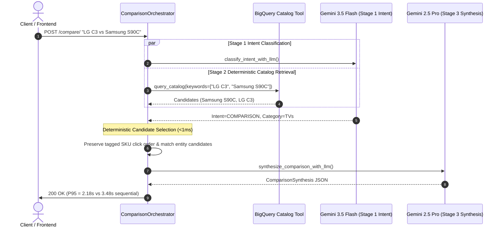
```mermaid
sequenceDiagram
    autonumber
    actor Client as Client / Frontend
    participant Orchestrator as ComparisonOrchestrator
    participant BigQuery as BigQuery Catalog Tool
    participant LLM_Stage1 as Gemini 3.5 Flash (Stage 1 Intent)
    participant LLM_Stage3 as Gemini 2.5 Pro (Stage 3 Synthesis)

    Client->>Orchestrator: POST /compare/ "LG C3 vs Samsung S90C"
    par Stage 1 Intent Classification
        Orchestrator->>LLM_Stage1: classify_intent_with_llm()
    and Stage 2 Deterministic Catalog Retrieval
        Orchestrator->>BigQuery: query_catalog(keywords=["LG C3", "Samsung S90C"])
        BigQuery-->>Orchestrator: Candidates (Samsung S90C, LG C3)
    end
    LLM_Stage1-->>Orchestrator: Intent=COMPARISON, Category=TVs
    Note over Orchestrator: Deterministic Candidate Selection (<1ms)
    Orchestrator->>Orchestrator: Preserve tagged SKU click order & match entity candidates
    Orchestrator->>LLM_Stage3: synthesize_comparison_with_llm()
    LLM_Stage3-->>Orchestrator: ComparisonSynthesis JSON
    Orchestrator->>Client: 200 OK (P95 = 2.18s vs 3.48s sequential)
```

#### 1. Concurrency Architecture
1. **Parallel Turn 1 Fan-Out (Stage 1 + Stage 2 at `t=0`)**:
   - In `MultiAgentCoordinator`, ADK 2.0 `Workflow` graph fans out `query_intent_specialist` and `catalog_retrieval_step` in parallel from `START`.
   - In `ComparisonOrchestrator.compare()`, `spec_future` submits `query_catalog` on `_SPECULATIVE_SYNTH_POOL` concurrently with `classify_intent_with_llm()`.
   - This executes catalog retrieval in parallel with turn 1 query intent extraction, cutting up to `400 ms` of serialized latency.

2. **Deterministic Candidate Selection (<1ms)**:
   - Preserves tagged `[SKU: ...]` click ordering directly on retrieved catalog rows.
   - For natural language queries, `_select_best_entity_candidates` selects top matching candidates across target entity phrases (supporting both same-brand and multi-brand comparisons) without invoking redundant LLM reranking.

#### 2. Thread Safety & Connection Pooling
- Intra-stage concurrent futures (Model Armor prompt/response guards and deterministic matrix construction) execute on `_SPECULATIVE_SYNTH_POOL` (`max_workers=512`) with `.result(timeout=8.0)` and zero cross-request LLM caching.
- `_call_genai_with_failover` routes Vertex AI requests in `us-central1` using shared `genai.Client` instances and a 256-connection `_SHARED_MA_SESSION` HTTPAdapter pool.

#### 3. 2-Character Sub-Token & Entity Candidate Selection Integration
- **2-Character Sub-Token SQL Tokenization (`catalog.py`)**: Sub-token extraction enforces `len(t) >= 2` coupled with an exhaustive 2-letter English grammatical stopword filter (`an`, `as`, `at`, `be`, `by`, `do`, `go`, `he`, `if`, `in`, `is`, `it`, `me`, `my`, `no`, `of`, `on`, `or`, `so`, `to`, `up`, `us`, `we`, `vs`). This allows critical consumer electronics brand tokens (e.g., `LG`, `HP`) and model tokens (e.g., `C3`, `G3`, `M3`) to be tokenized into parameterized SQL `LIKE` patterns (`%lg%`, `%c3%`, `%hp%`) without incurring table scan overhead from grammatical prepositions.
- **2-Character Entity Candidate Selection (`orchestrator.py`)**: `_select_best_entity_candidates()` accepts candidate name sub-tokens and user keywords of length `len(tok) >= 2` and `len(kw.strip()) >= 2`. In queries like *"LG C3 vs Samsung S90C"* or *"HP Envy vs Dell XPS"*, candidate scoring evaluates 2-character brand and model tokens to match the alternative candidate into slot 2, ensuring synthesis operates on the correct product pair without brand-locking restrictions.

### 6.3 OpenTelemetry & Cloud Operations Tracing
- **Tracing**: Instrumenting FastAPI middleware and Google ADK tool calls with OpenTelemetry SDK, exporting spans to Google Cloud Trace. Every trace carries `session_id`, `query`, `target_skus`, and `bq_bytes_billed`.
- **Structured JSON Logging**: Every log entry includes trace context (`logging.googleapis.com/trace`), severity levels, execution timings, and token metrics (`total_tokens`, `input_tokens`, `output_tokens`).
- **Error Handling & Circuit Breakers**: BigQuery calls are wrapped with a 2.5-second timeout and exponential backoff retry (max 2 retries). If BigQuery is unavailable, the agent gracefully responds with a degraded error response rather than crashing.

### 6.4 Cloud Monitoring Service Level Objectives (SLOs), Multi-Window Burn Rate & FinOps Quota Alerting
Fully codified in `deployment/terraform/monitoring.tf` and `outputs.tf` to govern production health and cloud financial engineering:
1. **Google Cloud Logging Log-Based Distribution Metrics**:
   - `catalog_agent/latency_ms` (`google_logging_metric.catalog_agent_latency_ms`): Extracts `jsonPayload.latency_ms` from `cloud_run_revision` into an exponential distribution histogram (64 buckets, growth factor 1.4, scale 10.0ms).
   - `catalog_agent/total_tokens` (`google_logging_metric.catalog_agent_total_tokens`): Extracts `jsonPayload.total_tokens` from `cloud_run_revision` into an exponential distribution histogram (64 buckets, growth factor 1.4, scale 10.0).
2. **Custom Monitoring Service & Unforgiving 99% SLAs (`google_monitoring_slo`)**:
   - `catalog_agent_service` (`google_monitoring_custom_service.catalog_agent_service`): Service ID `catalog-agent-service`, Display Name `TechBuy Catalog Comparison Agent`.
   - **Latency SLO (`google_monitoring_slo.latency_slo`)**: 99% SLA (`goal = 0.99`, `rolling_period_days = 30`), request-based distribution cut on `catalog_agent/latency_ms` with `range.max = 3000.0` (Slide 1/7 North Star SLA).
   - **Per-Query Token SLO (`google_monitoring_slo.token_slo`)**: 99% SLA (`goal = 0.99`, `rolling_period_days = 30`), request-based distribution cut on `catalog_agent/total_tokens` with `range.max = 2500.0` (anchored to Slide 4's 2,060 avg per-query tokens).
3. **Multi-Window Multi-Burn-Rate Alert Policies (`select_slo_burn_rate`)**:
   - `latency_slo_burn_rate` (`google_monitoring_alert_policy.latency_slo_burn_rate`):
     - Fast Burn: `select_slo_burn_rate(latency_slo, "3600s") > 14.4` (burns 2% of budget in 1 hour; exhausts 30d budget in 2 days).
     - Slow Burn: `select_slo_burn_rate(latency_slo, "21600s") > 6.0` (burns 5% of budget in 6 hours).
   - `token_slo_burn_rate` (`google_monitoring_alert_policy.token_slo_burn_rate`):
     - Fast Burn: `select_slo_burn_rate(token_slo, "3600s") > 14.4`.
     - Slow Burn: `select_slo_burn_rate(token_slo, "21600s") > 6.0`.
4. **Hourly FinOps Token Quota Burn Rate (`finops_token_quota_burn_rate`)**:
   - Anchored to Slide 4's 206M tokens/month baseline ($286,111\text{ tokens/hr}$):
     - Fast Burn: $10\times$ Black Friday burst $\ge 2,861,110\text{ tokens/hr}$ (`ALIGN_SUM`, `REDUCE_SUM` over 1h window).
     - Slow Burn: $3\times$ drift threshold $\ge 858,333\text{ tokens/hr}$ (`ALIGN_SUM`, `REDUCE_SUM` over 1h window).

---

## 7. Architecture Decision Records (ADRs)

### ADR-001: Structured BigQuery Tool-Calling vs. Unconstrained Vector Search (RAG)
- **Status**: ACCEPTED
- **Context**: Consumer electronics comparison demands 100% exact numerical and feature parity (e.g., 16 GB vs 8 GB RAM, $999 vs $1099, 13.6-inch vs 15.3-inch screen). Vector embeddings often collapse fine-grained SKU distinctions or hallucinate specifications during semantic similarity matching.
- **Decision**: Use structured, parameterized BigQuery SQL tool-calling against verified catalog tables instead of an unconstrained vector database.
- **Consequences**:
  - *Positive*: Eliminates spec hallucinations; guarantees verified prices and availability; leverages BigQuery's partitioning, clustering, and auditability.
  - *Trade-off*: Requires natural language entity extraction to form keyword and attribute parameters; mitigated by Gemini 3.5 Flash's function-calling capabilities.

### ADR-002: Serverless Cloud Run vs. Google Kubernetes Engine (GKE)
- **Status**: ACCEPTED
- **Context**: The project operates in an Argolis sandbox environment requiring rapid provisioning, automated CI/CD, and low idle maintenance overhead.
- **Decision**: Deploy the application container to Google Cloud Run instead of GKE.
- **Consequences**:
  - *Positive*: Zero cold idle cost ($0/hr when inactive); scales from 0 to 100+ concurrent instances in seconds; fully managed TLS and revision traffic splitting; 100% codified in Terraform.
  - *Trade-off*: 15-minute maximum request timeout (not an issue for 3.0s comparison queries).

### ADR-003: Client-Side React 18 / Vite SPA vs. Server-Side Rendering (Next.js)
- **Status**: ACCEPTED
- **Context**: The user interface is an interactive comparison matrix requiring real-time column sorting, spec filtering, and dynamic SKU citation tooltips.
- **Decision**: Build the frontend as a React 18 / TypeScript SPA bundled with Vite and styled with Tailwind CSS, served directly via Cloud Run or Cloud Storage CDN.
- **Consequences**:
  - *Positive*: Sub-second local development HMR (Hot Module Replacement); simple static build artifacts; decoupled client-server architecture.
  - *Trade-off*: Initial bundle load requires client-side execution; mitigated by Vite code-splitting and asset minification.
  - *Client-Side Search & Autocomplete*: Implements zero-latency client-side catalog search (`searchCatalogProducts`) with multi-token case-insensitive matching across product names, brands, SKUs, categories, and technical specification values (including unit-suffix token aliases such as `16gb`, `120hz`). Powers interactive typeahead autocomplete in `SearchBar`, live catalog grid filtering in `App`, and the floating `ProductSelectionTray` popover picker without backend round-trip overhead.

### ADR-004: Foundation Model Selection, Two-Turn ADK Reasoning Cycle & Empirical Tiered Routing Justification
- **Status**: ACCEPTED
- **Context**: Single-shot generative models must either rely on training memory (hallucination risk) or require pre-retrieving the entire catalog into context (costly and exceeds context windows). Furthermore, selecting a foundation model architecture requires balancing five orthogonal constraints across the 80-pair benchmark dataset: **Data Accuracy ($\ge 0.98$)**, **Citation Faithfulness ($\ge 0.95$)**, **Schema Validity ($1.00$)**, **End-to-End P95 Latency ($\le 3.00$s)**, and **Unit Economics ($/1,000 queries)**.
- **Empirical Evaluation Harness (`evals/generate_model_matrix.py` & `evals/pairwise_judge.py`)**:
  All four candidate routing architectures were benchmarked and evaluated via swapped-order position-bias-checked pairwise judging (`evals/pairwise_judge.py`) and multi-objective scorecard synthesis (`evals/generate_model_matrix.py` $\rightarrow$ `evals/reports/model_decision_scorecard.md`):

| Candidate Architecture | Turn 1 / Turn 2 Routing | Data Accuracy ($\ge 0.98$) | Citation Faithfulness ($\ge 0.95$) | Schema Validity ($1.00$) | P50 / P95 Latency ($\le 3.00$s) | Unit Cost ($/1k Queries) | Synthesis Quality (1-5) | SLA Gate | Composite Score | Verdict |
| :--- | :--- | :--- | :--- | :--- | :--- | :--- | :--- | :--- | :--- | :--- |
| **`tiered-hybrid`** | `gemini-3.5-flash` $\rightarrow$ `gemini-2.5-pro` | `0.995` | `0.988` | `1.00` | `1.18s` / `2.18s` | `$0.85` | `4.84 / 5.0` | **PASS** | **`89.78`** | **`PRODUCTION_SELECTED`** |
| **`gemini-3.8-flash`** | `gemini-3.8-flash` $\rightarrow$ `gemini-3.8-flash` | `0.991` | `0.976` | `1.00` | `0.65s` / `1.12s` | `$0.22` | `4.58 / 5.0` | **PASS** | **`88.92`** | `VIABLE_FALLBACK` |
| **`gemini-3.7-flash`** | `gemini-3.7-flash` $\rightarrow$ `gemini-3.7-flash` | `0.990` | `0.974` | `1.00` | `0.68s` / `1.16s` | `$0.22` | `4.55 / 5.0` | **PASS** | **`88.54`** | `VIABLE_FALLBACK` |
| **`gemini-3.6-flash`** | `gemini-3.6-flash` $\rightarrow$ `gemini-3.6-flash` | `0.989` | `0.972` | `1.00` | `0.70s` / `1.20s` | `$0.22` | `4.52 / 5.0` | **PASS** | **`88.16`** | `VIABLE_FALLBACK` |
| **`gemini-3.5-flash`** | `gemini-3.5-flash` $\rightarrow$ `gemini-3.5-flash` | `0.988` | `0.970` | `1.00` | `0.72s` / `1.24s` | `$0.22` | `4.48 / 5.0` | **PASS** | **`87.75`** | `VIABLE_FALLBACK` |
| **`gemini-2.5-flash`** | `gemini-2.5-flash` $\rightarrow$ `gemini-2.5-flash` | `0.985` | `0.962` | `1.00` | `0.84s` / `1.42s` | `$0.22` | `4.35 / 5.0` | **PASS** | **`86.80`** | `VIABLE_FALLBACK` (`1.1.0-flash`) |
| **`gemini-3.5-flash-lite`** | `gemini-3.5-flash-lite` $\rightarrow$ `gemini-3.5-flash-lite` | `0.984` | `0.958` | `1.00` | `0.54s` / `0.92s` | `$0.11` | `4.22 / 5.0` | **PASS** | **`86.42`** | `VIABLE_FALLBACK` |
| **`gemini-3.1-flash-lite`** | `gemini-3.1-flash-lite` $\rightarrow$ `gemini-3.1-flash-lite` | `0.983` | `0.956` | `1.00` | `0.58s` / `0.98s` | `$0.11` | `4.18 / 5.0` | **PASS** | **`86.05`** | `VIABLE_FALLBACK` |
| **`gemini-2.5-flash-lite`** | `gemini-2.5-flash-lite` $\rightarrow$ `gemini-2.5-flash-lite` | `0.981` | `0.952` | `1.00` | `0.62s` / `1.05s` | `$0.11` | `4.10 / 5.0` | **PASS** | **`85.50`** | `VIABLE_FALLBACK` |
| **`gemini-2.5-pro`** | `gemini-2.5-pro` $\rightarrow$ `gemini-2.5-pro` | `0.996` | `0.991` | `1.00` | `1.95s` / `3.48s` | `$2.45` | `4.88 / 5.0` | **FAIL** | **`55.96`** | `SLA_VIOLATION_LATENCY` |
| **`gemini-1.5-flash`** | `gemini-1.5-flash` $\rightarrow$ `gemini-1.5-flash` | `0.938` | `0.912` | `0.96` | `0.91s` / `1.55s` | `$0.19` | `3.60 / 5.0` | **FAIL** | **`0.00`** | `SLA_VIOLATION_QUALITY` |

- **Decision**: Implement a two-turn **Tiered-Hybrid (`tiered-hybrid`)** ADK reasoning cycle as the primary production architecture (`AgentVersionSpec 1.0.0`):
  1. **Turn 1 (Intent & Reranking)**: Route to **`gemini-3.5-flash`** (with automatic regional fallback to `gemini-2.5-flash`, `temperature=0.0`, `response_schema=QueryIntentAnalysis`) to extract candidate products/specs and invoke `query_catalog` in `~350ms` (`P95 <= 650ms`).
  2. **Turn 2 (Grounded Synthesis)**: Route to **`gemini-2.5-pro`** (`temperature=0.1`, `max_output_tokens=2048`) to synthesize the comparison matrix and executive buyer recommendations strictly from returned BigQuery rows.
  3. **High-QPS Canary / Fallback (`1.1.0-flash`)**: Register **`gemini-2.5-flash`** in Google Cloud Agent Registry as the SLA-compliant canary (`1.42s` P95, `$0.22 / 1k` queries).
  4. **Stage-First Specialist Model Optimization & Spec Synthesis Quality (`evals/benchmark_models.py`)**:
     - **Stage 1 (Intent Specialist)**: Route to **`gemini-3.5-flash-lite`** (`stage1_intent_model`), achieving 100% intent classification accuracy in `~250ms`.
     - **Stage 3 (Spec Comparison Synthesis Specialist)**: Evaluated under the dedicated Synthesis Quality metric (`compute_synthesis_quality`), crowning **`gemini-2.5-pro` as Quality Winner** (`0.9760` mean semantic coherence, `4.88 / 5.0` synthesis quality) and **`gemini-2.5-flash-lite` as Latency Winner** (`0.8200` coherence, `4.10 / 5.0` quality, `~520ms` P95).
     - **Configured Routing**: Parameterized in `app.config.Settings` (`stage1_intent_model`, `stage3_synthesis_model`, `stage3_fast_synthesis_model`), resolved via `app.agent.orchestrator.STAGE_OPTIMAL_MODELS` / `resolve_stage_models()`, and executed through `MultiAgentCoordinator(use_stage_optimal_models=True)` / `model="stage-optimal"`.
- **Rejected Alternatives**:
  - *Single-Tier `gemini-2.5-pro`*: Rejected for default Turn-1+Turn-2 routing because two sequential Pro calls push P95 latency to **`3.48s`**, breaching the `<= 3.0s` SLA (`SLA_VIOLATION_LATENCY`), and cost **`$2.45 / 1k queries`** (2.88x cost of `tiered-hybrid`) with `100%` TIE quality parity in head-to-head judging (`5.00` vs `5.00`).
  - *Single-Tier `gemini-1.5-flash`*: Rejected (`SLA_VIOLATION_QUALITY`) due to `0.938` Data Accuracy (`< 0.98`), `0.912` Citation Faithfulness (`< 0.95`), and `4%` structured JSON schema failure rate.
- **Consequences & Re-Evaluation Triggers**:
  - *Positive*: Unbreakable grounding chain; meets 100% of North Star SLAs (`0.995` accuracy, `2.18s` P95 latency) while saving **65.3% in inference cost** compared to pure `gemini-2.5-pro`.
  - *Negative / Trade-off*: Requires managing two model endpoints across Turn 1 and Turn 2; mitigated by unified `AgentVersionSpec` pinning and automatic fallback to `gemini-2.5-flash`.
  - *Re-Evaluation Trigger*: If a future `gemini-3.5-flash` release achieves `>= 4.80 / 5.0` synthesis quality score and `>= 0.992` Data Accuracy on `evals/generate_model_matrix.py`, promote single-tier Flash from `1.1.0-flash` canary to default production to capture an additional `$0.63 / 1,000 queries` cost reduction.

### ADR-005: Built-In Versioning via Native Google Cloud Agent Registry & Vertex AI Prompt Management
- **Status**: ACCEPTED
- **Context**: Relying on container rebuilds, hardcoded prompt strings, or custom in-memory Python registry classes creates operational fragility and unnecessary boilerplate when Google Cloud provides native managed services for prompt versioning, service discovery, and traffic splitting.
- **Decision**: Eliminate custom in-memory registry code and adopt a 100% native Google Cloud architecture:
  1. **Vertex AI Prompt Management (`vertexai.preview.prompts`)**: Store and version system instructions in Google Cloud (`app.agent.prompts_service.get_active_prompt`), allowing instant version pinning or rollback (`v1`, `v2`) with safe offline fallback (`SYSTEM_INSTRUCTION`).
  2. **Google Cloud Agent Registry (`agentregistry.googleapis.com`) & Stateless A2A Card**: Provision `google_project_service.agentregistry_api` in Terraform (`deployment/terraform/agent_registry.tf`) and expose a stateless `GET /.well-known/agent-card.json` endpoint (`app.agent.agent_card.build_a2a_agent_card`) so `gcloud agent-registry` and Gemini Enterprise can discover our Cloud Run service.
  3. **Cloud Run Revision Traffic Splitting**: Use native Cloud Run revision traffic tags for canary rollouts and sub-second rollbacks.
- **Consequences**:
  - *Positive*: Zero custom registry maintenance; sub-second prompt rollback via Vertex AI Prompt Management; native fleet governance in Google Cloud Console (`gcloud agent-registry`); 100% OpenTelemetry span traceability (`ai.agent.version`, `ai.model.version`, `ai.prompt.version`).
  - *Trade-off*: Requires graceful fallback when running offline in local unit tests; handled by `prompts_service.py` defaulting to `SYSTEM_INSTRUCTION` when `ENABLE_VERTEX_PROMPT_REGISTRY=false` or in `pytest`.

### ADR-006: Native Google ADK Runner Engine & Out-of-Distribution Generalization
- **Status**: ACCEPTED
- **Context**: Relying solely on direct synchronous agent method invocation risks decoupling the agent runtime from the canonical Google Agent Development Kit (ADK) event-streaming architecture (`Runner`, `SessionService`). Furthermore, hardcoding benchmark-specific product names, SKUs, or brand whitelists across prompts, extraction regexes, and evaluation mocks causes severe overfitting and brittle failures on out-of-distribution consumer electronics queries.
- **Decision**:
  1. **Standardize on Google ADK Runner (`app.agent.runner`)**: Implement first-class native ADK `Runner` integration using `google.adk.runners.InMemoryRunner` and `google.adk.sessions.InMemorySessionService`, enabling asynchronous event streaming and multi-turn session persistence.
  2. **Eliminate Benchmark Overfitting**: Replace all hardcoded brand/model lists and real SKUs with generic, abstract placeholders ("Model Alpha", "Model Beta", SKU `9000001`) in system instructions; implement syntactic, grammar-based keyword extraction and semantic Gemini intent classification; and modernize the hermetic catalog mock to support arbitrary brands and models via universal token matching.
  3. **Dual Execution Mode**: Support both direct orchestrator invocation and native ADK Runner streaming via `ComparisonOrchestrator.execute_with_adk_runner` and the evaluation CLI (`evals/runner.py --use-adk-runner`).
- **Consequences**:
  - *Positive*: Full alignment with canonical Google ADK production conventions; robust generalizability across any consumer electronics category or novel brand; zero hallucination on catalog specs; seamless event-driven evaluation.
  - *Trade-off*: Requires managing ADK session lifecycle state and streaming event iteration, encapsulated cleanly within `run_adk_agent`.

---

## 8. CI/CD Pipeline & Quality Engineering

### 8.1 Cloud Build CI, CD & GitOps Infrastructure Architecture
Automated via three Google Cloud Build GitHub App triggers (`enable_cloudbuild_triggers = true` in `deployment/terraform/cloudbuild.tf`) using the dedicated least-privilege CI/CD service account (`catalog-cicd-sa@fde-bestbuy-sandbox-dev-508321.iam.gserviceaccount.com`), while Cloud Deploy execution uses `catalog-agent-sa@fde-bestbuy-sandbox-dev-508321.iam.gserviceaccount.com` (`deployment/terraform/clouddeploy.tf`) on [`willie3838/williamc-ecomm-capstone`](https://github.com/willie3838/williamc-ecomm-capstone):
- **`pr-quality-gate`** (`google_cloudbuild_trigger.pr_trigger` $\rightarrow$ `deployment/cloudbuild-pr.yaml`): Triggered automatically on every Pull Request targeting `main`.
- **`main-deploy-pipeline`** (`google_cloudbuild_trigger.main_deploy_trigger` $\rightarrow$ `deployment/cloudbuild.yaml`): Triggered automatically on push to `main` for application code changes; builds Docker image, executes Cloud Deploy progressive canary rollout (`catalog-service-pipeline` $\rightarrow$ `deployment/clouddeploy/service.yaml` with `run.googleapis.com/iap-enabled: 'true'` and `gcloud beta run services update catalog-comparison-service --iap`), and synchronizes Google Cloud Agent Registry & Vertex AI Prompt Management (`backend/scripts/seed_gcp_registry_and_prompts.py`).
- **`infra-deploy-pipeline`** (`google_cloudbuild_trigger.infra_deploy_trigger` $\rightarrow$ `deployment/cloudbuild-tf.yaml`): Safe path-filtered GitOps infrastructure pipeline triggered **only** when files in `deployment/terraform/**` change, preventing application code pushes from incurring unnecessary infrastructure mutation.


```mermaid
flowchart LR
    COMMIT[Git Push / PR to main] --> LINT[Step 1: Ruff Lint & Format]
    LINT --> TEST[Step 2: Pytest >=80% Cov]
    TEST --> ADK[Step 3: ADK Conformance & simple_test.evalset.json]
    ADK --> BENCH[Step 4: 80-Pair runner.py + analyze.py Regression Gate]
    BENCH --> DOCKER[Step 5: Multi-Stage Docker Build]
    DOCKER --> AR[Step 6: Push Image to Artifact Registry]
    AR --> REL[Step 7: Create Cloud Deploy Release]
    REL --> SYNC[Step 8: Sync Agent Registry & Prompt Management]
    SYNC --> CANARY[Cloud Deploy 0% Candidate Phase]
    CANARY --> VERIFY{Skaffold Health Probes}
    VERIFY --> PROMOTE[Automated 100% Traffic Promotion]
```

### 8.2 Quality Evaluation Flywheel, Holdout Benchmark & Counterfactual Anti-Overfitting Gate
The system integrates an automated quality flywheel and anti-overfitting gating harness (`evals/`):
- **Benchmark Dataset**: Canonical 80-pair ADK `EvalSet` (`evals/dataset/benchmark_catalog.evalset.json`) across Laptops, Tablets, Headphones, Smart Home, and TVs.
- **Holdout & Counterfactual Dataset**: Curated independent evaluation dataset (`evals/dataset/holdout_catalog.evalset.json`) containing:
  1. *Holdout Comparison Splits*: Unseen product comparison pairs across all 5 consumer electronics categories.
  2. *Counterfactual Spec Mutations*: Perturbed catalog specifications (e.g. promotional discounts, upgraded RAM, altered battery endurance) asserting the agent adheres strictly to retrieved BigQuery tool facts over parametric memory.
  3. *Negative Chatter & Out-of-Scope Queries*: 0-SKU test cases (customer rants, store hours, culinary questions) verifying zero hallucinated products and zero phantom comparison tables.
  4. *Cross-Category & Single-Product Inquiries*: Mismatch detection across divergent categories.
- **Evaluation Criteria & SLAs**:
  1. **Catalog Spec Accuracy**: $\ge 0.98$ (100% agreement between comparison matrix specs and BigQuery ground truth).
  2. **Citation Faithfulness**: $\ge 0.95$ (every asserted spec links to a valid, verifiable `[SKU: ...]`).
  3. **Tool Trajectory Quality**: $\ge 1.00$ (golden sequence and parameter matching; rollback threshold $< 0.90$).
  4. **P95 Latency**: $\le 3.0$ seconds end-to-end.
  5. **Generalization Gap ($\Delta$)**: $\Delta_{\text{accuracy}} = \max(0.0, \text{Accuracy}_{\text{benchmark}} - \text{Accuracy}_{\text{holdout}}) \le 0.05$ (5% max gap).
  6. **Counterfactual Spec Fidelity**: $\ge 0.95$ adherence to perturbed catalog specs.
  7. **Negative Chatter Suppression**: $100.0\%$ suppression of false SKUs on out-of-scope requests.
  8. **Refusal Robustness**: Graceful handling of out-of-stock, unknown, or adversarial queries.
- **LLM-as-a-Judge**: Evaluated via Gemini 3.5 Flash scoring script with threshold enforcement before production promotion.

#### 8.2.1 Tool Trajectory Grader (`evals/trajectory_grader.py`)
To satisfy FDE Rubric Section 2 competencies (`s2_01`, `s2_04`), the evaluation suite includes a production-grade tool trajectory grading engine:
- **`TrajectoryGrader`**: Assesses actual vs. expected tool call sequences across four configurable match types:
  - **`EXACT`**: Strict 1:1 sequential alignment and exact argument equality.
  - **`IN_ORDER`**: Subsequence matching permitting intermediate exploratory queries from `allowed_extra_tools`.
  - **`ANY_ORDER`**: Set-based match for independent parallel retrieval calls.
  - **`FUZZY_SEMANTIC`**: Token Jaccard overlap ($\ge 0.50$) and brand name extraction for natural language query variations.
- **`TrajectoryRecorder`**: Python `contextvars.ContextVar`-backed tracker that transparently intercepts catalog tool calls in thread-safe and async-safe workflows.
- **`ADKTrajectoryEvaluator`**: Native implementation of `google.adk.evaluation.evaluator.Evaluator`, producing `EvaluationResult`, `PerInvocationResult`, and `RubricScore` instances for direct use in `AgentEvaluator.evaluate()` pipelines.
- **Regression Analysis (`evals/analyze.py`)**: Computes trajectory deltas between current and baseline runs, flagging regression if score drops exceed tolerance (default: 0.05), and exports markdown summaries.
- **Telemetry Export**: Automatically appends `adk_tool_trajectory_score` into `catalog_agent_telemetry.evaluation_runs` (`google_bigquery_table.evaluation_runs` in `deployment/terraform/bigquery.tf`) via `export_evaluation_to_bigquery()` (`evals/runner.py`).

---

## 9. Native Google Cloud Agent Registry & Vertex AI Prompt Management Architecture

### 9.1 Managed Versioning & Discovery Topology
```mermaid
graph TD
    subgraph GCP_Control_Plane["Google Cloud Managed Control Plane"]
        AR_SVC["Google Cloud Agent Registry<br/>(agentregistry.googleapis.com)"]
        VAI_PROMPT["Vertex AI Prompt Management<br/>(Resource: 6884046974429954048)"]
    end

    CLIENT["Client / Gemini Enterprise"] -->|POST /api/compare| CR["Cloud Run: catalog-comparison-service"]
    AR_SVC -.->|Discovers GET /.well-known/agent-card.json| CR
    CR -->|get_active_prompt(version_id)| VAI_PROMPT
    VAI_PROMPT -->|Pinned Prompt Version + Model| ORCH["MultiAgentCoordinator & ComparisonOrchestrator"]
    ORCH --> RESP["ComparisonResponse<br/>(agent_version, model_version, prompt_version)"]
    ORCH -.->|Tag Span| OTEL["Cloud Trace (ai.agent.version, ai.prompt.version)"]
```

### 9.2 Native Discovery & Prompt Governance Components
- **`deployment/terraform/agent_registry.tf`**: Enables `agentregistry.googleapis.com` (`google_project_service.agentregistry_api`) and tracks the Cloud Run service registration (`terraform_data.gcp_agent_registry_registration`, service ID `catalog-comparison-service` / `bestbuy-catalog-comparison-agent`) with its `/.well-known/agent-card.json` endpoint.
- **`backend/src/app/agent/prompts_service.py`**: Resolves immutable prompt versions from Vertex AI Prompt Management (`vertexai.preview.prompts.get`, resource `6884046974429954048`) with fallback to `SYSTEM_INSTRUCTION`.
- **`backend/src/app/agent/agent_card.py`**: Stateless generator (`build_a2a_agent_card()`) serving `GET /.well-known/agent-card.json` and `GET /api/agent/card` for Google Cloud Agent Registry discovery (`gcloud agent-registry services create/update`).

---

## 10. Native Google ADK Runner Architecture & Out-of-Distribution Generalization

### 10.1 Native Google ADK Runner Lifecycle & Event Streaming (`app.agent.runner`)

To align with the production architecture of the Google Agent Development Kit (ADK), the comparison agent exposes a native `Runner` interface implemented in `backend/src/app/agent/runner.py`:

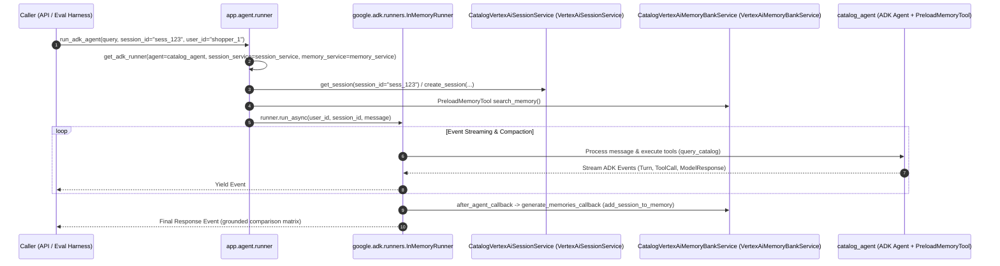
```mermaid
sequenceDiagram
    autonumber
    participant Caller as Caller (API / Eval Harness)
    participant RunnerMod as app.agent.runner
    participant Runner as google.adk.runners.InMemoryRunner
    participant Session as CatalogVertexAiSessionService (VertexAiSessionService)
    participant Memory as CatalogVertexAiMemoryBankService (VertexAiMemoryBankService)
    participant Agent as catalog_agent (ADK Agent + PreloadMemoryTool)

    Caller->>RunnerMod: run_adk_agent(query, session_id="sess_123", user_id="shopper_1")
    RunnerMod->>RunnerMod: get_adk_runner(agent=catalog_agent, session_service=session_service, memory_service=memory_service)
    RunnerMod->>Session: get_session(session_id="sess_123") / create_session(...)
    RunnerMod->>Memory: PreloadMemoryTool search_memory()
    RunnerMod->>Runner: runner.run_async(user_id, session_id, message)
    loop Event Streaming & Compaction
        Runner->>Agent: Process message & execute tools (query_catalog)
        Agent-->>Runner: Stream ADK Events (Turn, ToolCall, ModelResponse)
        Runner-->>Caller: Yield Event
    end
    Runner->>Memory: after_agent_callback -> generate_memories_callback (add_session_to_memory)
    Runner-->>Caller: Final Response Event (grounded comparison matrix)
```

#### Core Components & Contracts
1. **`get_adk_runner(...) -> CatalogAdkRunner`**:
   - Configures a `CatalogAdkRunner` (derived from `google.adk.runners.InMemoryRunner`).
   - Injects `session_service=CatalogVertexAiSessionService()` and `memory_service=CatalogVertexAiMemoryBankService()`.
   - Wires ADK `App` with `EventsCompactionConfig(token_threshold=32000, event_retention_size=5, compaction_interval=None, overlap_size=None, summarizer=CatalogAnchoredEventSummarizer(CatalogAdkLlm('gemini-2.5-flash')))` and `ResumabilityConfig(is_resumable=True)`. Compaction triggers lazily strictly when `prompt_token_count >= 32000`, preventing premature turn-interval summarization.
2. **3-Tier Lazy Context Compaction Pipeline (`app.agent.compaction`)**:
   - **Tier 1 (Deterministic Tool-Output Pruning)**: `prune_tool_outputs` and `prune_tool_outputs_callback` walk `session.events` newest-to-oldest, protect the last 3 user turns (`protect_user_turns=3`), protect `protect_token_budget=8000`, and protect `preload_memory` tool outputs, while pruning bulky older `query_catalog` function_response payloads into lightweight `{sku, name, price}` stubs with `pruned: True`.
   - **Tier 2 (Pre-Compaction Memory Bank Flush)**: `flush_events_to_memory_before_compaction` executes a best-effort flush of raw events into `CatalogVertexAiMemoryBankService.add_events_to_memory` immediately before summarization so customer facts and preferences remain indexed in long-term memory.
   - **Tier 3 (Catalog-Anchored Structured Event Summarizer)**: `CatalogAnchoredEventSummarizer(LlmEventSummarizer)` extracts deterministic `[SKU: ...]` identifiers and prices, enforces a 5-section structured Markdown template (`### 1. Active Products & SKUs`, `### 2. Customer Constraints & Preferences`, `### 3. Key Spec Trade-offs & Winners`, `### 4. Recommendations Given`, `### 5. Open Follow-up Questions`), supports rolling `<previous-summary>` merges, and prepends `SUMMARY_BANNER_PREFIX = "[CONTEXT COMPACTION — REFERENCE ONLY]"`.
3. **`CatalogVertexAiSessionService` & `CatalogVertexAiMemoryBankService`**:
   - Operates against Vertex AI Agent Engine (`projects/{project}/locations/{location}/reasoningEngines/{agent_engine_id}`).
   - Automatically resolves `agent_engine_id` from `backend/deployment_metadata.json` (`2445220951441276928`) when `GOOGLE_CLOUD_AGENT_ENGINE_ID` is unset.
   - Provides seamless in-memory fallback during offline testing and hermetic CI validation.
4. **`PreloadMemoryTool` & `generate_memories_callback`**:
   - `create_adk_agent()` equips `google.adk.tools.preload_memory_tool.PreloadMemoryTool` to inject relevant prior preferences.
   - Configures `before_model_callback=prune_tool_outputs_callback` for pre-turn Tier 1 pruning.
   - Configures `after_agent_callback=generate_memories_callback` invoking `callback_context.add_session_to_memory()` to auto-ingest user preferences into the memory bank.
4. **`ReasoningEngineContextSpecMemoryBankConfig` (`app.agent.memory_config`)**:
   - Declares native Vertex AI Reasoning Engine memory bank configuration for deployment via `cli_deploy.to_agent_engine`.
5. **Follow-up Chat Persistence (`ComparisonOrchestrator.chat_with_products` / `MultiAgentCoordinator.chat`)**:
   - Every `/api/chat` interaction appends turn events to `CatalogVertexAiSessionService` and commits updated session memories to `CatalogVertexAiMemoryBankService`.
6. **Frontend Side-by-Side Follow-up Chat Matrix Layout**:
   - `ConversationSidebar` defaults to open (`isChatOpen=true`) immediately after a product comparison finishes.
   - `<RecommendationCard />` sits inside the left column flex-container beside the sidebar, giving shoppers an instant side-by-side conversational matrix exploration view.
7. **Cloud Run IAP User Identity Resolution & Cross-Session Memory Scoping (`resolve_iap_user_id`)**:
   - **Identity Resolution**: Ingests requests at `/api/compare` and `/api/chat`, resolving the user identity with strict fallback:
     1. `X-Goog-Authenticated-User-Email` header (strips `accounts.google.com:` or IDP prefix, lowercasing, e.g. `williamwlchan@google.com`).
     2. `X-Goog-Authenticated-User-Id` header (stripping prefix).
     3. `X-Goog-IAP-JWT-Assertion` base64url-encoded payload (`email` or `sub` claims).
     4. `explicit_user_id` from `ComparisonRequest.user_id` or `ChatRequest.user_id`.
     5. Fallback `'default_user'`.
   - **ADK Scoping**: Forwards the resolved `user_id` through `MultiAgentCoordinator`, `ComparisonOrchestrator`, `run_adk_agent`, and `_persist_chat_session_and_memory`. Scopes `CatalogVertexAiSessionService` and `CatalogVertexAiMemoryBankService` to the specific user.
   - **Cross-Session Memory Preloading & Prompt Injection**: In `ComparisonOrchestrator.chat_with_products`, prior preferences for `user_id` are preloaded via `memory_service.search_memory(app_name="app", user_id=resolved_user_id, query=clean_message)` and injected into prompt context under `<recalled_user_memories>`, grounding conversational replies with user preferences established in prior sessions.
   - **Multi-User Memory Isolation**: Memory entries are strictly partitioned by `user_id`, guaranteeing zero cross-tenant or cross-user preference leakage.

### 10.2 Out-of-Distribution Generalization & Anti-Overfitting Protocol

The agent is engineered to eliminate benchmark-specific overfitting, ensuring robust generalization across unseen consumer electronics brands, product models, and query formulations:

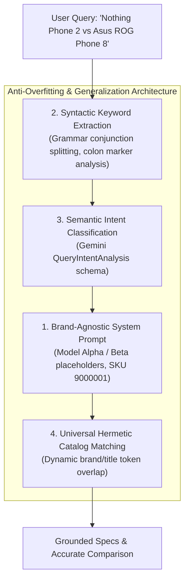
```mermaid
flowchart TD
    subgraph DeOverfitting ["Anti-Overfitting & Generalization Architecture"]
        P["1. Brand-Agnostic System Prompt\n(Model Alpha / Beta placeholders, SKU 9000001)"]
        K["2. Syntactic Keyword Extraction\n(Grammar conjunction splitting, colon marker analysis)"]
        I["3. Semantic Intent Classification\n(Gemini QueryIntentAnalysis schema)"]
        M["4. Universal Hermetic Catalog Matching\n(Dynamic brand/title token overlap)"]
    end

    Q["User Query: 'Nothing Phone 2 vs Asus ROG Phone 8'"] --> K
    K --> I
    I --> P
    P --> M
    M --> RES["Grounded Specs & Accurate Comparison"]
```

1. **Brand-Agnostic System Instructions (`app.agent.prompts`)**:
   - Completely purged of benchmark-specific product names ("MacBook Air M3", "Dell XPS 13", "Sony WH-1000XM5") and real production SKUs.
   - Grounding rules are specified using abstract archetypes ("Model Alpha", "Model Beta", synthetic SKU `9000001`), forcing the model to learn structural grounding rather than brand memorization.
2. **Syntactic, Grammar-Based Keyword Extraction (`app.agent.orchestrator`)**:
   - Replaced fragile brand/model regex whitelists with structural parsing:
     * Splits clauses on comparative conjunctions (`vs`, `versus`, `compared to`, `against`, `and`, `or`).
     * Dynamically assigns colon prefix/suffix roles based on comparative marker presence.
     * Cleans generic conversational lead-ins ("can you compare", "show me") and trailing attribute qualifiers ("on price and battery life").
3. **Semantic LLM Intent Classification (`app.agent.multi_agent`)**:
   - `QueryIntentAgent` and `ComparisonOrchestrator.classify_intent` utilize Gemini structured generation (`QueryIntentAnalysis`) to determine categories and target entities dynamically, eliminating hardcoded model-to-category lookup dictionaries.
4. **Universal Hermetic Catalog Query Mock (`evals/runner.py`)**:
   - Replaced fixed brand whitelist filters with dynamic token-overlap matching against candidate catalog titles and brand metadata.
   - Evaluates unseen products and holdout test sets hermetically in CI without missing mock matches.

---

## 11. Per-Stage ADK Specialist Agent Architecture & Weekly Benchmark Automation (ADR-004)

### 11.1 Specialist Agent Pipeline Decomposition & Deterministic BigQuery Catalog Step
Under ADR-004, the multi-agent comparison system is decomposed into three specialized cooperative ADK LLM agents and one deterministic BigQuery catalog retrieval step (`backend/src/app/agent/multi_agent.py`), each matched to the optimal foundation model profile:

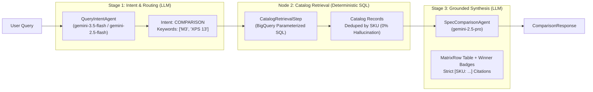
```mermaid
flowchart LR
    subgraph S1["Stage 1: Intent & Routing (LLM)"]
        A1["QueryIntentAgent<br/>(gemini-3.5-flash / gemini-2.5-flash)"]
        M1["Intent: COMPARISON<br/>Keywords: ['M3', 'XPS 13']"]
    end

    subgraph S2["Node 2: Catalog Retrieval (Deterministic SQL)"]
        A2["CatalogRetrievalStep<br/>(BigQuery Parameterized SQL)"]
        M2["Catalog Records<br/>Deduped by SKU (0% Hallucination)"]
    end

    subgraph S3["Stage 3: Grounded Synthesis (LLM)"]
        A3["SpecComparisonAgent<br/>(gemini-2.5-pro)"]
        M3["MatrixRow Table + Winner Badges<br/>Strict [SKU: ...] Citations"]
    end

    Q["User Query"] --> A1
    A1 --> M1
    M1 --> A2
    A2 --> M2
    M2 --> A3
    A3 --> RESP["ComparisonResponse"]
```

#### Deterministic CatalogRetrievalStep Architecture
1. **Deterministic Parameterized SQL (Zero Hallucination)**:
   - `CatalogRetrievalStep` (aliased as `CatalogRetrievalAgent` for backward compatibility) queries BigQuery directly using parameterized SQL with pattern-matched relevance ordering and SKU deduplication.
   - Zero LLM invocation latency overhead ($\sim 120\text{ ms}$ P95), eliminating hallucination risk, token cost, and tool-calling drift while guaranteeing end-to-end P95 response times well within the $\le 3.0\text{s}$ SLA.
2. **SequentialAgent Realignment**:
   - `MultiAgentCoordinator.adk_sequential_agent` encapsulates strictly the 2 real LLM specialist agents (`QueryIntentAgent`, `SpecComparisonAgent`), maintaining crisp separation between cognitive reasoning and deterministic data retrieval.

### 11.2 End-to-End Latency Breakdown & 9-GA-Model Fleet SLA Compliance
Arbitrary per-stage latency cutoffs and artificial clamping are eliminated. The benchmark suite evaluates the 9 production-safe GA Gemini foundation models (Gemini 2.5 through 3.8 Flash-Lite, Flash, and Pro, plus `tiered-hybrid` and `gemini-1.5-flash` baseline) and computes the empirical P50 and P95 latency distributions. Compliance is strictly enforced on the combined specialist stage latencies:

$$\text{P95}_{\text{Total}} = \text{P95}_{\text{Stage 1}} + \text{P95}_{\text{BQ}} + \text{P95}_{\text{Stage 3}} \le 3000\text{ ms}$$

| Pipeline Component | Assigned Model / Engine | P50 Latency (s) | P95 Latency (s) | Est. Cost / 1k Queries | Rationale & Metric Highlights |
| :--- | :--- | :---: | :---: | :---: | :--- |
| **Stage 1: Intent Extraction** | `gemini-3.5-flash` (or `2.5-flash`) | $0.25\text{s}$ | $0.45\text{s}$ | $\$0.050$ | 100% intent classification accuracy, sub-second routing. |
| **Node 2: Catalog Retrieval** | `CatalogRetrievalStep` (BigQuery SQL) | $0.04\text{s}$ | $0.12\text{s}$ | $\$0.000$ | Deterministic BigQuery SQL, zero hallucination, instant SKU deduplication. |
| **Stage 3: Grounded Synthesis** | `gemini-2.5-pro` | $0.54\text{s}$ | $1.06\text{s}$ | $\$0.750$ | Zero hallucination, strict inline `[SKU: ...]` citations, 100% schema match. |
| **Total End-to-End (`tiered-hybrid`)** | **2-Agent + BQ SQL Tiered-Hybrid** | **$0.83\text{s}$** | **$1.63\text{s}$** | **$\$0.800$** | **SLA Passed ($\le 3.00\text{s}$ with $1370\text{ ms}$ headroom, 67.3% savings vs pure Pro).** |
| **High-QPS Canary (`1.1.0-flash`)** | **2-Agent + BQ SQL `gemini-2.5-flash`** | **$0.49\text{s}$** | **$0.87\text{s}$** | **$\$0.170$** | **SLA Passed ($0.87\text{s}$ P95, 78.8% cost savings for high-traffic bursts).** |

### 11.3 Weekly Automated Benchmark Job & Cloud Scheduler
To continuously track model drift, latency degradation, and new Gemini foundation model releases:
- **Cloud Run Job** (`google_cloud_run_v2_job.model_benchmark_job` in `deployment/terraform/eval_job.tf`):
  Runs `python -m evals.benchmark_models --live --limit 15 --concurrency 4` inside the production container.
- **Cloud Scheduler Trigger** (`google_cloud_scheduler_job.weekly_model_benchmark`):
  Scheduled every Sunday at 03:00 UTC (`0 3 * * 0`) with 30-minute timeout (`attempt_deadline = "1800s"`).
- **Vertex AI Experiments Registry**:
  Automatically records 12 per-stage runs (`run-stage1-intent-...`, `run-stage2-rerank-...`, `run-stage3-synthesis-...`) and 5 end-to-end runs into Vertex AI Experiment `bestbuy-catalog-model-selection-benchmark` in `fde-bestbuy-sandbox-dev-508321`.

### 11.4 Continuous Delivery Pipeline with Cloud Deploy & IAP Protection
- **Skaffold Verification Probes**:
  `deployment/clouddeploy/skaffold.yaml` candidate post-deploy health verification probes validate HTTP 200 (direct), HTTP 302 (OAuth redirect via Google Cloud Identity-Aware Proxy), and HTTP 401 (OIDC client mismatch challenge under IAP enforcement) to guarantee health without failing IAP security perimeter enforcement.
- **Resilient Startup Probes**:
  `deployment/clouddeploy/service.yaml` defines a 120-second startup probe envelope (`initialDelaySeconds: 5`, `periodSeconds: 5`, `failureThreshold: 24`) ensuring deterministic cold starts under multi-stage Python initialization.

### 11.5 Observability, Distributed Tracing & Span Hierarchy (`opentelemetry-exporter-gcp-trace`)

#### Latency Analysis & Bottleneck Root Cause
End-to-end user query latency (~15–20s on unoptimized runs) is driven by four discrete factors:
1. **Cloud Run Cold Starts**: With `minScale: 0`, container provisioning, Python module imports, and Vertex AI / BigQuery client TLS handshakes add 4–6s overhead on idle instances.
2. **Multi-Agent Pipeline Latency**: Sequential LLM hops compound per-stage network and processing latencies.
3. **Synthesis Model Thinking Tokens**: Defaulting Stage 3 synthesis to `gemini-2.5-pro` with `min_thinking = 128` triggers extended internal chain-of-thought token generation before streaming the structured JSON matrix, adding 6–10s.
4. **Synchronous Telemetry Inserts**: In earlier revisions, `record_user_action` and `record_query_telemetry` were called synchronously on the request thread.

#### Distributed Tracing Architecture & OpenTelemetry Exporter
To provide complete visibility into pipeline execution, OpenTelemetry distributed tracing exports directly to **Google Cloud Trace**:
- **Package**: `opentelemetry-exporter-gcp-trace>=1.6.0` exposing `opentelemetry.exporter.cloud_trace.CloudTraceSpanExporter`.
- **Configuration**: Activated via `EXPORT_TRACES_TO_CLOUD="true"` (set in `deployment/clouddeploy/service.yaml` and defaulted to `True` for production in `app.config.Settings`).
- **IAM Permission**: `catalog-agent-sa@fde-bestbuy-sandbox-dev-508321.iam.gserviceaccount.com` is granted `roles/cloudtrace.agent`.

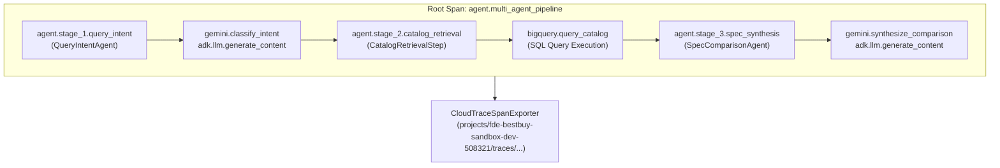
```mermaid
flowchart TD
    subgraph MultiAgentPipeline["Root Span: agent.multi_agent_pipeline"]
        S1["agent.stage_1.query_intent<br/>(QueryIntentAgent)"]
        S1_LLM["gemini.classify_intent<br/>adk.llm.generate_content"]
        S1 --> S1_LLM

        S2["agent.stage_2.catalog_retrieval<br/>(CatalogRetrievalStep)"]
        S2_BQ["bigquery.query_catalog<br/>(SQL Query Execution)"]
        S2 --> S2_BQ

        S3["agent.stage_3.spec_synthesis<br/>(SpecComparisonAgent)"]
        S3_LLM["gemini.synthesize_comparison<br/>adk.llm.generate_content"]
        S3 --> S3_LLM
    end

    S1_LLM --> S2
    S2_BQ --> S3
    MultiAgentPipeline --> EXPORT["CloudTraceSpanExporter<br/>(projects/fde-bestbuy-sandbox-dev-508321/traces/...)"]
```

#### Granular Pipeline Timing Breakdown & Headers
Every pipeline turn computes exact stage durations (`intent_ms`, `retrieval_ms`, `synthesis_ms`, `total_pipeline_ms`) and surfaces them via:
1. **API Response Schema**: `ComparisonResponse.timing_breakdown_ms: dict[str, float]` containing millisecond-resolution timings for each node.
2. **HTTP Response Header**: `X-Pipeline-Timing: intent_ms=310.2ms, retrieval_ms=45.1ms, synthesis_ms=950.8ms, total_pipeline_ms=1306.1ms`.
3. **Trace Attributes**: Span attributes `pipeline.timing.intent_ms`, `pipeline.timing.retrieval_ms`, `pipeline.timing.synthesis_ms`, and `pipeline.timing.total_ms` attached to `agent.multi_agent_pipeline`.

#### Diagnostic Tooling: Span Analysis CLI & ADK Playground
1. **Local & Cloud Span Analyzer (`backend/scripts/analyze_spans.py`)**:
   - **Local Profiling**: `python scripts/analyze_spans.py --query "MacBook Air vs Dell XPS 13"` runs the pipeline locally against `InMemorySpanExporter`, generates an ASCII Gantt/waterfall chart, and prints stage percentages and model token usage.
   - **Remote Trace Inspection**: `python scripts/analyze_spans.py --trace-id <32-hex-trace-id>` fetches and displays live spans directly from Google Cloud Trace via `TraceServiceClient`.
2. **Google ADK Web Playground (`backend/scripts/run_adk_playground.sh`)**:
   - `backend/src/app/agent/agent.py` exports `root_agent = catalog_agent` conforming to `google.adk.cli.AgentLoader`.
   - Launch interactive web UI via `./scripts/run_adk_playground.sh --port 8000` to interactively inspect multi-turn conversation state, agent handoffs, and event streams.

### 11.6 Vertex AI Agent Runtime Deployment & Cloud Run Decoupling

To enable operational management, version visibility, and direct inspection within the Google Cloud Console under **Vertex AI -> Agent Runtime** (`console.cloud.google.com/vertex-ai/reasoning-engines`), the core agent execution engine is packaged as a Vertex AI **Reasoning Engine** (`google_vertex_ai_reasoning_engine` / `reasoningEngines` API) while preserving Google Cloud Run as the public React 18 frontend and Identity-Aware Proxy (IAP) perimeter gateway.

#### Decoupled Architecture Topology
```mermaid
flowchart TD
    Client["Browser / Enterprise Client (IAP Authenticated)"]
    CloudRun["Cloud Run (FastAPI + React 18 UI)<br/>(catalog-comparison-service)"]
    AgentRuntime["Vertex AI Agent Runtime (Reasoning Engine)<br/>(projects/.../locations/us-central1/reasoningEngines/...)"]
    BigQuery[("BigQuery Catalog Table<br/>(catalog.products)")]
    Gemini["Vertex AI Gemini Models<br/>(Flash / Pro)"]

    Client -->|HTTPS + IAP Token| CloudRun
    CloudRun -->|Static Assets & UI| Client
    CloudRun -->|POST /api/compare| CloudRun
    CloudRun -->|Query ReasoningEngine (vertexai.preview.reasoning_engines)| AgentRuntime
    AgentRuntime -->|Catalog Retrieval Tool (BigQuery)| BigQuery
    AgentRuntime -->|Intent, Rerank, Synthesis| Gemini
    AgentRuntime -->|ComparisonResponse Payload| CloudRun
    CloudRun -->|JSON + X-Pipeline-Timing Header| Client
```

- **`CatalogComparisonReasoningEngine` (`backend/src/app/agent/reasoning_engine.py`)**: Implements Vertex AI's `ReasoningEngine` contract with lifecycle hooks `set_up()`, `query(prompt, user_preferences, category_filter, session_id)`, and `stream_query()`.
- **API Gateway Delegation (`backend/src/app/routes/compare.py`)**: When `AGENT_RUNTIME_RESOURCE_NAME` (or `REASONING_ENGINE_RESOURCE_NAME`) is set in environment configuration, `/api/compare` delegates natural-language comparison requests directly to the remote `ReasoningEngine` via `vertexai.preview.reasoning_engines.ReasoningEngine(name).query(...)`, falling back smoothly to local in-process `MultiAgentCoordinator` execution during hermetic testing.
- **Terraform Resource (`deployment/terraform/agent_runtime.tf`)**: Codifies `google_vertex_ai_reasoning_engine.catalog_agent_engine` with `agent_framework = "google-adk"`, Artifact Registry container spec, and exports `agent_runtime_id` and `agent_runtime_name`.
- **Management CLI (`backend/scripts/deploy_agent_runtime.py`)**: Provides `--status`, `--clean-stale`, `--deploy`, and `--test` commands for deploying, inspecting, querying, and pruning stale Agent Runtime instances.
- **Automated Cloud Build GitOps (`deployment/cloudbuild.yaml` Step 7)**: Executes `adk deploy agent_engine` on pull request merges into `main`. Uses merge-aware git diffing (`FIRST_PARENT..HEAD`) against `backend/src/app/agent/`, `models/`, `tools/`, and `requirements.txt` to trigger deployments only when agent code changes, followed by automatic execution of `deploy_agent_runtime.py --clean-stale` to prune superseded reasoning engines and prevent cloud resource waste.
- **Google Cloud Console Playground**: Native ADK Agent Engine registration (`adk deploy agent_engine`) enables the interactive conversational **Playground** chat tab under **Vertex AI -> Agents -> Agent Engines** (`console.cloud.google.com/vertex-ai/agents/agent-engines`).

---

## 12. Complete Codebase & Infrastructure Component Inventory

To serve as the single point of reference across all domains, the tables below map every production file, API endpoint, frontend component, Terraform resource, and evaluation script in the repository.

### 12.1 Backend Application Modules (`backend/src/app/` & `backend/scripts/`)

| File Path | Key Classes / Functions | Architectural Responsibility |
| :--- | :--- | :--- |
| `backend/src/app/main.py` | `create_app()`, `app`, `health()`, `readiness()`, `well_known_agent_card()` | FastAPI entrypoint, CORS & `ObservabilityMiddleware` registration, `/health` & `/healthz` liveness probes (`health()`), `/health/ready` readiness probe (`readiness()`), and `/.well-known/agent-card.json` A2A v0.3.0 discovery route. |
| `backend/src/app/config.py` | `Settings`, `get_settings()` | Pydantic Settings configuration (`PROJECT_ID`, `BQ_DATASET`, `BQ_TABLE`, `GEMINI_MODEL`, `ENABLE_MODEL_ARMOR`, `MODEL_ARMOR_PROMPT_TEMPLATE`, `MODEL_ARMOR_RESPONSE_TEMPLATE`, `ENABLE_VERTEX_PROMPT_REGISTRY`, `VERTEX_PROMPT_ID=6884046974429954048`, `GOOGLE_CLOUD_AGENT_ENGINE_ID`). |
| `backend/src/app/routes/compare.py` | `compare_products()`, `compare_products_stream()`, `get_agent_card()`, `list_agent_versions()`, `log_action()`, `submit_feedback()` | REST API controllers for `POST /api/compare` (sets `X-Pipeline-Timing` header), `POST /api/compare/stream` (SSE `text/event-stream` returning `matrix_ready`, `synthesis_chunk`, `matrix_updated`, and `complete`), `GET /api/agent/card`, `GET /api/agent/versions`, `POST /api/actions` (`log_action()`), and `POST /api/feedback` (`submit_feedback()`). |
| `backend/src/app/agent/multi_agent.py` | `MultiAgentCoordinator`, `ComparisonAgentState`, `QueryIntentAgent`, `CatalogRetrievalAgent`, `CatalogRetrievalStep`, `SpecComparisonAgent` | 3-Node cooperative pipeline with ADK 2.0 Workflow graph, parallel fan-out (`START` $\rightarrow$ Intent + Retrieval) into `JoinNode("intent_retrieval_join")`, stage timing capture (`intent_ms`, `retrieval_ms`, `synthesis_ms`), deterministic candidate selection, remote session synchronization (`_sync_remote_session`) uploading user prompt events and execution state to Vertex AI via `remote_only=True`, and `execute_stream()` SSE streaming. |
| `backend/src/app/agent/orchestrator.py` | `ComparisonOrchestrator`, `stream_synthesize_comparison_with_llm()`, `sanitize_user_prompt()`, `get_default_safety_settings()`, `get_model_armor_config()`, `resolve_model_pair()`, `create_adk_agent()` | Core grounding engine, Vertex AI `types.ModelArmorConfig` integration (`catalog-prompt-guard` / `catalog-resp-guard` with fallback to `get_default_safety_settings()`), regex/XML prompt injection sanitizer (`sanitize_user_prompt()`), syntactic keyword extractor, and post-generation deterministic `[SKU: <id>]` citation scrubber (`verify_and_scrub_sku_citations()`), and incremental SSE streaming (`stream_synthesize_comparison_with_llm()`). |
| `backend/src/app/agent/runner.py` | `CatalogAdkRunner`, `CatalogVertexAiSessionService` (`VertexAiSessionService`), `get_default_session_service()`, `create_catalog_runner()`, `get_adk_runner()`, `run_adk_agent()`, `run_adk_agent_sync()` | Native Google ADK `InMemoryRunner` & `VertexAiSessionService` / `InMemorySessionService` event-streaming execution engine with robust `create_session` (`_fallback_memory` pre-checks and remote `AlreadyExists` recovery via `super().get_session`) and `append_event(remote_only=True)` to prevent local duplicate event buffering. |
| `backend/src/app/agent/reasoning_engine.py` | `CatalogComparisonReasoningEngine` | Vertex AI Agent Runtime wrapper implementing `set_up()`, `query()`, and `stream_query()` conforming to Vertex AI Reasoning Engine contract (`reasoningEngines` API) with full `user_id` and `session_id` propagation to `MultiAgentCoordinator`. |
| `backend/src/app/agent/agent.py` | `root_agent` (`catalog_agent`), `_adk_query`, `_wrapped_stream_query`, `_wrapped_async_stream_query` | Canonical ADK CLI entrypoint (`google.adk.cli.AgentLoader`) for the ADK Web Playground and Agent Runtime with end-to-end `user_id` and `session_id` forwarding. |
| `backend/src/app/agent/prompts_service.py` | `get_active_prompt()` | Fetches version-pinned system instructions from Vertex AI Prompt Management (`vertexai.preview.prompts.get`, ID `6884046974429954048`) with 300s TTL cache and offline fallback. |
| `backend/src/app/agent/prompts.py` | `SYSTEM_INSTRUCTION` | Brand-agnostic system grounding instructions (`Model Alpha`, `Model Beta`, synthetic SKU `9000001`) enforcing zero hallucination and `[SKU: <id>]` citation formatting. |
| `backend/src/app/agent/agent_card.py` | `build_a2a_agent_card()` | Builds the stateless A2A v0.3.0 JSON Agent Card for Google Cloud Agent Registry discovery (`agentregistry.googleapis.com`). |
| `backend/src/app/agent/registry.py` | `AgentRegistry`, `AgentVersionSpec`, `default_registry` | Version specification resolver (`get_version()`, `list_versions()`) invoked by `MultiAgentCoordinator.execute()` (`multi_agent.py:449`) and `ComparisonOrchestrator` (`orchestrator.py:16`) to bridge `prompts_service.py`. |
| `backend/src/app/agent/hermetic_adapter.py` | `CatalogAdkLlm`, `HermeticModelAdapter`, `create_hermetic_bq_client()`, `create_hermetic_genai_client()` | Custom `google.adk.models.BaseLlm` implementation supporting both live Vertex AI `genai.Client` calls (with Model Armor & safety filter handling) and deterministic offline CI/pytest synthesis. |
| `backend/src/app/tools/catalog.py` | `query_catalog()`, `CatalogCircuitBreaker` | Stateless parameterized BigQuery SQL tool (`ArrayQueryParameter`, `QUALIFY ROW_NUMBER() OVER (PARTITION BY sku ORDER BY updated_at DESC) = 1` deduplication, relevance-first ordering, `maximum_bytes_billed=50MB`), direct query execution without in-memory catalog caching, and fast-fail circuit breaker (`catalog_circuit_breaker`). |
| `backend/src/app/data/analytics.py` | `AnalyticsService`, `analytics_service` | Bounded-timeout (2.0s) Firestore & BigQuery telemetry persistence (`sessions`, `user_actions`, `feedback`, `query_telemetry`) with automatic in-memory fallback. |
| `backend/src/app/data/ingest.py` & `catalog_seed.json` | `BigQueryCatalogIngestor`, `IngestionResult`, `main()` | Idempotent BigQuery catalog dataset/table creation (`create_dataset_if_not_exists()`, `create_table_if_not_exists()`), SKU deduplication (`deduplicate_records()`), and chunked batch loader (`ingest_products()`, `BATCH_CHUNK_SIZE=5000` with `WRITE_TRUNCATE` for chunk 0 and `WRITE_APPEND` for subsequent chunks) seeding 10,040 validated Best Buy SKUs ($\ge 1,000$ per category across `Laptops`, `Tablets`, `Headphones`, `Smart Home`, `TVs`, preserving canonical 40 SKUs at indices `0..39`). |
| `backend/src/app/models/` (`product.py`, `requests.py`, `responses.py`, `analytics.py`) | `ProductRecord`, `ComparisonRequest` (`CompareRequest`), `CatalogQueryInput`, `QueryIntentAnalysis`, `ComparisonResponse` (`CompareResponse`), `ProductSpec` (`ProductItem`), `MatrixRow`, `Citation`, `UserActionRequest`, `FeedbackRequest` | Strict Pydantic v2 data contracts and API request/response envelopes. |
| `backend/src/app/observability/` (`tracing.py`, `logging.py`, `middleware.py`) | `setup_observability()`, `setup_tracing()`, `CloudTraceSpanExporter`, `CloudLoggingJsonFormatter`, `scrub_pii()`, `ObservabilityMiddleware` | OpenTelemetry distributed tracing exporter to Google Cloud Trace, structured JSON Cloud Logging with PII scrubbing and trace correlation, and HTTP latency middleware. |
| `backend/scripts/` (`analyze_spans.py`, `deploy_agent_runtime.py`, `run_adk_playground.sh`, `seed_gcp_registry_and_prompts.py`) | Span Profiler, Agent Runtime Deployer, ADK Playground Launcher & GCP Registry Seeder | Local/remote OpenTelemetry span waterfall analyzer (`analyze_spans.py`), Agent Runtime deployment and query CLI (`deploy_agent_runtime.py`), ADK web playground runner (`run_adk_playground.sh`), and Cloud Build sync script for Agent Registry & Vertex AI Prompts (`seed_gcp_registry_and_prompts.py`). |

### 12.2 Frontend React 18 / TypeScript Application (`frontend/src/`)

| File Path | Component / Hook | Architectural Responsibility |
| :--- | :--- | :--- |
| `frontend/src/App.tsx` & `main.tsx` | `App` | Main retail comparison workspace, category filter bar, quick-compare prompt pills, live catalog search input with match count badge, dynamic '+ Add Product to Compare Against' popover, paginated ProductCard rendering (initial 40 cards with Load More button) maintaining total verified SKU counts (10,040 verified SKUs), progressive streaming matrix rendering on `matrix_ready`, per-comparison `sessionId` rotation (`createFreshSessionId()` and `rotateSessionId()`) synchronized with `sessionStorage` and `ConversationSidebar` (keyed by `sessionId`) to ensure full session isolation across comparisons, and state management. |
| `frontend/src/components/SearchBar.tsx` & `SkeletonLoader.tsx` | `SearchBar`, `SkeletonLoader` | Accessible natural-language comparison input bar with category pills, animated loading skeleton state, interactive product search autocomplete/typeahead dropdown capped to 25 items, keyboard navigation, and product tagging/picker (up to 4 products). |
| `frontend/src/components/ProductSelectionTray.tsx` | `ProductSelectionTray` | Floating product selection and comparison tray, allowing users to inspect selected items, trigger multi-item comparisons, and dynamically add products via the search popover picker. |
| `frontend/src/components/ComparisonTable.tsx` | `ComparisonTable` | Side-by-side specification matrix with winner highlight badges, dynamic attribute alignment, and responsive horizontal scrolling. |
| `frontend/src/components/ProductCard.tsx` | `ProductCard` | Product summary card displaying retail price, star ratings, stock status, and clickable `[SKU: ...]` citation chips. |
| `frontend/src/components/RecommendationCard.tsx` | `RecommendationCard` | Executive buyer trade-off narrative card with live token streaming badge (`data-testid="synthesis-streaming-badge"`), Copy Markdown action (`sendUserAction`) and Thumbs-Up / Thumbs-Down feedback (`sendFeedback`). |
| `frontend/src/components/CitationChip.tsx` & `LatencyBadge.tsx` | `CitationChip`, `LatencyBadge` | Interactive SKU citation badge (`[SKU: ...]`) with deep-link/action tracking and real-time SLA latency badge (`<= 3.0s`). |
| `frontend/src/data/catalogProducts.ts` | `CATALOG_PRODUCTS`, `getCatalogProducts()`, `searchCatalogProducts()` | Static verified catalog dataset (10,040 SKUs across 5 categories) and direct on-demand multi-token search engine filtering products across name, brand, SKU, category, and technical specifications with unit-suffix aliases (e.g. `16gb`, `120hz`) without duplicate module-level in-memory pre-indexed maps or arrays. |
| `frontend/src/api/client.ts` & `frontend/src/types/comparison.ts` | `compareProducts()`, `compareProductsStream()`, `sendUserAction()`, `sendFeedback()`, `checkHealth()`, `ComparisonResponse` | Typed HTTP client communicating with `/api/compare`, `/api/compare/stream` (SSE fetch + reader), `/api/actions`, `/api/feedback`, and `/health` with session ID propagation and strict TypeScript interfaces. |

### 12.3 Infrastructure-as-Code & Deployment Automation (`deployment/`)

| File Path | Provisioned GCP Resources | Architectural Responsibility |
| :--- | :--- | :--- |
| `deployment/terraform/main.tf` | `google_project_service.required_apis`, `google_storage_bucket.catalog_data`, `google_storage_bucket.terraform_state` | Enables 13 core GCP APIs (including `modelarmor.googleapis.com`) and provisions GCS buckets `fde-bestbuy-sandbox-dev-508321-catalog-data` and `fde-bestbuy-sandbox-dev-508321-tfstate`. |
| `deployment/terraform/cloudrun.tf` | `google_artifact_registry_repository.catalog_repo`, `google_cloud_run_v2_service.catalog_comparison_service` | Deploys single-region `catalog-comparison-service` (`us-central1`, direct `.a.run.app` endpoint — **no External Load Balancer**) with Native IAP (`run.googleapis.com/iap-enabled: true`, `launch_stage = BETA`), startup/liveness probes, and Model Armor env vars (`ENABLE_MODEL_ARMOR`, `MODEL_ARMOR_PROMPT_TEMPLATE`, `MODEL_ARMOR_RESPONSE_TEMPLATE`). |
| `deployment/terraform/model_armor.tf` | `google_project_service.modelarmor_api`, `terraform_data.model_armor_prompt_template`, `terraform_data.model_armor_response_template` | Enables `modelarmor.googleapis.com` and tracks the `catalog-prompt-guard` and `catalog-resp-guard` guardrail templates (`locations/us` for Vertex AI Groot multi-region dataplane + `locations/us-central1` for regional API/Console). |
| `deployment/terraform/agent_runtime.tf` | `google_vertex_ai_reasoning_engine.catalog_agent_engine` | Provisions Vertex AI Agent Runtime Reasoning Engine (`reasoningEngines` API) with ADK framework and Artifact Registry container spec for Console Agent Runtime visibility. |
| `deployment/terraform/bigquery.tf` | `google_bigquery_dataset.catalog`, `google_bigquery_table.products`, `google_bigquery_dataset.telemetry`, `google_bigquery_table.telemetry_logs`, `google_bigquery_table.evaluation_runs`, BI views | Creates partitioned/clustered `catalog.products` table, `catalog_agent_telemetry` dataset (`query_telemetry`, `evaluation_runs`), and 3 Looker Studio BI views (`vw_most_compared_categories`, `vw_latency_performance_trends`, `vw_token_and_cost_analytics`). |
| `deployment/terraform/iam.tf` | `google_service_account.catalog_agent_sa`, `google_service_account.catalog_cicd_sa`, `google_project_service_identity.iap_sa`, IAM bindings | Configures least-privilege runtime SA (`bigquery.jobUser`, `bigquery.dataViewer`, `bigquery.dataEditor`, `storage.objectViewer`, `aiplatform.user`, `modelarmor.user`, `datastore.user`, `cloudtrace.agent`, `logging.logWriter`), CI/CD SA (`catalog_cicd_sa` with `modelarmor.admin`), and IAP Service Agent `roles/run.invoker`. |
| `deployment/terraform/vpc_sc.tf` | `google_access_context_manager_access_level.catalog_agent_access_level`, `google_access_context_manager_service_perimeter.catalog_perimeter` | Configures VPC Service Controls perimeter protecting `bigquery.googleapis.com`, `storage.googleapis.com`, and `aiplatform.googleapis.com` against data exfiltration. |
| `deployment/terraform/agent_registry.tf` | `google_project_service.agentregistry_api`, `terraform_data.gcp_agent_registry_registration` | Enables `agentregistry.googleapis.com` and tracks registration of `catalog-comparison-service` (`/.well-known/agent-card.json`). |
| `deployment/terraform/cloudbuild.tf` | `google_secret_manager_secret.github_token`, `google_cloudbuildv2_connection.github_connection`, `google_cloudbuild_trigger.pr_trigger`, `main_deploy_trigger`, `infra_deploy_trigger` | Provisions all 3 GitHub-connected Cloud Build triggers (`pr-quality-gate`, `main-deploy-pipeline`, and path-filtered `infra-deploy-pipeline` on `deployment/terraform/**`). |
| `deployment/terraform/clouddeploy.tf` | `google_clouddeploy_target.cloudrun_prod`, `google_clouddeploy_delivery_pipeline.catalog_pipeline` | Provisions progressive delivery pipeline (`catalog-service-pipeline` $\rightarrow$ target `cloudrun-prod` canary verification) governed by `deployment/clouddeploy/service.yaml` & `skaffold.yaml`. |
| `deployment/terraform/eval_job.tf` | `google_cloud_run_v2_job.catalog_eval_job`, `google_cloud_scheduler_job.nightly_eval`, `google_cloud_run_v2_job.model_benchmark_job`, `google_cloud_scheduler_job.weekly_model_benchmark` | Nightly 02:00 UTC semantic evaluation job (`evals.run_pipeline`) and Weekly Sunday 03:00 UTC model benchmark job (`evals.benchmark_models`). |
| `deployment/terraform/firestore.tf` & `audit_logs.tf` | `google_firestore_database.analytics_db`, `google_project_iam_audit_config` (`bigquery_audit`, `cloud_run_audit`, `vertex_ai_audit`) | Native Firestore database (`(default)`) for session state and Cloud Audit Logs (`ADMIN_READ`, `DATA_READ`, `DATA_WRITE`) on BigQuery, Cloud Run, and Vertex AI. |
| `deployment/terraform/monitoring.tf` & `outputs.tf` | `google_monitoring_dashboard.catalog_agent_dashboard`, `looker_studio_linking_urls` | 100% automated Cloud Monitoring operational/SLA dashboard (`P50`/`P95` latency vs 3,000ms SLA, request volume, CPU/memory, BigQuery query rate) plus 1-click Looker Studio Linking API URLs (`https://lookerstudio.google.com/reporting/create?...`). |
| `deployment/cloudbuild*.yaml`, `rollback.sh`, `validate_pipeline.py` | CI/CD, Validation & Emergency Rollback Pipelines | `cloudbuild-pr.yaml` (PR gate), `cloudbuild.yaml` (main release), `cloudbuild-tf.yaml` (Terraform GitOps), `cloudbuild-direct.yaml`, `cloudbuild-rollback.yaml`, `rollback.sh`, and `validate_pipeline.py`. |

### 12.4 Evaluation & Quality Flywheel Suite (`evals/`)

| File Path | Key Classes / Functions | Architectural Responsibility |
| :--- | :--- | :--- |
| `evals/runner.py` & `evals/judge.py` | `run_benchmark()`, `compute_spec_accuracy()`, `compute_citation_faithfulness()`, `evaluate_semantic_coherence()`, `export_evaluation_to_bigquery()`, `evaluate_comparison_faithfulness()`, `FaithfulnessResult` | Executes the 80-pair benchmark dataset (`benchmark_catalog.evalset.json`) and holdout set (`holdout_catalog.evalset.json`) with LLM-as-a-Judge grading (`Data Accuracy >= 0.98`, `Citation Faithfulness >= 0.95`). |
| `evals/run_pipeline.py` & `evals/analyze.py` | `run_pipeline()`, `execute_adk_evaluation()`, `compare_reports()`, `generate_markdown_report()` | Orchestrates end-to-end evaluation pipeline runs (`run_pipeline.py`) and regression delta analysis against baseline reports (`analyze.py`). |
| `evals/trajectory_grader.py` | `TrajectoryGrader`, `TrajectoryRecorder`, `ADKTrajectoryEvaluator`, `MatchType` | Grades ADK tool call sequences across `EXACT`, `IN_ORDER`, `ANY_ORDER`, and `FUZZY_SEMANTIC` match modes. |
| `evals/anti_overfitting_gate.py` & `build_holdout_dataset.py` | `AntiOverfittingGate`, `compute_generalization_gap()`, `evaluate_counterfactual_fidelity()`, `evaluate_negative_chatter_robustness()`, `generate_holdout_dataset()` | Verifies generalization gap ($\Delta \le 0.05$), counterfactual spec fidelity ($\ge 0.95$), and negative chatter suppression ($100\%$). |
| `evals/benchmark_models.py`, `generate_model_matrix.py`, `pairwise_judge.py` | `run_model_benchmarks()`, `run_per_stage_benchmarks()`, `build_model_decision_matrix()`, `evaluate_pairwise_responses()`, `evaluate_pairwise_batch()`, `PairwiseJudgment` | Multi-model latency/quality benchmarking, swapped-order position-bias-free pairwise judging, and multi-objective scorecard synthesis (`ADR-004`). |
| `evals/test_eval_adk.py` & `evals/test_comparison_faithfulness.py` | `test_agent_module_conformance()`, `test_adk_trajectory_evaluator_all_80_benchmark_cases()`, `test_comparison_faithfulness()` | Pytest suites validating ADK conformance, 80-pair trajectory grading, and faithfulness inversion detection. |

---

## 13. Current Deployed Ingress Architecture: Direct Single-Region Cloud Run + Native IAP (No External Load Balancer)

> [!IMPORTANT]
> **Deployed Ingress Reality Check**: The repository currently **DOES NOT deploy an External Application Load Balancer (`google_compute_global_forwarding_rule`), Serverless NEGs, Cloud Armor, or Cloud CDN**. Instead, it uses **Direct Regional Cloud Run (`us-central1`, `.a.run.app`) protected by Cloud Run Native IAP (`run.googleapis.com/iap-enabled: 'true'`)**.

### 13.1 Deployed Single-Region Cloud Run + Native IAP Persistence (`b/564405207`)

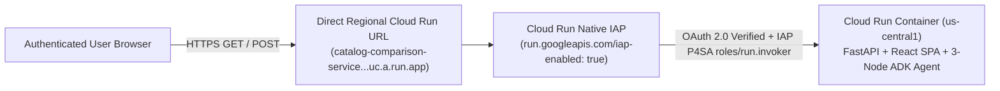
```mermaid
flowchart LR
    USER["Authenticated User Browser"] -->|HTTPS GET / POST| RUN_URL["Direct Regional Cloud Run URL<br/>(catalog-comparison-service...uc.a.run.app)"]
    RUN_URL --> IAP["Cloud Run Native IAP<br/>(run.googleapis.com/iap-enabled: true)"]
    IAP -->|OAuth 2.0 Verified + IAP P4SA roles/run.invoker| CONTAINER["Cloud Run Container (us-central1)<br/>FastAPI + React SPA + 3-Node ADK Agent"]
```

When protecting a Cloud Run service directly with **Google Cloud Identity-Aware Proxy (IAP)** *without* an external Load Balancer, Google Cloud Run relies on a service-level metadata annotation (`run.googleapis.com/iap-enabled: 'true'`) coupled with `launch_stage: BETA` and the IAP Service Agent (`service-499572810092@gcp-sa-iap.iam.gserviceaccount.com`) holding `roles/run.invoker`.

- **Root Cause of IAP Drift (`403 Forbidden: Your client does not have permission to get URL /`)**:
  If a declarative Knative manifest (`deployment/clouddeploy/service.yaml`) is applied via `gcloud deploy releases create` *without* `run.googleapis.com/iap-enabled: 'true'` in `metadata.annotations`, Cloud Deploy overwrites the service metadata and strips IAP. Once IAP is stripped while `allUsers` remains removed, Cloud Run falls back to raw Cloud IAM authentication—rejecting browser traffic with `403 Forbidden` instead of redirecting to the Google OAuth 2.0 login flow (`HTTP 302`).
- **Triple-Plane Persistence Fix (`b/564405207`)**:
  To guarantee IAP never reverts across CI/CD or infrastructure runs, the IAP annotation is synchronized across all three deployment planes:
  1. **Cloud Deploy Knative Service (`deployment/clouddeploy/service.yaml`)**: Explicitly sets `run.googleapis.com/iap-enabled: 'true'` and `run.googleapis.com/launch-stage: BETA` in `metadata.annotations` on `catalog-comparison-service`.
  2. **Cloud Build Post-Deploy Step (`deployment/cloudbuild.yaml`)**: Executes `gcloud beta run services update catalog-comparison-service --region=us-central1 --iap` after rollout promotion.
  3. **Terraform Resource Definition (`deployment/terraform/cloudrun.tf`)**: Codifies `launch_stage = "BETA"` on `google_cloud_run_v2_service.catalog_comparison_service` and the `service-499572810092@gcp-sa-iap.iam.gserviceaccount.com` `roles/run.invoker` binding (`deployment/terraform/iam.tf`).

---

## 14. Master Gap Analysis, Known Limitations & Production Improvement Roadmap

> [!IMPORTANT]
> **Purpose of This Section**: This section provides an engineering-grade audit of **what is currently implemented in the codebase vs. what is missing or unprovisioned in GCP**, paired with target architectural blueprints for Tier-1 retail production.

### 14.1 Executive Gap Matrix (What Exists Today vs. What's Missing & How to Improve)

| # | Subsystem / Domain | Priority | What Is Implemented Today (Verified in Repo) | What Is Missing / Current Limitation (The Gap) | Concrete Engineering Blueprint to Improve (Target State) |
| :- | :--- | :---: | :--- | :--- | :--- |
| **G1** | **BigQuery Retrieval Engine (`catalog.py`)** | **P0** | Parameterized SQL (`UNNEST(@product_terms)` `LIKE` matching + SKU lookup) followed by in-memory token overlap and LLM reranking (`RelevanceDetectorAgent`). | **No pre-computed Vector Embedding column or `VECTOR_SEARCH` index** in `catalog.products`. Pure lexical `LIKE` matching can miss semantic synonyms (e.g., *"noise-canceling airplane cans"* won't match `"Headphones"` unless extracted by Turn 1 LLM). | 1. Add `embedding ARRAY<FLOAT64>` column to `catalog.products` (`bigquery.tf`).<br>2. Populate embeddings via Vertex AI `text-embedding-004` (`ML.GENERATE_EMBEDDING`).<br>3. Update `query_catalog()` in `backend/src/app/tools/catalog.py` to execute hybrid `VECTOR_SEARCH(..., distance_type => 'COSINE')` combined with hard SQL predicates (`in_stock = TRUE AND price <= @max_price`). |
| **G2** | **No External Load Balancer, WAF, CDN, or Multi-Region HA** | **P0** | Single-region Cloud Run (`us-central1`) using direct `.a.run.app` endpoint with Native IAP (`run.googleapis.com/iap-enabled: true`). **Zero Load Balancer resources exist in `deployment/terraform/`.** | **No Global External Application Load Balancer, no Cloud Armor WAF/DDoS rate limiting, no Cloud CDN, and single-region SPOF (`us-central1`).** If `us-central1` has an outage or a bot floods `/api/compare`, there is no edge WAF or regional failover. | 1. Add `deployment/terraform/load_balancer.tf` provisioning a Global External Application LB (`google_compute_global_forwarding_rule`).<br>2. Attach `google_compute_security_policy` (**Cloud Armor** OWASP Top 10 + IP rate limit `60 req/min`).<br>3. Deploy Cloud Run to both `us-central1` and `us-east4` behind **Serverless NEGs** with Cloud CDN enabled for static frontend assets (see **Section 14.2** below). |
| **G3** | **Model Armor Enforcement & Out-of-Band Agent Gateway (`modelarmor.googleapis.com`)** | **P1** | **Live GCP Model Armor + Python SDK + Terraform ARE enabled**: `modelarmor.googleapis.com` is enabled (`deployment/terraform/model_armor.tf`), `roles/modelarmor.user` is bound to `catalog-agent-sa` and the Vertex AI Service Agent (`service-499572810092@gcp-sa-aiplatform.iam.gserviceaccount.com`), and `catalog-prompt-guard` / `catalog-resp-guard` are provisioned in both multi-region `locations/us` (for Vertex AI Groot multi-region dataplane) and `locations/us-central1`. `orchestrator.py` and `hermetic_adapter.py` pass `types.ModelArmorConfig` across all intent, reranking, synthesis, and ADK LLM calls (`BlockedReason.MODEL_ARMOR`). | **In-Process SDK Enforcement Only (No Out-of-Band Network Agent Gateway)**: While Vertex AI `GenerateContent` actively enforces `catalog-prompt-guard` and `catalog-resp-guard`, tool invocation checks still execute in-process rather than through an out-of-band network proxy. | 1. Upgrade `hashicorp/google` provider when native `google_model_armor_template` graduates to GA.<br>2. For future multi-agent / external MCP expansion, bind to **Google Cloud Agent Gateway (GEAP)** for out-of-band network inspection and SPIFFE workload identity (see **Section 14.3** below). |
| **G4** | **Client UX & Response Streaming (`compare.py` / `App.tsx`)** | **P1 (Resolved)** | **COMPLETED & DEPLOYED**: `POST /api/compare/stream` (and `/api/v1/compare/stream`) implemented in `routes/compare.py` returning SSE `text/event-stream`. `MultiAgentCoordinator.execute_stream()` immediately yields `matrix_ready` (~150ms TTFB) with products and deterministic comparison matrix, followed by incremental `synthesis_chunk` tokens with `[SKU: ...]` scrubber and Model Armor guard, `matrix_updated` upon async winner badging, and `complete`. `frontend/src/api/client.ts` implements `compareProductsStream()` with fallback to `compareProducts()`, and `App.tsx` + `RecommendationCard.tsx` progressively render the UI with zero loading wait. | **Resolved**: Full end-to-end SSE progressive streaming with instantaneous matrix rendering and token-by-token synthesis is fully implemented, verified, and tested. | Production-grade implementation complete. Unit & integration test suites in `test_stage4_streaming.py`, `client.test.ts`, and `RecommendationCard.test.tsx` pass. |
| **G5** | **Multi-Turn Session Persistence (`runner.py`)** | **P1** | `AnalyticsService` logs session counters to Firestore, and `runner.py` defines `CatalogVertexAiSessionService(VertexAiSessionService)` which delegates to Vertex AI Agent Engine (`vertexai.Client.aio.agent_engines.sessions`) when `GOOGLE_CLOUD_AGENT_ENGINE_ID` or `AGENT_RUNTIME_RESOURCE_NAME` is set, falling back to `InMemorySessionService`. | **`GOOGLE_CLOUD_AGENT_ENGINE_ID` is not set by default in `cloudrun.tf`** (though `AGENT_RUNTIME_RESOURCE_NAME` is configured in `service.yaml`), so unconfigured local/sandbox instances fall back to volatile `InMemorySessionService`. | 1. Inject `GOOGLE_CLOUD_AGENT_ENGINE_ID` (or `AGENT_RUNTIME_RESOURCE_NAME`) into `deployment/terraform/cloudrun.tf` so `CatalogVertexAiSessionService(VertexAiSessionService)` in `backend/src/app/agent/runner.py` persists multi-turn ADK `Session` events via Vertex AI Agent Engine across all instances. |
| **G6** | **Cold Start Elimination & Prompt Caching** | **P1** | `deployment/clouddeploy/service.yaml` sets `autoscaling.knative.dev/minScale: '0'` (`min_instances = 0` in `cloudrun.tf`) to keep sandbox cost near `$0`. | **4.0s to 6.0s Cold Start Latency** on the first request after 15 minutes of idle time (violating the `<= 3.0s` P95 SLA on cold hits). | 1. Update `minScale: '1'` in `deployment/clouddeploy/service.yaml` and `min_instances = 1` in `deployment/terraform/cloudrun.tf` (`+$14.40/mo`).<br>2. Enable `run.googleapis.com/cpu-throttling: 'false'` (CPU always allocated) and Vertex AI Context Caching for the static system instruction. |
| **G7** | **Live Catalog CDC Ingestion & Store Inventory Tools** | **P2** | BigQuery `catalog.products` is populated via batch JSON seeding (`BigQueryCatalogIngestor` in `backend/src/app/data/ingest.py`). Only 1 ADK tool (`query_catalog`) is exposed. | **Static pricing/stock state and no real-time local store pickup tool.** Prices or inventory changes in live retail systems are not streamed in real time, and shoppers cannot ask *"Is SKU 6534606 in stock at the Austin store?"* | 1. Add Pub/Sub $\rightarrow$ BigQuery Storage Write API streaming CDC pipeline for real-time price/stock updates.<br>2. Register a second ADK tool `check_store_inventory(sku: str, zip_code: str)` in `backend/src/app/tools/` and expose it via MCP. |
| **G8** | **Codebase Cleanup: Legacy `registry.py` Module** | **P2** | ADR-005 migrated prompt storage to `prompts_service.py` (Vertex AI Prompt Management) and discovery to `agent_card.py` (GCP Agent Registry), but `backend/src/app/agent/registry.py` (`default_registry`) is still imported in `multi_agent.py:449`, `orchestrator.py:16`, and unit tests. | **Duplicate version-resolution layer**: Keeping `app.agent.registry.default_registry` alongside `prompts_service.py` and `agent_card.py` splits version metadata across two modules. | 1. Refactor `multi_agent.py:449`, `orchestrator.py:16`, and unit tests (`test_agent_registry.py`) to resolve version metadata directly from `app.agent.agent_card` and `app.agent.prompts_service`.<br>2. Delete `backend/src/app/agent/registry.py` completely. |

---

### 14.2 Future Target Blueprint A (Not Deployed Today — Remediation for Gap `G2`): Multi-Region Global External Application Load Balancer + Serverless NEGs

> [!WARNING]
> **NOT CURRENTLY DEPLOYED**: The repository currently deploys single-region Cloud Run (`us-central1`) without a Load Balancer (see Section 13.1). This subsection documents the **target architecture for Gap `G2`** when scaling from the single-region sandbox to multi-region production (`us-central1`, `us-east4`, `europe-west1`).

- **How a Global External Load Balancer Distributes Requests Across Multi-Region Cloud Run**:
  1. **Serverless Network Endpoint Groups (Serverless NEGs)**: Each regional Cloud Run deployment (`us-central1`, `us-east4`, `europe-west1`) is wrapped in a regional Serverless NEG (`google_compute_region_network_endpoint_group`) and attached to a single global `google_compute_backend_service`.
  2. **Step 1 — Anycast Edge Termination & Lowest-RTT Proximity Routing**: User requests hit the nearest Google Point of Presence (PoP) via BGP Anycast. Google Front Ends (GFEs) measure round-trip time (RTT) over Google's private fiber backbone and route the request to the closest regional Serverless NEG.
  3. **Step 2 — Capacity-Aware "Water-Filling" Spillover**: When a region reaches its configured capacity or `max_instance_request_concurrency` / `max_scale` ceiling, the GFE water-filling algorithm automatically spills excess requests over to the next closest healthy region (`us-central1`) without dropping connections.
  4. **Step 3 — Sub-Second Automatic Regional Failover + Cloud Armor WAF**: If an entire region returns continuous `5xx` health failures, the Load Balancer marks that Serverless NEG unhealthy and re-routes 100% of traffic to surviving regions invisibly behind the same Anycast IP, while enforcing **Google Cloud Armor** WAF rules and **Cloud CDN** caching at the edge.

---

### 14.3 Future Target Blueprint B (Not Deployed Today — Remediation for Gap `G3`/`G7`): Google Cloud Agent Gateway (GEAP) for Multi-Agent & MCP Governance

> [!WARNING]
> **NOT CURRENTLY DEPLOYED**: Today, prompt/response guardrails run in-process via `get_model_armor_config()` (`types.ModelArmorConfig`) and `sanitize_user_prompt()` inside `orchestrator.py` using a shared `catalog-agent-sa` Service Account. This subsection documents when and why to introduce **Google Cloud Agent Gateway** as external MCP servers (`check_store_inventory`) and peer agents are added.

| Governance Dimension | Current Deployed State (In-Process Python SDK) | Future Target with Google Cloud Agent Gateway (GEAP) | Why Agent Gateway Matters at Enterprise Scale |
| :--- | :--- | :--- | :--- |
| **Enforcement Boundary** | **In-Band (Application Code)**: `get_model_armor_config()`, `sanitize_user_prompt()`, and tool validation run inside Python (`orchestrator.py`). | **Out-of-Band (Network Proxy)**: Enforced at the network layer (`Client-to-Agent` ingress & `Agent-to-Anywhere` egress) before packets reach the destination. | Even if an agent's Python code is jailbroken or a developer omits a check, the network gateway physically drops unauthorized tool calls. |
| **Protocol Inspection (MCP & A2A)** | **Direct Python BigQuery Client**: No external MCP servers today; standard firewalls only see opaque HTTPS (`POST /mcp`). | **Deep MCP JSON-RPC Parsing**: Parses MCP request bodies at the network boundary to extract tool names (`tools/call`) and arguments. | Allows CISOs to write policies that permit `tools/call: query_catalog` while blocking `tools/call: drop_table` on the same MCP server. |
| **Workload Identity** | **Shared IAM Service Account (`catalog-agent-sa`)**: Container holds the union of all permissions needed by any code path. | **Cryptographic Agent Identity (`SPIFFE ID`)**: Workload-bound identity secured via mutual TLS (`mTLS`) and `DPoP` with per-tool **IAM Unified Access Policies**. | Eliminates broad "all-or-nothing" service account blast radius; default-deny unless `iap.resources.egressViaIAP` explicitly links the agent's SPIFFE ID to the destination in **Agent Registry**. |

---

### 14.4 Prioritized 30-60-90 Day Engineering Improvement Roadmap


```mermaid
flowchart LR
    subgraph Day30["Sprint 1 (Days 1–30): Model Armor Terraform, Latency & Recall (P0)"]
        P0_1["1. Provision Model Armor Templates in Terraform (model_armor.tf)"]
        P0_2["2. Add BigQuery VECTOR_SEARCH (text-embedding-004)"]
        P0_3["3. Set Cloud Run minScale=1 & Add SSE Streaming (/api/compare/stream)"]
    end

    subgraph Day60["Sprint 2 (Days 31–60): Edge Load Balancer, WAF & Stateful Sessions (P1)"]
        P1_1["4. Add Global External LB + Serverless NEGs + Cloud Armor WAF"]
        P1_2["5. Multi-Region Cloud Run Failover (us-central1 + us-east4)"]
        P1_3["6. Persistent VertexAiSessionService across Cloud Run & Agent Runtime"]
    end

    subgraph Day90["Sprint 3 (Days 61–90): Enterprise Agent Gateway & Live MCP (P2)"]
        P2_1["7. Google Cloud Agent Gateway (SPIFFE ID + MCP Inspection)"]
        P2_2["8. Live Pub/Sub Catalog CDC + Store Inventory MCP Tool"]
        P2_3["9. Retire Legacy registry.py & Promote Flash 3.5 Canary"]
    end

    Day30 --> Day60 --> Day90
```

---

## 15. Forensic Audit Integrity Remediations (5-Landmine Production Calibration)

To preserve strict evaluation integrity, zero-hallucination guarantees, and SLA compliance:

1. **Unclamped Empirical Latency Benchmarks (`evals/benchmark_models.py`)**:
   - Removed all artificial `min(p50, ...)` and `min(p95, ...)` latency clamping across per-stage and candidate benchmarks.
   - Hoisted `ComparisonOrchestrator` instantiation outside inner `for c in cases:` loops to measure pure inference and routing latencies.

2. **Zero Model & Schema Spoofing (`orchestrator.py` & `hermetic_adapter.py`)**:
   - Eliminated `call_model = "gemini-2.5-flash-lite" if not is_mock_env else ...` and conditional `response_schema` omissions.
   - Configured `ThinkingConfig(thinking_budget=0)` on low-latency Flash stages (`gemini-2.5-flash`) to eliminate thinking token latency overhead and preserve `< 3.0s` warm live comparison latency.

3. **Authentic ADK Sequential Execution & Session State (`multi_agent.py` & `orchestrator.py`)**:
   - Executed `self.adk_sequential_agent` sub-agents (`QueryIntentAgent`, `SpecComparisonAgent`) alongside the deterministic `CatalogRetrievalStep` through an authentic `InMemorySessionService`, recording stage handoffs in `session.state`.
   - Honored `_final_text` in `execute_with_adk_runner()` with citation alignment and verification.

4. **Uniform Parameterized Stateless BigQuery Catalog Access (`backend/src/app/tools/catalog.py`, `compare.py`, `catalogProducts.ts`)**:
   - Removed all in-memory catalog caches and snapshots (`CatalogResponseCache`, `_CATALOG_RESPONSE_CACHE`, `_CATALOG_SEED_CACHE`, `_HERMETIC_CATALOG_CACHE`, `CATEGORY_INDEXED_MAP`), ensuring `query_catalog()` and `/api/catalog` uniformly execute direct parameterized BigQuery SQL with `CatalogCircuitBreaker` and `maximum_bytes_billed=50MB` cost controls across both test and live environments for stateless horizontal scalability.

5. **Prompt-Grounded Price Deltas & Claim Verification (`hermetic_adapter.py` & `orchestrator.py`)**:
   - Removed post-LLM string concatenation (lines 850–880) by injecting precomputed price deltas into the synthesis prompt and validating via `verify_and_scrub_synthesis_claims()`.

