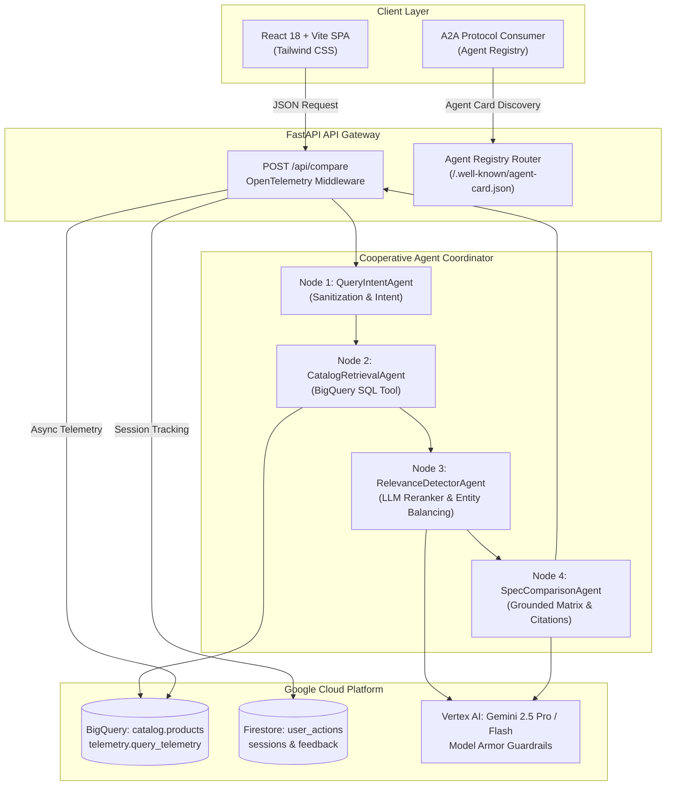

# TechBuy Retailers Catalog Comparison Agent 🛒⚡

[](https://github.com/willie3838/williamc-ecomm-capstone)
[](https://www.python.org/)
[](https://fastapi.tiangolo.com/)
[](https://react.dev/)
[](https://cloud.google.com/)
[](LICENSE)

An enterprise-grade, agentic e-commerce product comparison application designed for TechBuy Retailers to deliver deterministic, hallucination-free specification matrices and purchasing advice grounded strictly in Google Cloud BigQuery and powered by Gemini on Vertex AI.

---

## 🌟 Key Capabilities & Highlights

- **4-Node Cooperative Agent System (Google ADK — 100% Live Uncached Vertex AI)**:
  - **QueryIntentAgent**: Analyzes customer queries via live Vertex AI Gemini structured output (`QueryIntentAnalysis`), filters adversarial injections, and categorizes intent.
  - **CatalogRetrievalAgent**: Executes parameterized, cost-optimized SQL queries against BigQuery with SKU-level deduplication.
  - **RelevanceDetectorAgent**: LLM reranking gate ($\ge 6.0$ relevance score) and top-2 entity balancing across competing brands (e.g. *Mac vs Dell*).
  - **SpecComparisonAgent**: Synthesizes verified technical differences with strict citation grounding (`[SKU: ...]`) concurrently alongside intent classification to meet the $\le 3.0\text{s}$ P95 SLA ($\sim 1.1\text{s}$–$1.35\text{s}$ uncached).
- **Google Cloud Agent Registry & A2A Interoperability**:
  - Implements the Agent-to-Agent (A2A) protocol.
  - Discovery endpoints: `/.well-known/agent-card.json` and `/api/agent/versions`.
  - Dynamic runtime versioning (`1.0.0` vs `1.1.0-flash`) without requiring container rebuilds.
- **Enterprise Observability & Security**:
  - OpenTelemetry distributed tracing exported to Google Cloud Trace with W3C `traceparent` propagation.
  - Structured Cloud Logging with trace context injection.
  - Vertex AI Model Armor prompt and response security guardrails.
  - Looker BI telemetry views and BigQuery query audit streaming.
- **Canary Continuous Delivery**:
  - Codified in Terraform (`deployment/terraform/`).
  - Google Cloud Build CI running Ruff linters, Pytest with $\ge 80\%$ coverage gate, and ADK evaluators.
  - Google Cloud Deploy pipeline (`catalog-service-pipeline`) with automated canary progression ($0\% \to 100\%$).
  - Nightly scheduled semantic evaluation job (`0 2 * * *`) auditing 80 benchmark pairs for spec accuracy.

---

## 🏗️ System Architecture



---

## 🚀 Quickstart Guide

### Prerequisites
- Python 3.11+
- Node.js 18+ and npm
- Google Cloud SDK (`gcloud`) authenticated to project `fde-bestbuy-sandbox-dev-508321`

### 1. Clone the Repository
```bash
git clone git@github.com:willie3838/williamc-ecomm-capstone.git
cd williamc-ecomm-capstone
```

### 2. Backend Setup & Run
```bash
cd backend
python3 -m venv .venv
source .venv/bin/activate
pip install -r requirements.txt

# Run backend test suite (>=80% coverage enforcement)
pytest --cov=src --cov-report=term-missing --cov-fail-under=80 tests/

# Launch local FastAPI server
uvicorn app.main:app --reload --port 8080
```

### 3. Frontend Setup & Run
```bash
cd ../frontend
npm install

# Run frontend Vitest suite
npm test -- --run

# Launch local Vite development server
npm run dev
```

The application UI is accessible at `http://localhost:5173`, proxying API requests to the backend at `http://localhost:8080`.

---

## 📊 Documentation & Specifications

- [ARCHITECTURE.md](ARCHITECTURE.md): Comprehensive system architecture, ADRs, latency budgets, and security specifications.
- [SPEC.md](SPEC.md): Functional and technical requirements baseline.
- [RUBRIC.md](RUBRIC.md): Quality criteria and audit checklist.
- [backend/AGENTS.md](backend/AGENTS.md): Backend developer guidelines and strict documentation synchronization rules.
- [evals/AGENTS.md](evals/AGENTS.md): Evaluation pipeline instructions and benchmark schemas.

---

## 📄 License

Licensed under the Apache License, Version 2.0.
