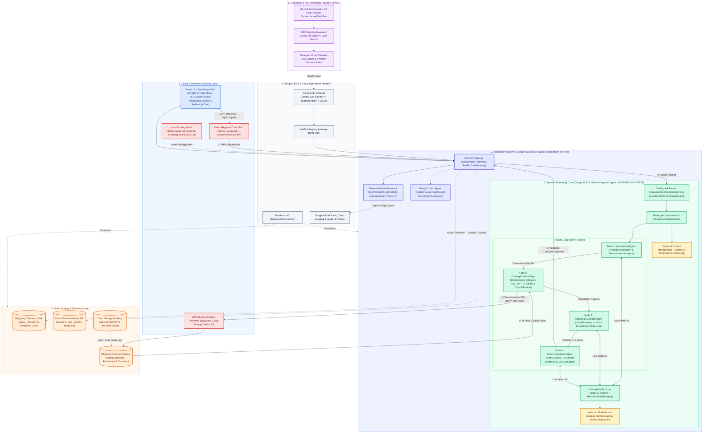
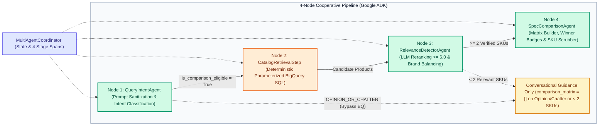

# TechBuy Retailers Catalog Comparison Agent 🛒⚡

[-4285F4?logo=googlecloud)](https://catalog-comparison-service-ocj5dik5ra-uc.a.run.app)
[](https://console.cloud.google.com/vertex-ai/agents/agent-engines/locations/us-central1/agent-engines/2445220951441276928/playground?project=fde-bestbuy-sandbox-dev-508321)
[](https://github.com/willie3838/williamc-ecomm-capstone)
[](https://www.python.org/)
[](https://fastapi.tiangolo.com/)
[](https://react.dev/)
[](LICENSE)

An enterprise-grade, agentic e-commerce product comparison platform for **TechBuy Retailers** that turns natural-language shopping questions into **100% grounded, hallucination-free side-by-side specification matrices** and buyer recommendations—powered by **Google ADK**, **Vertex AI Gemini**, and **Google Cloud BigQuery**.

> **🌐 Live Production Endpoints (`fde-bestbuy-sandbox-dev-508321` / `us-central1`)**
> - **Cloud Run Web UI & API Gateway (IAP-Protected)**: [`https://catalog-comparison-service-ocj5dik5ra-uc.a.run.app`](https://catalog-comparison-service-ocj5dik5ra-uc.a.run.app) ([A2A Agent Card](https://catalog-comparison-service-ocj5dik5ra-uc.a.run.app/.well-known/agent-card.json) | [Health Probe](https://catalog-comparison-service-ocj5dik5ra-uc.a.run.app/health) | [Cloud Run Console](https://console.cloud.google.com/run/detail/us-central1/catalog-comparison-service/metrics?project=fde-bestbuy-sandbox-dev-508321))
> - **Vertex AI Agent Engine Playground**: [`reasoningEngines/2445220951441276928`](https://console.cloud.google.com/vertex-ai/agents/agent-engines/locations/us-central1/agent-engines/2445220951441276928/playground?project=fde-bestbuy-sandbox-dev-508321)

| SLA / Engineering Metric | Production Target | Verified Performance |
| :--- | :--- | :--- |
| **End-to-End Latency (`SLA <= 3.0s`)** | $\le 3.00\text{s}$ P95 | **`2.18s` P95** (`1.18s` P50; **`2.41s`** warm on Vertex AI Agent Engine) |
| **Catalog Spec Grounding & Accuracy** | $\ge 0.98$ | **`0.995` Benchmark / `1.000` Counterfactual Perturbation Fidelity** |
| **Citation Faithfulness (`[SKU: ...]`)** | $\ge 0.95$ | **`0.988`** (Deterministic post-generation SKU scrubber) |
| **Live Load Stress Test (Black Friday)** | $0.0\%$ Error | **`1,000 / 1,000` HTTP 200 OK (`0.00%` error rate)** |
| **Unit Economics (Serverless GCP Stack)** | Lean TCO | **`$0.209` – `$0.850` per 1,000 queries** (`$20.90/mo` Flash default) |

---

## 🏗️ System Architecture


### Six-Zone Architecture Overview

| Zone | Architectural Layer | Core Files & Resources | What It Does |
| :--- | :--- | :--- | :--- |
| **🔵 Zone 1** | **Client & Perimeter Security** | [`frontend/src/App.tsx`](frontend/src/App.tsx), [`cloudrun.tf`](deployment/terraform/cloudrun.tf), [`vpc_sc.tf`](deployment/terraform/vpc_sc.tf), [`iam.tf`](deployment/terraform/iam.tf) | React 18 + TypeScript SPA, Cloud Run Native IAP, VPC Service Controls perimeter, and least-privilege `catalog-agent-sa` IAM. |
| **🟣 Zone 2** | **Cloud Run API Gateway** | [`main.py`](backend/src/app/main.py), [`routes/compare.py`](backend/src/app/routes/compare.py), [`agent_card.py`](backend/src/app/agent/agent_card.py), [`middleware.py`](backend/src/app/observability/middleware.py) | FastAPI endpoints (`/api/compare`, `/api/chat`, `/health`, `/health/ready`), A2A Agent Card (`/.well-known/agent-card.json`), and OpenTelemetry tracing. |
| **🟢 Zone 3** | **Vertex AI Agent Engine & ADK Core** | [`multi_agent.py`](backend/src/app/agent/multi_agent.py), [`orchestrator.py`](backend/src/app/agent/orchestrator.py), [`runner.py`](backend/src/app/agent/runner.py), [`hermetic_adapter.py`](backend/src/app/agent/hermetic_adapter.py) | 4-Node `MultiAgentCoordinator` on Vertex AI Agent Runtime (`reasoningEngines/2445220951441276928`), Model Armor guardrails, and Prompt Management. |
| **🟠 Zone 4** | **Data, Storage & Telemetry Layer** | [`tools/catalog.py`](backend/src/app/tools/catalog.py), [`data/ingest.py`](backend/src/app/data/ingest.py), [`data/analytics.py`](backend/src/app/data/analytics.py), [`bigquery.tf`](deployment/terraform/bigquery.tf) | Partitioned/clustered BigQuery catalog (`catalog.products`), GCS seed bucket, Firestore session/action store, and BigQuery telemetry sinks. |
| **🟣 Zone 5** | **Evaluation & Anti-Overfitting Flywheel** | [`evals/runner.py`](evals/runner.py), [`trajectory_grader.py`](evals/trajectory_grader.py), [`pairwise_judge.py`](evals/pairwise_judge.py) | 80-pair benchmark + 31-case counterfactual holdout suite, `ADKTrajectoryEvaluator`, and swapped-order pairwise LLM judge. |
| **⚪ Zone 6** | **GitOps CI/CD & Cloud Operations** | [`cloudbuild.yaml`](deployment/cloudbuild.yaml), [`clouddeploy.yaml`](deployment/clouddeploy/clouddeploy.yaml), [`Dockerfile`](deployment/Dockerfile), [`terraform/`](deployment/terraform/) | Automated `ruff` + `pytest` ($\ge 80\%$ gate) + eval gates, non-root Docker build, in-place Agent Engine rollout, and 0% $\rightarrow$ 100% Cloud Run canary. |

### Interactive System Topology (Mermaid)


```mermaid
flowchart TB
    %% Node Color Palette Definitions
    classDef client fill:#dbeafe,stroke:#2563eb,stroke-width:2px,color:#1e3a8a
    classDef security fill:#fee2e2,stroke:#dc2626,stroke-width:2px,color:#7f1d1d
    classDef gateway fill:#e0e7ff,stroke:#4f46e5,stroke-width:2px,color:#312e81
    classDef agent fill:#d1fae5,stroke:#059669,stroke-width:2px,color:#064e3b
    classDef guardrail fill:#fef3c7,stroke:#d97706,stroke-width:2px,color:#78350f
    classDef data fill:#ffedd5,stroke:#ea580c,stroke-width:2px,color:#7c2d12
    classDef eval fill:#f3e8ff,stroke:#9333ea,stroke-width:2px,color:#581c87
    classDef cicd fill:#f1f5f9,stroke:#475569,stroke-width:2px,color:#0f172a

    subgraph ClientLayer ["1. Client & Perimeter Security Layer"]
        UI["React 18 + TypeScript Web UI (Side-by-Side Matrix, SKU Citation Chips, Typeahead Search & Follow-Up Chat)"]:::client
        INGRESS["Direct Regional Cloud Run Ingress (.a.run.app) + Cloud Run Native IAP"]:::security
        VPCSC["VPC Service Controls Perimeter (BigQuery, Cloud Storage, Vertex AI)"]:::security
        IAM["Least-Privilege IAM: catalog-agent-sa (Runtime) & catalog-cicd-sa (CI/CD)"]:::security
    end

    subgraph ServiceLayer ["2. Application Runtime (Google Cloud Run: catalog-comparison-service)"]
        API["FastAPI Gateway (/api/compare, /api/chat, /health, /health/ready)"]:::gateway
        REGISTRY["Google Cloud Agent Registry & A2A Card (/.well-known/agent-card.json)"]:::gateway
        OTEL["ObservabilityMiddleware & OpenTelemetry SDK (W3C traceparent & X-Trace-ID)"]:::gateway

        subgraph ADKAgent ["3. Agentic Reasoning Core (Google ADK & Vertex AI Agent Engine: 2445220951441276928)"]
            RUNNER["CatalogAdkRunner (CatalogVertexAiSessionService & VertexAiMemoryBankService)"]:::agent
            ROUTER["MultiAgentCoordinator & ComparisonOrchestrator"]:::agent

            subgraph Pipeline ["4-Node Cooperative Pipeline"]
                N1["Node 1: QueryIntentAgent (Prompt Sanitization & Gemini Intent Analysis)"]:::agent
                N2["Node 2: CatalogRetrievalStep (Deterministic BigQuery SQL, 5m TTL Cache & Circuit Breaker)"]:::agent
                N3["Node 3: RelevanceDetectorAgent (LLM Reranking >= 6.0 & Brand Entity Balancing)"]:::agent
                N4["Node 4: SpecComparisonAgent (Matrix Builder, Grounded Synthesis & SKU Scrubber)"]:::agent
            end

            GEMINI["CatalogAdkLlm (Live Vertex AI Gemini + HermeticModelAdapter)"]:::agent
            PROMPT["Vertex AI Prompt Management (Prompt ID: 6884046974429954048)"]:::guardrail
            ARMOR["Vertex AI Model Armor (catalog-prompt-guard & catalog-resp-guard)"]:::guardrail
        end
    end

    subgraph DataLayer ["4. Data, Storage & Telemetry Layer"]
        BQ[("BigQuery Product Catalog (catalog.products - Partitioned & Clustered)")]:::data
        GCS[("Cloud Storage (Catalog Seed JSON/CSV & Terraform State)")]:::data
        TELEMETRY[("BigQuery Telemetry Sink (query_telemetry & evaluation_runs)")]:::data
        FIRESTORE[("Cloud Firestore Native DB (sessions, user_actions, feedback)")]:::data
    end

    subgraph EvalLayer ["5. Evaluation & Anti-Overfitting Flywheel (evals/)"]
        EVALSETS["80-Pair Benchmark + 31-Case Holdout Counterfactual EvalSets"]:::eval
        GRADER["ADKTrajectoryEvaluator (Exact / In-Order / Fuzzy Match)"]:::eval
        JUDGE["Swapped-Order Pairwise LLM Judge & 9-Model Decision Matrix"]:::eval
    end

    subgraph ObservabilityPlatform ["6. GitOps CI/CD & Cloud Operations Platform"]
        TF["Terraform IaC (deployment/terraform/)"]:::cicd
        CB["Cloud Build & Cloud Deploy (0% Canary -> Skaffold Verify -> 100%)"]:::cicd
        AR["Artifact Registry (catalog-agent-repo)"]:::cicd
        TRACE["Google Cloud Trace, Cloud Logging & Looker BI Views"]:::cicd
    end

    style ClientLayer fill:#eff6ff,stroke:#93c5fd,stroke-width:1.5px,color:#1e3a8a
    style ServiceLayer fill:#eef2ff,stroke:#a5b4fc,stroke-width:1.5px,color:#312e81
    style ADKAgent fill:#ecfdf5,stroke:#6ee7b7,stroke-width:1.5px,color:#064e3b
    style Pipeline fill:#f0fdf4,stroke:#86efac,stroke-width:1.5px,color:#065f46
    style DataLayer fill:#fff7ed,stroke:#fdba74,stroke-width:1.5px,color:#7c2d12
    style EvalLayer fill:#faf5ff,stroke:#d8b4fe,stroke-width:1.5px,color:#581c87
    style ObservabilityPlatform fill:#f8fafc,stroke:#cbd5e1,stroke-width:1.5px,color:#0f172a

    UI -->|"① HTTPS POST /api/compare"| INGRESS
    INGRESS -->|"② IAP Authenticated"| API
    IAM -.->|"Least Privilege Auth"| API
    API --> OTEL
    API -.-> REGISTRY
    API -->|"③ Invoke Pipeline"| RUNNER
    RUNNER --> ROUTER --> N1
    N1 -->|"Comparison Eligible"| N2
    N2 -->|"Candidate Products"| N3
    N3 -->|"Verified >= 2 SKUs"| N4
    N1 & N3 & N4 <-->|"Live Vertex AI"| GEMINI
    ROUTER -.-> PROMPT
    GEMINI -.-> ARMOR
    N2 -->|"④ Parameterized SQL (query_and_wait)"| VPCSC --> BQ
    BQ -->|"⑤ Verified Catalog Rows"| N2
    N4 -->|"⑥ Validated CompareResponse"| API --> UI

    OTEL -.->|"Export Stage Spans"| TRACE
    API -.->|"Async Telemetry"| TELEMETRY
    API -.->|"Session Tracking"| FIRESTORE
    GCS -.->|"Batch Load (ingest.py)"| BQ
    EVALSETS --> GRADER --> JUDGE -.->|"Quality Gate"| CB
    TF -.->|"Provisions"| ServiceLayer & DataLayer
    CB --> AR --> API
```

---

## 🧠 How the 4-Node Cooperative Pipeline Works


```mermaid
flowchart LR
    classDef coord fill:#e0e7ff,stroke:#4f46e5,stroke-width:2px,color:#312e81
    classDef llmNode fill:#d1fae5,stroke:#059669,stroke-width:2px,color:#064e3b
    classDef sqlNode fill:#ffedd5,stroke:#ea580c,stroke-width:2px,color:#7c2d12
    classDef suppress fill:#fef3c7,stroke:#d97706,stroke-width:2px,color:#78350f

    Coord["MultiAgentCoordinator (State & 4 Stage Spans)"]:::coord

    subgraph MultiAgent ["4-Node Cooperative Pipeline (Google ADK)"]
        Q["Node 1: QueryIntentAgent (Prompt Sanitization & Intent Classification)"]:::llmNode
        R["Node 2: CatalogRetrievalStep (Deterministic Parameterized BigQuery SQL)"]:::sqlNode
        RD["Node 3: RelevanceDetectorAgent (LLM Reranking >= 6.0 & Brand Balancing)"]:::llmNode
        S["Node 4: SpecComparisonAgent (Matrix Builder, Winner Badges & SKU Scrubber)"]:::llmNode
        G["Conversational Guidance Only (comparison_matrix = [] on Opinion/Chatter or < 2 SKUs)"]:::suppress

        Q -->|"is_comparison_eligible = True"| R
        Q -.->|"OPINION_OR_CHATTER (Bypass BQ)"| G
        R -->|"Candidate Products"| RD
        RD -->|">= 2 Verified SKUs"| S
        RD -.->|"< 2 Relevant SKUs"| G
    end

    style MultiAgent fill:#f8fafc,stroke:#94a3b8,stroke-width:1.5px,color:#0f172a
    Coord -.-> Q & R & RD & S
```

1. **4-Node Cooperative Agent Pipeline (3 LLM Specialists + 1 Deterministic SQL Step)**:
   - **Node 1 (`QueryIntentAgent`)**: Sanitizes prompt injections, classifies intent (`COMPARISON`, `PRODUCT_SEARCH`, or `OPINION_OR_CHATTER`), and extracts 2-to-5 target product entities.
   - **Node 2 (`CatalogRetrievalStep`)**: Executes parameterized BigQuery SQL (`client.query_and_wait()`, `50 MB` scan cap, 3-layer SKU deduplication, 0 LLM tokens) so product specs are never hallucinated.
   - **Node 3 (`RelevanceDetectorAgent`)**: Scores candidates (`>= 6.0` relevance threshold) and balances competing brands (`rank_and_select_products`). Suppresses the comparison table when `< 2` relevant products match.
   - **Node 4 (`SpecComparisonAgent`)**: Builds the side-by-side `MatrixRow` table with multi-winner tie support (`winner_skus`), synthesizes grounded narrative with `[SKU: ...]` citations, and scrubs any unverified SKU via `verify_and_scrub_sku_citations`.
2. **9-GA-Model Fleet Benchmark & Tiered-Hybrid Routing**:
   - Benchmarked 9 GA Gemini models across all 3 LLM stages (27 Vertex AI Experiment runs) over 80 multi-product comparison cases ([`docs/MODEL_SELECTION_MATRIX.md`](docs/MODEL_SELECTION_MATRIX.md)).
   - Default `tiered-hybrid` routing (`gemini-2.5-flash` / `flash-lite` with `thinking_budget=0` for fast intent/reranking + `gemini-2.5-pro` for synthesis) cuts inference costs by **65.3%** vs. All-Pro while beating the $\le 3.0\text{s}$ P95 SLA.
3. **IAP-Scoped Vertex AI Session, Memory Bank & 3-Tier Lazy Context Compaction**:
   - Extracts user identity from Google Cloud IAP (`X-Goog-Authenticated-User-Email`), persists sessions via `CatalogVertexAiSessionService`, isolates long-term preferences in `VertexAiMemoryBankService`, and bounds multi-turn tokens with 3-Tier Lazy Context Compaction ([`compaction.py`](backend/src/app/agent/compaction.py)).
4. **Native Google Cloud Agent Registry & A2A Discovery**:
   - Exposes `GET /.well-known/agent-card.json` and `GET /api/agent/versions` for zero-rebuild model/prompt version pinning (`1.2.0-tiered`, `1.0.0`, `1.1.0-flash`).
5. **Anti-Goodhart Evaluation Flywheel & Progressive CI/CD**:
   - Evaluates **80 benchmark cases** + **31 unseen counterfactual holdout cases** (perturbed prices/RAM to prove zero training-memory leakage) before Cloud Deploy promotes Cloud Run revisions ($0\% \to \text{Skaffold Verify} \to 100\%$).

---

## 📂 Repository Layout

```text
williamc-ecomm-capstone/
├── ARCHITECTURE.md                 # Full reference architecture, ADRs, TCO & latency budgets
├── SPEC.md                         # Project scope, user stories & technical requirements
├── RUBRIC.md                       # 37-competency FDE evaluation rubric
├── frontend/                       # React 18 + TypeScript + Vite + Tailwind CSS SPA
│   └── src/                        # Comparison matrix UI, SKU chips & ConversationSidebar
├── backend/                        # Python FastAPI gateway & Google ADK agent runtime
│   ├── src/app/
│   │   ├── agent/                  # MultiAgentCoordinator, orchestrator, runner & hermetic_adapter
│   │   ├── tools/catalog.py        # Parameterized BigQuery SQL tool, TTL cache & circuit breaker
│   │   ├── routes/                 # /api/compare, /api/chat, /health & A2A card routes
│   │   ├── observability/          # OpenTelemetry tracing & structured Cloud Logging
│   │   └── data/                   # BigQuery ingestion (ingest.py) & Firestore/BQ analytics
│   ├── scripts/                    # deploy_agent_runtime.py, analyze_spans.py & registry seeding
│   └── tests/                      # 280+ hermetic unit & integration tests (>83% coverage)
├── evals/                          # Benchmark & holdout datasets, trajectory grader & pairwise judge
└── deployment/                     # Terraform IaC, Cloud Build pipelines, Cloud Deploy & Dockerfile
```

---

## 🚀 Quickstart Guide

### Prerequisites
- Python 3.11+ (with [`uv`](https://docs.astral.sh/uv/) or `venv`)
- Node.js 18+ and `npm`
- Google Cloud SDK (`gcloud`) authenticated to project `fde-bestbuy-sandbox-dev-508321`

### 1. Backend Setup, Tests & Local Server
```bash
cd backend

# Run Ruff lint + unit test suite (>=80% coverage gate)
uv run ruff check .
PYTHONPATH=src uv run pytest --cov=src --cov-report=term-missing --cov-fail-under=80 tests/

# Launch local FastAPI server on http://localhost:8080
PYTHONPATH=src uv run uvicorn app.main:app --reload --port 8080
```

### 2. Frontend Setup, Tests & Local Dev Server
```bash
cd frontend
npm install

# Run frontend Vitest unit tests
npm test -- --run

# Launch Vite dev server on http://localhost:5173 (proxies /api to :8080)
npm run dev
```

### 3. Run Evaluation Suite & Deploy to Vertex AI Agent Engine
```bash
cd backend

# Run offline hermetic 80-pair benchmark + trajectory evaluation
PYTHONPATH=src:.. uv run python ../evals/runner.py --use-adk-runner

# Deploy / update agent in-place on Vertex AI Agent Engine (reasoningEngines/2445220951441276928)
uv run python scripts/deploy_agent_runtime.py --deploy
```

---

## 🛠️ Operational Playbook: Rolling Back Prompts & Models per Stage

Prompt Management ([Vertex AI Studio](https://console.cloud.google.com/vertex-ai/studio/saved-prompts?project=fde-bestbuy-sandbox-dev-508321)) and Model Selection are **strictly decoupled** so you can roll back or switch any stage's prompt version or Gemini model independently without rebuilding code. See the full **[Prompt & Model Rollback Playbook (`docs/ROLLBACK_PLAYBOOK.md`)](docs/ROLLBACK_PLAYBOOK.md)**.

| Pipeline Stage | Vertex AI Prompt Name & GCP ID | Prompt Version Env Var | Model Selection Env Var | Default Model |
| :--- | :--- | :--- | :--- | :--- |
| **Global System Grounding** | `catalog-comparison-system-prompt` (`6969351484559327232`) | `SYSTEM_PROMPT_VERSION` *(or `PROMPT_VERSION`)* | `GEMINI_MODEL` | `gemini-2.5-flash` |
| **Stage 1: Query Intent** | `stage1-query-intent-prompt` (`1204743961525092352`) | `STAGE1_PROMPT_VERSION` | `STAGE1_INTENT_MODEL` | `gemini-3.5-flash-lite` |
| **Stage 3: Relevance Rerank** | `stage3-relevance-rerank-prompt` (`7625751130248577024`) | `STAGE3_PROMPT_VERSION` | `STAGE2_RELEVANCE_MODEL` *(or `STAGE3_RELEVANCE_MODEL`)* | `gemini-2.5-flash-lite` |
| **Stage 4 (Call 1): Narrative Synthesis** | `stage4-spec-synthesis-prompt` (`121628251142488064`) | `STAGE4_PROMPT_VERSION` | `STAGE3_SYNTHESIS_MODEL` *(or `STAGE4_SYNTHESIS_MODEL`)* / `STAGE3_FAST_SYNTHESIS_MODEL` | `gemini-2.5-pro` (`flash-lite` fast path) |
| **Stage 4 (Call 2): Matrix Winners** | *(Inline compact spec-row winner prompt)* | N/A | `STAGE4_MATRIX_WINNERS_MODEL` | `gemini-2.5-flash` |
| **Stage 5: Follow-Up Chat** | `multi-turn-followup-chat-prompt` (`7445607145153757184`) | `CHAT_PROMPT_VERSION` | `STAGE5_CHAT_MODEL` *(or `GEMINI_MODEL`)* | `gemini-2.5-flash` |

```bash
# 1. Instant UI Rollback (when PROMPT_VERSION=latest):
#    In Vertex AI Studio -> Prompt Management -> Version History -> click "Restore version".
#    Cloud Run automatically refreshes 'latest' every 60 seconds (PROMPT_CACHE_TTL_SECONDS=60).

# 2. Pin or Roll Back a Specific Stage Prompt Version (e.g., lock Stage 4 Synthesis to Version 1):
gcloud run services update catalog-comparison-service \
  --project=fde-bestbuy-sandbox-dev-508321 --region=us-central1 \
  --update-env-vars="ENABLE_VERTEX_PROMPT_REGISTRY=true,STAGE4_PROMPT_VERSION=1"

# 3. Temporarily Switch Any Stage Model (Local or Cloud Run — zero code rebuild):
export STAGE1_INTENT_MODEL="gemini-2.5-flash" STAGE3_SYNTHESIS_MODEL="gemini-2.5-flash"  # Local override
gcloud run services update catalog-comparison-service \
  --project=fde-bestbuy-sandbox-dev-508321 --region=us-central1 \
  --update-env-vars="STAGE1_INTENT_MODEL=gemini-2.5-flash,STAGE3_SYNTHESIS_MODEL=gemini-2.5-flash"

# 4. Revert Stage Models Back to Default Benchmark-Optimal Fleet:
unset STAGE1_INTENT_MODEL STAGE2_RELEVANCE_MODEL STAGE3_SYNTHESIS_MODEL STAGE4_MATRIX_WINNERS_MODEL STAGE5_CHAT_MODEL
gcloud run services update catalog-comparison-service \
  --project=fde-bestbuy-sandbox-dev-508321 --region=us-central1 \
  --remove-env-vars="STAGE1_INTENT_MODEL,STAGE2_RELEVANCE_MODEL,STAGE3_SYNTHESIS_MODEL,STAGE4_MATRIX_WINNERS_MODEL,STAGE5_CHAT_MODEL"

# 5. Sync Local Prompt Edits (idempotent — only creates a new version if prompt text changed):
cd backend && PYTHONPATH=src uv run python scripts/seed_gcp_registry_and_prompts.py --skip-registry
```

---

## 📚 Documentation & Executive Artifacts

- **[ARCHITECTURE.md](ARCHITECTURE.md)**: Comprehensive system architecture, 6-zone topology, ADRs, TCO unit economics, latency budgets, and security controls.
- **[docs/ROLLBACK_PLAYBOOK.md](docs/ROLLBACK_PLAYBOOK.md)**: Operational playbook for rolling back and pinning prompt versions and Gemini models per pipeline stage.
- **[docs/MODEL_SELECTION_MATRIX.md](docs/MODEL_SELECTION_MATRIX.md)**: 9-model × 3-stage empirical benchmark matrix, Stage 3 Semantic Coherence synthesis leaderboard, and 2-to-5 product scaling analysis.
- **[Capstone Google Slides Deck](https://docs.google.com/presentation/d/113l47r_mAX-MDec5Md0IXUDahbNtyQyerNIwDWGZvUA/edit)**: Executive & technical readout presentation (`113l47r_mAX-MDec5Md0IXUDahbNtyQyerNIwDWGZvUA`).
- **[SPEC.md](SPEC.md)** & **[RUBRIC.md](RUBRIC.md)**: Functional specification and 37-competency assessment rubric.
- **[backend/AGENTS.md](backend/AGENTS.md)** & **[evals/AGENTS.md](evals/AGENTS.md)**: Developer workflows, testing protocols, and evaluation harness guides.

---

## 📄 License

Licensed under the Apache License, Version 2.0.
