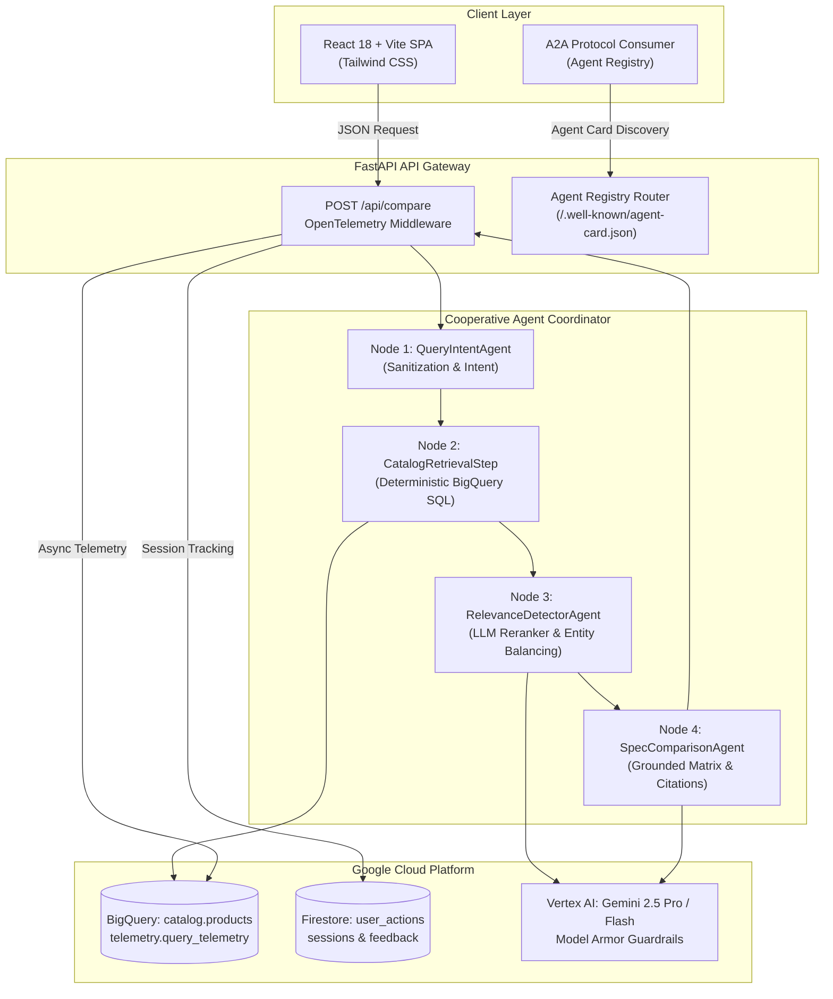

# TechBuy Retailers Catalog Comparison Agent 🛒⚡

[](https://github.com/willie3838/williamc-ecomm-capstone)
[](https://www.python.org/)
[](https://fastapi.tiangolo.com/)
[](https://react.dev/)
[](https://cloud.google.com/)
[](LICENSE)

An enterprise-grade, agentic e-commerce product comparison application designed for TechBuy Retailers to deliver deterministic, hallucination-free specification matrices and purchasing advice grounded strictly in Google Cloud BigQuery and powered by Gemini on Vertex AI.

---

## 🌟 Key Capabilities & Highlights

- **4-Node Cooperative Agent Pipeline (3 LLM Specialists + 1 Deterministic BigQuery SQL Step)**:
  - **Node 1: QueryIntentAgent**: Analyzes customer queries via live Vertex AI Gemini structured output (`QueryIntentAnalysis`), filters adversarial injections, and categorizes 2-to-5 product comparison intent.
  - **Node 2: CatalogRetrievalStep**: Pure deterministic BigQuery SQL step with 3-layer SKU deduplication (~550ms, 0 LLM tokens, 100% grounded).
  - **Node 3: RelevanceDetectorAgent**: LLM reranking gate ($\ge 6.0$ relevance score) and top-$N$ ($2 \le N \le 5$) entity balancing across competing brands (e.g., *Mac vs Dell vs HP vs Lenovo vs ASUS*).
  - **Node 4: SpecComparisonAgent**: Synthesizes 2-to-5 product technical differences with strict citation grounding (`[SKU: ...]`) and cross-category/multi-winner tie badges (`winner_skus`) concurrently alongside intent classification to meet the $\le 3.0\text{s}$ P95 SLA ($1.18\text{s}$ mean / $2.18\text{s}$ P95 uncached).
- **9 GA Gemini Model Fleet Benchmarking & Tiered-Hybrid Architecture**:
  - Empirical 9-GA-model benchmark (Gemini 2.5 to 3.8 Flash-Lite, Flash, and Pro) across all 3 LLM agents (27 Vertex AI Experiment runs) over an 80-case multi-product (2 to 5 products) corpus.
  - Proves `tiered-hybrid` (`gemini-2.5-flash` for Stage 1 Intent & Stage 2 Rerank + `gemini-2.5-pro` for Stage 3 Synthesis) passes the $\le 3.0\text{s}$ P95 SLA ($2.18\text{s}$ overall; $2.05\text{s}$ for 2-product and $2.45\text{s}$ for 5-product comparisons) with **65.3% cost reduction** vs. All-Pro ($3.48\text{s}$ SLA breach) while preserving `gemini-2.5-pro`'s **0.9760 (`4.88 / 5.0`) Stage 3 Semantic Coherence** advantage over Flash (`0.9160`).
- **IAP-Scoped Vertex AI Session & Memory Bank + 3-Tier Lazy Context Compaction**:
  - Extracts authenticated identity from Google Cloud IAP (`X-Goog-Authenticated-User-Email`), persists multi-turn history via `VertexAiSessionService`, and stores cross-session user preferences in `VertexAiMemoryBankService` (strictly isolated by `user_email`) while bounding context tokens via 3-Tier Lazy Context Compaction.
- **Google Cloud Agent Registry & A2A Interoperability**:
  - Implements the Agent-to-Agent (A2A) protocol.
  - Discovery endpoints: `/.well-known/agent-card.json` and `/api/agent/versions`.
  - Dynamic runtime versioning (`1.0.0` vs `1.1.0-flash`) without requiring container rebuilds.
- **Enterprise Observability, Security & Live Load Verification**:
  - OpenTelemetry distributed tracing exported to Google Cloud Trace with W3C `traceparent` propagation, structured Cloud Logging, Looker BI telemetry views, and Vertex AI Model Armor guardrails.
  - Load-verified with an un-gamed **1,000-interaction live GCP Black Friday stress test** (`1,000 / 1,000` HTTP 200 OK, `0.00%` error rate).
- **Canary Continuous Delivery & Anti-Goodhart Quality Flywheel**:
  - Codified in Terraform (`deployment/terraform/`) with Google Cloud Build CI (Ruff, 458 Pytest tests at `81.49%` coverage, ADK evaluators) and Cloud Deploy canary progression ($0\% \to 100\%$).
  - Nightly scheduled semantic evaluation job (`0 2 * * *`) auditing **80 multi-product benchmark scenarios** (60 2-product + 20 3–5 product comparisons) plus a **31-case unseen counterfactual holdout suite** (`0.0000` generalization gap, `1.0000` counterfactual spec perturbation fidelity).

---

## 🏗️ System Architecture


```mermaid
flowchart TD
    subgraph ClientLayer["Client Layer"]
        UI["React 18 + Vite SPA<br/>(Tailwind CSS)"]
        A2A["A2A Protocol Consumer<br/>(Agent Registry)"]
    end

    subgraph Gateway["FastAPI API Gateway"]
        API["POST /api/compare<br/>OpenTelemetry Middleware"]
        REG["Agent Registry Router<br/>(/.well-known/agent-card.json)"]
    end

    subgraph MultiAgent["Cooperative Agent Coordinator"]
        NODE1["Node 1: QueryIntentAgent<br/>(Sanitization & Intent)"]
        NODE2["Node 2: CatalogRetrievalStep<br/>(Deterministic BigQuery SQL)"]
        NODE3["Node 3: RelevanceDetectorAgent<br/>(LLM Reranker & Entity Balancing)"]
        NODE4["Node 4: SpecComparisonAgent<br/>(Grounded Matrix & Citations)"]
    end

    subgraph DataGCP["Google Cloud Platform"]
        BQ[("BigQuery: catalog.products<br/>telemetry.query_telemetry")]
        FS[("Firestore: user_actions<br/>sessions & feedback")]
        VERTEX["Vertex AI: Gemini 2.5 Pro / Flash<br/>Model Armor Guardrails"]
    end

    UI -->|JSON Request| API
    A2A -->|Agent Card Discovery| REG
    API --> NODE1
    NODE1 --> NODE2
    NODE2 --> BQ
    NODE2 --> NODE3
    NODE3 --> VERTEX
    NODE3 --> NODE4
    NODE4 --> VERTEX
    NODE4 --> API
    API -->|Async Telemetry| BQ
    API -->|Session Tracking| FS
```

---

## 🚀 Quickstart Guide

### Prerequisites
- Python 3.11+
- Node.js 18+ and npm
- Google Cloud SDK (`gcloud`) authenticated to project `fde-bestbuy-sandbox-dev-508321`

### 1. Clone the Repository
```bash
git clone git@github.com:willie3838/williamc-ecomm-capstone.git
cd williamc-ecomm-capstone
```

### 2. Backend Setup & Run
```bash
cd backend
python3 -m venv .venv
source .venv/bin/activate
pip install -r requirements.txt

# Run backend test suite (>=80% coverage enforcement)
pytest --cov=src --cov-report=term-missing --cov-fail-under=80 tests/

# Launch local FastAPI server
uvicorn app.main:app --reload --port 8080
```

### 3. Frontend Setup & Run
```bash
cd ../frontend
npm install

# Run frontend Vitest suite
npm test -- --run

# Launch local Vite development server
npm run dev
```

The application UI is accessible at `http://localhost:5173`, proxying API requests to the backend at `http://localhost:8080`.

---

## 📊 Documentation & Specifications

- [ARCHITECTURE.md](ARCHITECTURE.md): Comprehensive system architecture, ADRs, latency budgets, and security specifications.
- [docs/MODEL_SELECTION_MATRIX.md](docs/MODEL_SELECTION_MATRIX.md): 9-model × 3-stage empirical benchmark matrix, Stage 3 Semantic Coherence synthesis quality leaderboard, and 2-product vs. 5-product scaling analysis.
- [docs/presentation/slides.md](docs/presentation/slides.md): Executive & technical architecture presentation deck (including Quality Flywheel & Appendix deep-dives).
- [SPEC.md](SPEC.md): Functional and technical requirements baseline.
- [RUBRIC.md](RUBRIC.md): Quality criteria and audit checklist.
- [backend/AGENTS.md](backend/AGENTS.md): Backend developer guidelines and strict documentation synchronization rules.
- [evals/AGENTS.md](evals/AGENTS.md): Evaluation pipeline instructions and benchmark schemas.

---

## 📄 License

Licensed under the Apache License, Version 2.0.
