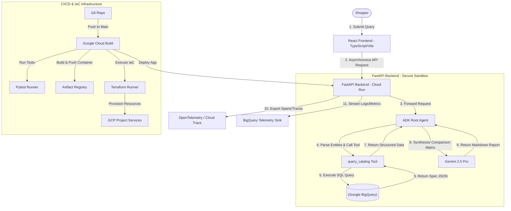

# E-Commerce TechBuy Retailers Catalog Comparison Agent: Full Specification

---

# Part 1: Project Scope Agreement

## GenAI Co-Build Scope Agreement

### Cloud AI FDE Team

#### Project Name
TechBuy Retailers Catalog Comparison Agent

#### Engagement Type
Onboarding Project 5 (eCommerce Domain)

#### Staging Environment
100% Self-Contained in Argolis Sandbox

#### Metadata
- **Customer Name**: TechBuy Retailers (Simulated)
- **Agreement Date**: June 13, 2026
- **Agreement Status**: Draft
- **Customer Sponsor**: [TechBuy VP of Digital Commerce]
- **Google Sponsor**: GenAI FDE Manager (M1)
- **Customer Lead**: [TechBuy Lead Cloud Architect]
- **Google Lead**: FDE Pod Lead / Onboarding Buddy

---

## Company Overview

TechBuy Retailers is a major consumer electronics retailer looking to modernize its online shopping experience. The company wants to deploy a conversational "Product Comparison Agent" that allows customers to compare detailed specifications and prices across thousands of catalog items. The platform must be provisioned entirely through Infrastructure as Code (IaC) and support automated serverless deployments to ensure ease of replication across regional sandboxes.

---

## Project Overview

#### TechBuy Retailers Catalog Comparison Agent (AI Sandbox Initiative)

Lay the underlying foundation for e-commerce agentic capabilities by developing a secure, self-contained AI Catalog Operations Sandbox.

This engagement focuses on establishing a secure, scalable "AI Sandbox" inside the onboarding FDE's allocated Argolis Project. It empowers operators to deploy a comparison agent that queries a BigQuery product catalog via structured tool-calling. The project will bridge the gap between shoppers requesting complex natural language product comparisons and the engineering need for automated, codified infrastructure (Terraform) and serverless deployments (Cloud Run & Cloud Build).

---

## Project Scope

| Scope / Deliverable | Responsible Party |
| :--- | :--- |
| **Design of the Agentic Architecture**: ADK agent utilizing structured tool-calling to fetch and compare product attributes. | Google FDE (Noogler) |
| **Data Engineering & Storage**: Ingestion of TechBuy Retailers product catalog JSON/CSV dataset into Google BigQuery. | Google FDE (Noogler) |
| **Infrastructure as Code (IaC)**: Provisioning of all GCP resources (Cloud Run, BigQuery, GCS, IAM, Service Accounts) via Terraform. | Google FDE (Noogler) |
| **CI/CD Pipeline**: Configuration of Google Cloud Build to execute formatting checks, run tests, build containers, and deploy to Cloud Run. | Google FDE (Noogler) |
| **Observability Setup**: OpenTelemetry and Cloud Trace integration to profile query processing latency. | Google FDE (Noogler) |
| **Automated Verification**: pytest suite with mocked BigQuery client and LLM tool calls, achieving >80% code coverage. | Google FDE (Noogler) |

### Out of Scope
- Real-time inventory synchronization with live warehouse databases (static catalog only).
- Processing of active customer checkout transactions or credit card inputs.
- Deployments beyond the allocated, self-contained Argolis Sandbox environment.

---

## User Journey

1. **Submit Comparison Query**: A customer inputs a natural language query (e.g., *"Compare the key specs and price differences between the iPad Pro 11-inch and the Samsung Galaxy Tab S9"* or non-comparative input like *"this is a stupid laptop"*).
2. **Intent & Entity Extraction (Node 1 - QueryIntentAgent)**: The agent sanitizes the query against prompt injection, detects if the input is a genuine comparison request vs an opinion/rant, and extracts candidate entities.
3. **Structured Tool-Calling (Node 2 - CatalogRetrievalAgent)**: If eligible for comparison, the agent calls the `query_catalog` tool to execute parameterized SQL queries against the BigQuery catalog. (Bypassed for non-comparative rants).
4. **Relevance Verification & Reranking (Node 3 - RelevanceDetectorAgent)**: The agent executes pure LLM reranking against the query context. Candidates with relevance score $< 6.0$ are filtered out. If fewer than 2 relevant products match, comparison matrix generation is suppressed.
5. **Spec Alignment & Display Output (Node 4 - SpecComparisonAgent)**:
   - If 2+ verified products match: The system builds a structured comparison matrix, spec deltas, winner badges, and SKU citations.
   - If non-comparative or $<2$ products: The system suppresses the matrix (`comparison_matrix = []`) and provides conversational guidance on how to submit a valid comparison.
6. **Infrastructure Deployment**: A developer makes a code change, pushes to git, and Cloud Build automatically deploys the updated container to Cloud Run.

---

## Objectives

### Business Objectives
- **Increase Conversion Rates**: Help shoppers make informed purchasing decisions faster by providing instant, side-by-side comparison tables.
- **Codify Operations**: Enable the engineering team to spin up new isolated digital catalog sandboxes in minutes using Terraform.
- **Reduce Latency**: Deflect manual catalog searches, returning comparison results in <3.0 seconds.

### Technical Objectives
- **Structured Tool-Calling**: Enforce strict tool usage where the model queries BigQuery rather than hallucinating product specifications.
- **Codified Deployments (IaC)**: Ensure 100% of required sandbox infrastructure is provisioned via Terraform HCL files.
- **Automated CI/CD**: Implement a Google Cloud Build pipeline that handles unit testing and deployments on Git merges.

---

## Timeline

| Sprint | Phase | User Stories | Tasks & Owners |
| :--- | :--- | :--- | :--- |
| **Sprint 1** | **Tactical (Discovery)** | As a developer, I want to initialize my git repo, define my Terraform files, and prepare the BigQuery schema. | Initialize Repo, write baseline Terraform files, define BQ schema. (FDE Noogler) |
| **Sprint 2** | **Tactical (Data Ingestion)** | As an engineer, I want to build the data ingestion pipeline to load TechBuy Retailers JSON/CSV catalog files into BigQuery. | Write python ingestion scripts, execute initial BigQuery load. (FDE Noogler) |
| **Sprint 3** | **Strategic (Orchestration)** | As a developer, I want to build the ADK Catalog agent, configure BigQuery tool-calling, and design the React matrix UI. | Develop ADK agent, build SQL query tools, construct React UI. (FDE Noogler) |
| **Sprint 4** | **Strategic (CI/CD & Evals)** | As a developer, I want to write the Cloud Build configuration, configure OpenTelemetry, and write the pytest suite. | Write cloudbuild.yaml, configure OTEL, and write pytests. (FDE Noogler) |
| **Sprint 5** | **Strategic (Deployment & IaC)** | As an engineer, I want to execute the Terraform plan to provision sandbox resources and run the initial deploy. | Execute Terraform apply, verify deployment on Cloud Run. (FDE Noogler) |
| **Sprint 6** | **Disengagement** | As a builder, I want to run my Product Readiness Review (PRR) readout, sanitize my code, and transition assets. | Run PRR readout with Lead, upload clean code to FDE shared repository. (FDE Noogler) |

---

## Technical Requirements

### Onboarding (Model A - In-Environment)
- Provisioning occurs inside the FDE's allocated Argolis Project sandbox.
- Access to development organizations and tools (GitHub, etc.).
- Development completed using JetSki / AGY 2.0 with Gemini 3.5 Flash assistance.

### Data Sources
- **Primary Corpus**: TechBuy Retailers Product Catalog (curated JSON/CSV).
- **Storage**: Loaded into Google BigQuery tables.
- **Data Policy**: Public catalog data only. No customer data or PII.

### Integration Points
- **BigQuery API**: For executing SQL queries via Python DB-API or client library.
- **Google Cloud Build**: For automated CI/CD pipelines.

### Technology Requirements
- **Runtime**: Python 3.11+ / FastAPI
- **Frontend**: React 18+ / TypeScript / Tailwind CSS
- **Orchestration**: Google ADK / AGY SDK
- **IaC**: Terraform (Google Provider)
- **Models**: Gemini 2.5 Pro (for reasoning and comparison synthesis), Gemini 3.5 Flash (for coding and evals)
- **Infrastructure**: Google Cloud Run, BigQuery, Cloud Storage, Cloud Build, Secret Manager, VPC Service Controls, OpenTelemetry, Cloud Trace

---

## Working Methodology and Environment Requirements

This project follows **Model A: In-Environment Development**.
- **Development Environment**: Complete development staged inside the secure Argolis sandbox.
- **Tooling**: Access to JetSki IDE and Gemini 3.5 Flash.
- **Infrastructure**: Dedicated GCP Dev Project (`fde-bestbuy-sandbox-dev`) with BigQuery, Cloud Run, GCS, Cloud Build, and Secret Manager APIs active.
- **Identity/IAM**: Enforced Least-Privilege IAM roles for the service accounts, codified in Terraform.
- **Data Policy**: Public catalog data.

---

## Team, Cadence, and Logistics

> [!NOTE]
> This section is here as context from a real scoping doc - since this is for solo project execution this does not need to be executed.

- **Manager (M1)**: General oversight, milestone gates, and PRR escalation.
- **Pod Lead / Buddy**: Strategic advisor, code reviews, and PR approvals (50-70% technical contribution).
- **Core Builder (Noogler)**: Tactical owner of the end-to-end SDLC and final deliverable.
- **Daily Rhythm**: 15-minute morning standup. Weekly status review and code walkthroughs.
- **Communication Channel**: Shared Google Chat Space (`fde-onboard-bestbuy-catalog`).

---

## Success Metrics & Transition Plan

### Success Criteria (The "Definition of Done")
- **Functional Verification**: Average score of 2-Competent across all FDE grading categories.
  - 100% of product specifications in the final comparison matrix must match the BigQuery database values.
  - Zero code-generation logic or queries executed directly on external databases (all routed via BigQuery tool).
  - $\ge$80% code coverage on FastAPI backend logic (mocking BigQuery).
- **Operational Verification**: Infrastructure provisioned entirely via Terraform (`terraform apply` runs clean), application deployed via Cloud Build to Google Cloud Run.
- **Observability**: Completed OpenTelemetry and Cloud Trace setup, exporting logs, BigQuery latencies, and tool execution times.

### Transition Plan
- **Platform Extraction**: Upon successful completion of Milestone 5, the Noogler enters the mandated 1-week Squad Cooldown.
- **Sanitation & Harvesting**: The Noogler generalizes the Terraform modules, removes project-specific variables, and pushes the reusable components to the FDE central repository.
- **Asset Registration**: The containerized mock environment and Terraform scripts are published to the Demo Library and transitioned to the demo operations team.

---

## Review Comments & Notes from Scoping
- [^1]: **Jiahui Li**: Should *"Semantic Comparison Quality Evaluation"* be included here? Is *"Nightly runs check 80 comparison pairs"* required?  
  *Douglas Gebert*: This could be something you would add - at a base level we are looking to ensure automated coverage at one or more of these areas: pre-commit/commit, PR, build, etc.
- [^2]: **Jiahui Li**: Also there is a section *"Operational & Business Intelligence"* in TDD not listed here. Is BI Dashboards and token tracking usage chart required?
- [^3]: **Jiahui Li**: I see VPC Service Controls in TDD, is that required and should be listed here?

---
---

# Part 2: Technical Design Document (TDD)

## FDE Technical Design Document

### Project Name: TechBuy Retailers Catalog Comparison Agent

- **FDE Lead(s):** Google Cloud FDE Team (buddy/manager review)
- **Last Updated:** June 13, 2026
- **Status:** Under Review

---

## Executive Summary

TechBuy Retailers requires a natural language product comparison agent to help customers analyze electronics specifications and prices. The agent must pull data directly from a BigQuery catalog via structured tool-calling to ensure accuracy, and the entire deployment must be automated using Terraform and Google Cloud Build.

This Technical Design Document outlines the architecture for the **TechBuy Retailers Catalog Comparison Agent**, an agentic system that:
1. **Uses Structured Tool-Calling against BigQuery**: Prevents product specification hallucinations by querying a structured BigQuery catalog.
2. **Codifies Infrastructure (IaC)**: Provisions all GCP sandbox resources (BigQuery, Cloud Run, GCS, IAM perimeters) via Terraform.
3. **Automates CI/CD**: Automatically builds, tests, and deploys the application using Google Cloud Build.

### Core "North Star" Metrics
- **Data Accuracy**: 100% agreement between the specs generated in the comparison matrix and the actual values in the BigQuery tables ($\ge 0.98$ target).
- **Citation Faithfulness**: $\ge 0.95$ inline SKU citation fidelity (`[SKU: ...]`) grounded in catalog data.
- **Tool Trajectory Quality**: $\ge 1.00$ golden sequence and argument compliance evaluated via `TrajectoryGrader` and `ADKTrajectoryEvaluator` across the 80 benchmark queries (rollback threshold $< 0.90$).
- **IaC Deployment Success**: 100% automated provisioning via Terraform without manual GCP console overrides.
- **CI/CD Execution Time**: Total Cloud Build pipeline duration $\le$ 5 minutes from git push to Cloud Run deployment.
- **Query Latency**: p95 latency $\le$ 3.0 seconds for generating a complete comparison report.

---

## System Architecture

### High-Level Diagram



### Architecture Principles
- **Declarative Infrastructure**: No GCP resources are created manually. Everything from IAM roles to BigQuery tables is codified in Terraform.
- **Accuracy via Tool-Calling**: The generative model is not allowed to recall product facts from its weights. It must use structured data fetched by the database query tool.
- **Serverless Portability**: The backend is hosted on Cloud Run, ensuring a zero-idle-cost development environment inside the Argolis Sandbox.

---

## Technical Components & Agent Logic

### 1. Catalog Agent (ADK)
- **Logic**: Receives natural language queries, extracts the entities (products and attributes), and invokes the query tool.
- **Prompt Instructions**:

```text
System Instructions:

You are a Product Expert. Your task is to compare the products requested by the user.

You must use the 'query_catalog' tool to fetch the specifications. Do not guess or use your own memory.

Format the output as a Markdown comparison table showing the attributes.

Provide a short narrative summarizing the key differences (value for money, performance highlights).
```

### 2. query_catalog Tool (ADK)
- **Logic**: Intercepts the parameters (product names and attributes) and executes a parameterized SQL query against BigQuery.
- **Code Example**:

```python
from google.cloud import bigquery
from pydantic import BaseModel, Field

class CatalogQueryInput(BaseModel):
    products: list[str] = Field(description="List of product names to search")
    attributes: list[str] = Field(description="Attributes to compare, e.g. price, cpu, memory")

def query_catalog(params: CatalogQueryInput) -> dict:
    client = bigquery.Client()
    # Execute parameterized query:
    query = """
    SELECT name, price, shortDescription, specifications 
    FROM `fde-bestbuy-sandbox-dev.catalog.products`
    WHERE name LIKE ANY (UNNEST(@product_names))
    """
    job_config = bigquery.QueryJobConfig(
        query_parameters=[
            bigquery.ArrayQueryParameter("product_names", "STRING", [f"%{p}%" for p in params.products])
        ]
    )
    query_job = client.query(query, job_config=job_config)
    results = query_job.result()
    return [dict(row) for row in results]
```

---

## Tooling & External Integrations

### Database Schema (BigQuery)
- **Dataset**: `catalog`
- **Table**: `products`
  - `sku`: `STRING` (Primary Key)
  - `name`: `STRING`
  - `price`: `FLOAT64`
  - `shortDescription`: `STRING`
  - `longDescription`: `STRING`
  - `specifications`: `JSON` (Stores variable attributes like CPU, RAM, Battery Life dynamically)

### Infrastructure as Code (Terraform)
- **File Structure**:
  - `deployment/terraform/providers.tf` — Configures GCP and Google Beta providers.
  - `deployment/terraform/variables.tf` — Sets sandbox Project ID and region variables.
  - `deployment/terraform/bigquery.tf` — Defines BigQuery datasets, tables, and ingestion buckets.
  - `deployment/terraform/cloudrun.tf` — Configures Google Cloud Run service and Artifact Registry.
  - `deployment/terraform/iam.tf` — Sets up least-privilege service accounts and GCP IAM bindings.

---

## Infrastructure, Security, & IAM

### Staging Environment
- **Dev Project ID**: `fde-bestbuy-sandbox-dev`
- **Region**: `us-central1`

### User Authentication & Authorization (IAM)
- **BigQuery Access**: The backend's custom Service Account (`catalog-agent-sa@fde-bestbuy-sandbox-dev.iam.gserviceaccount.com`) is granted:
  - `roles/bigquery.jobUser` (to run queries).
  - `roles/bigquery.dataViewer` (on the catalog dataset).
- **Terraform execution SA**: Cloud Build uses a high-privilege builder SA with rights to create Cloud Run services and BQ tables, strictly scoped inside the Sandbox perimeter.

### VPC Service Controls (VPC-SC)
- The Sandbox project is locked inside a VPC-SC perimeter, preventing BigQuery data exfiltration.

---

## CI/CD Pipeline (Cloud Build)

- **File**: `deployment/cloudbuild.yaml`
- **Build Steps**:
  1. **Linting**: Runs `ruff check` on the Python codebase.
  2. **Testing**: Runs `pytest` with mock BigQuery client connections to achieve >80% coverage.
  3. **Docker Build**: Builds the backend image.
  4. **Artifact Push**: Pushes the image to Artifact Registry.
  5. **Terraform Apply**: Applies the Terraform configuration, deploying the Artifact Registry image to Cloud Run.

```yaml
steps:
# 1. Run unit tests
- name: 'python:3.11-slim'
  entrypoint: 'bash'
  args:
  - '-c'
  - |
    pip install -r backend/requirements.txt pytest pytest-cov ruff
    ruff check backend/src/
    pytest backend/ --cov=backend/src --cov-fail-under=80

# 2. Build backend container
- name: 'gcr.io/cloud-builders/docker'
  args: ['build', '-t', 'us-central1-docker.pkg.dev/$PROJECT_ID/catalog-repo/agent-image:latest', '-f', 'deployment/Dockerfile', '.']

# 3. Push container image
- name: 'gcr.io/cloud-builders/docker'
  args: ['push', 'us-central1-docker.pkg.dev/$PROJECT_ID/catalog-repo/agent-image:latest']

# 4. Terraform Apply & Deploy
- name: 'hashicorp/terraform:latest'
  entrypoint: 'sh'
  args:
  - '-c'
  - |
    cd deployment/terraform
    terraform init
    terraform apply -auto-approve -var="project_id=$PROJECT_ID"
```

---

## Testing & Evaluation Framework

### 1. Heuristic Spec Check
- **Test**: `test_heuristic_spec_accuracy`
- **Logic**: Mocks the BigQuery client to return a known dataset for two products. Sends query to agent. Parses output table and asserts the prices and CPUs in the Markdown table match the mocked BigQuery values exactly.

### 2. Deployment Integration Test
- **Test**: Verifies that the Terraform configuration validates successfully (`terraform validate` and `terraform plan` checks are integrated in the pre-commit hook).

### 3. Semantic Comparison Quality Evaluation
- **Test**: `test_comparison_faithfulness`
- **Logic**: Nightly runs check 80 comparison pairs. Uses Gemini 3.5 Flash to verify that the comparison summary accurately reflects the differences listed in the data tables.

---

## Analytics, Insights & Feedback

### User Behavior & Engagement
- **User Actions**: Logs product comparison requests, copy markdown actions, and thumbs-up/down feedback. Stored in Firestore.
- **Session Metrics**: Tracks number of comparisons run per session with atomic Firestore increments and in-memory fallback, displayed in the UI telemetry bar as `Comparison #X`.
- **Entity Balancing & Deduplication**: For cross-brand queries (e.g. `mac vs dell`), results are guaranteed to balance across compared brands and deduplicate by SKU, preventing duplicate or single-brand results.

### Operational & Business Intelligence
- **Usage & Cost**: Logs token consumption per comparison and BigQuery query bytes scanned to monitor database cost.
- **Performance Trends**: Captures BigQuery query execution latency vs. total agent reasoning latency.
- **BI Dashboards**: Looker dashboards visualizing most compared product categories, database latencies, and average token costs.

### Observability & Audit
- **Logging**: Structured JSON logs including SQL query parameters are sent to Cloud Logging.
- **Audit Trails**: Cloud Audit Logs track all changes to Terraform-provisioned infrastructure, IAM modifications, and database data access.
