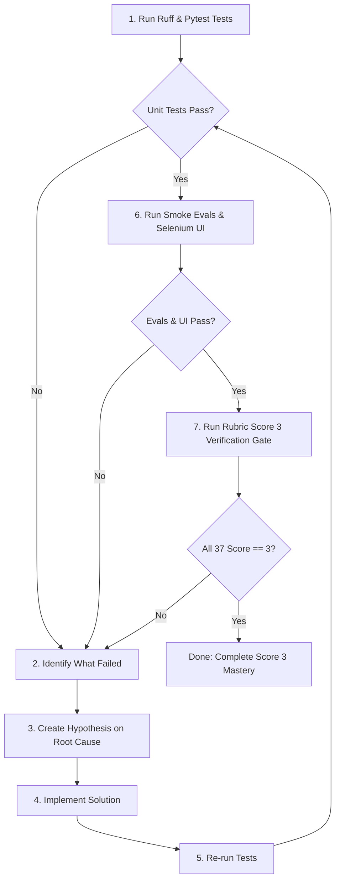

# Hillclimbing Skill

Hillclimbing is the autonomous outer-loop iteration methodology that drives software quality, test coverage, and benchmark performance upward without regressions.

---

## How Hillclimbing Works



### The Multi-Tier Hillclimbing Protocol

1. **Tier 1: Local Hermetic Code Quality & Testing (Fast Feedback)**:
   - **Ruff**: Enforces clean Python linting and formatting.
   - **Pytest Coverage Floor ($\ge 80\%$)**: Executes unit and in-memory contract tests with mocked clients.
   - **Hermetic Smoke Evals**: Evaluates catalog accuracy and citation faithfulness against offline benchmark fixtures.
   - **Selenium UI/UX Regression Audit**: Headless Chrome simulation verifying landing page, chip filters, comparison cards, badges, and citations.

2. **Tier 2: Live Google Cloud Verification (Production Grounding)**:
   - **Authentication Gate**: Pre-flight verification of active Google Cloud credentials (`gcloud auth print-access-token`) and Application Default Credentials (ADC).
   - If credentials are expired or unauthenticated, an interactive tmux pane `GCloud-Auth` is opened automatically for manual SSO/password login.
   - **Live BigQuery Grounding**: Executes live queries against `fde-bestbuy-sandbox-dev-508321.catalog.products` to verify row count and data availability.
   - **Live Cloud Run Health Probing**: Pings `/health` and `/ready` on the deployed Cloud Run service URL, validating response codes and latency.
   - **End-to-End Latency & Faithfulness**: Fires real comparison queries against Cloud Run, enforcing P95 latency $\le 3.0$s and real citation grounding.

3. **Tier 3: Capstone Rubric Score 3 Verification Gate**:
   - Executes `skills/rubric-audit/scripts/audit_rubric.py --verify --target-score 3`.
   - Requires all 37 competencies across Section 1 and Section 2 to satisfy a minimum score of 3 (Proficient).
   - Any score below 3 immediately exits with code 1 to force continuous hillclimbing iterations.
   - **Automated Independent Reviewer Launch**: Whenever performing a full rubric audit or verification, the agent **MUST automatically launch** an independent review pane in tmux with `gemini-3.8-flash` on `high` via `skills/rubric-audit/scripts/launch_unbiased_reviewer.sh` to ensure clean-context, zero-bias validation.

### Enterprise Google Cloud Services Bias (Non-Negotiable)
When diagnosing failures, formulating hypotheses, and implementing solutions, autonomous agents **MUST strictly bias towards enterprise-grade, managed Google Cloud native services** rather than implementing custom in-application re-inventions or heuristic scripts:
- **AI Threat & Jailbreak Defense (`s2_16`)**: MUST use **Google Cloud Model Armor** (`google.genai.types.ModelArmorConfig` with Vertex AI template paths) for prompt injection, jailbreak defense, and sensitive data protection, rather than bespoke regex blocklists.
- **Traffic Routing & A/B Testing (`s2_27`)**: MUST use **Google Cloud Run Revision Traffic Splitting** and **Google Cloud Deploy Canary Automation** at the network/ingress layer, rather than in-memory hash bucketing scripts.
- **Model Evaluation & Experiment Tracking (`s2_04`, `s2_27`)**: MUST use **Vertex AI Experiments** (`google.cloud.aiplatform.init(experiment=...)`) and **Vertex AI Gen AI Evaluation Service (AutoSxS)** for tracking model and prompt benchmarks.
- **Observability (`s2_19`)**: MUST use **Google Cloud Trace** and **Google Cloud Logging** via OpenTelemetry spans.
- **Catalog Grounding (`s2_02`)**: MUST query **BigQuery** with partitioned and clustered tables.
- **Secrets Management (`s2_15`)**: MUST use **Secret Manager**.

---

## Execution Commands

### Quick Unified Runner
Run all project checks (linter, pytest with coverage, smoke evals, and live gcloud check):
```bash
# Run standard checks with auto-detected GCP credentials
bash skills/hillclimb/scripts/run_checks.sh

# Force mandatory live Google Cloud verification (fails if not authenticated or not deployed)
bash skills/hillclimb/scripts/run_checks.sh --live-gcloud
```

### Authentication Management
Verify credentials or open a dedicated interactive authentication pane:
```bash
# Check current authentication status
bash skills/hillclimb/scripts/check_gcloud_auth.sh

# Check and automatically open interactive tmux pane if reauth is needed
bash skills/hillclimb/scripts/check_gcloud_auth.sh --open-auth-pane

# Directly spawn interactive gcloud auth pane in tmux
python3 skills/hillclimb/scripts/open_gcloud_auth_pane.py --project fde-bestbuy-sandbox-dev-508321
```

### Individual Step Execution

#### 1. Backend Linting & Unit Tests
```bash
cd backend
source .venv/bin/activate

# Linter and formatting
ruff check . --fix
ruff format .

# Unit tests with 80% coverage enforcement
pytest --cov=src --cov-report=term-missing --cov-fail-under=80 tests/
```

#### 2. Live Google Cloud Verification
```bash
python3 skills/hillclimb/scripts/run_live_gcloud_checks.py \
  --project fde-bestbuy-sandbox-dev-508321 \
  --region us-central1 \
  --service catalog-comparison-service \
  --dataset catalog
```

---

## Target Metrics & Thresholds

| Metric | Target | Minimum Floor | Failure Action |
| :--- | :--- | :--- | :--- |
| **Pytest Suite** | 100% Pass | 100% Pass | Block changes until all unit tests pass |
| **Code Coverage** | $\ge 80\%$ | $80\%$ | Pytest fails automatically via `--cov-fail-under=80` |
| **Ruff Lint & Format** | Clean | Clean | Run `ruff check . --fix && ruff format .` |
| **Data Accuracy** | $\ge 0.98$ | $0.95$ | Reject prompt/code change; investigate BigQuery grounding |
| **Citation Faithfulness**| $\ge 0.95$ | $0.90$ | Fix prompt citation constraints or regex extractor |
| **Live P95 Latency** | $\le 3.0$s | $4.0$s | Profile BigQuery query latency and LLM token generation on Cloud Run |
| **Live BigQuery Health**| 100% Online | 100% Online | Verify dataset permissions and table ingestion status |

---

## Skill Resources & Scripts
- [`scripts/run_checks.sh`](file:///usr/local/google/home/williamwlchan/Playground/williamc-ecomm-capstone/skills/hillclimb/scripts/run_checks.sh): Unified runner for Ruff linting, Pytest, smoke evals, and live Google Cloud checks.
- [`scripts/check_gcloud_auth.sh`](file:///usr/local/google/home/williamwlchan/Playground/williamc-ecomm-capstone/skills/hillclimb/scripts/check_gcloud_auth.sh): Pre-flight check for valid gcloud and ADC tokens.
- [`scripts/open_gcloud_auth_pane.py`](file:///usr/local/google/home/williamwlchan/Playground/williamc-ecomm-capstone/skills/hillclimb/scripts/open_gcloud_auth_pane.py): Splits a dedicated interactive tmux pane for manual authentication.
- [`scripts/run_live_gcloud_checks.py`](file:///usr/local/google/home/williamwlchan/Playground/williamc-ecomm-capstone/skills/hillclimb/scripts/run_live_gcloud_checks.py): Real end-to-end cloud tests against BigQuery and Cloud Run.
- [`scripts/run_smoke_eval.py`](file:///usr/local/google/home/williamwlchan/Playground/williamc-ecomm-capstone/skills/hillclimb/scripts/run_smoke_eval.py): Quantitative benchmark evaluator for catalog accuracy and citation faithfulness.
