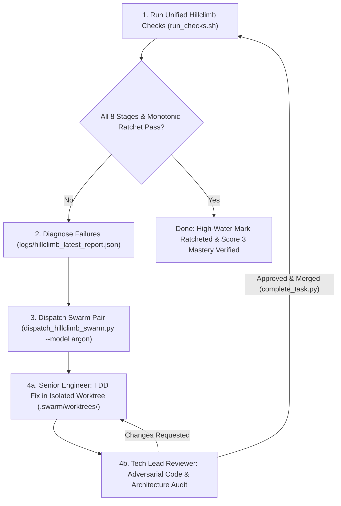

# Hillclimbing Skill

Hillclimbing is the autonomous outer-loop iteration methodology that drives software quality, test coverage, evaluation accuracy, and FDE rubric compliance monotonically upward (`S_{t+1} >= S_t`) without regressions.

---

## How Hillclimbing Works



### The Multi-Tier Hillclimbing & Swarm Remediation Protocol

1. **Tier 1: Local Hermetic Code Quality, Evals & Resilience (Fast Feedback)**:
   - **Ruff**: Enforces clean Python linting and formatting across `backend/`.
   - **Pytest Coverage Gate ($\ge 80\%$)**: Executes all 203+ unit and contract tests.
   - **Frontend TypeScript & Vite Build**: Verifies `npm --prefix frontend run build` compiles cleanly with zero type or bundling errors.
   - **Production 80-Pair Evaluation Suite (`evals.runner` + `evals.analyze`)**: Executes all 80 benchmark comparison cases through `ComparisonOrchestrator` against ground-truth catalog specs (`evals/dataset/benchmark_catalog.evalset.json`) and validates against baseline reports.
   - **Disaster Recovery & Chaos Resilience (`verify_disaster_recovery.sh`)**: Simulates total BigQuery outages, circuit-breaker fallback, and zero-corruption recovery.
   - **Selenium UI/UX Regression Audit**: Headless Chrome simulation verifying landing page, chip filters, comparison cards, badges, and SKU citations.

2. **Tier 2: Live Google Cloud Verification (Production Grounding)**:
   - **Authentication Gate (`check_gcloud_auth.sh` + `open_gcloud_auth_pane.py`)**: Pre-flight verification of **both** `gcloud auth print-access-token` and Application Default Credentials (`gcloud auth application-default print-access-token`). Opens an interactive `GCloud-Auth` tmux pane if either token is missing or expired.
   - **Comprehensive 7-Service Cloud Audit (`run_live_gcloud_checks.py`)**: Verifies BigQuery (`catalog.products` + `catalog_agent_telemetry`), Cloud Storage buckets, Artifact Registry, IAM least-privilege roles, Cloud Run health/SPA delivery, Cloud Trace, Cloud Logging, and E2E `/api/compare` latency ($\le 3.0\text{s}$) and SKU citations ($> 0$).

3. **Tier 3: Capstone Rubric Score 3 Gate & Monotonic High-Water Mark Ratchet**:
   - **Independent Unbiased Audit (`--fresh-audit`)**: Executes `bash skills/rubric-audit/scripts/launch_unbiased_reviewer.sh --wait-and-close` to spawn `argon` in a clean-context tmux pane, audit all 37 competencies against `RUBRIC.md`, auto-close the pane, and record findings.
   - **Monotonic High-Water Mark Ratchet (`hillclimb_ratchet.py`)**: Compares current run metrics (`pytest_coverage_pct`, `data_accuracy`, `citation_faithfulness`, `schema_conformance`, `latency_p95_seconds`, `rubric_s1_avg`, `rubric_s2_avg`) against `logs/hillclimb_state.json`. Blocks and flags any regression where $S_{t+1} < S_t$.

4. **Tier 4: Mandatory Swarm-Driven Remediation (`Tech Lead Reviewer` + `Senior Engineer Developer`)**:
   - **Never implement ad-hoc single-agent workarounds**: Whenever any check or metric fails, the solution **MUST** be implemented using the [`swarm-development`](file:///usr/local/google/home/williamwlchan/Playground/williamc-ecomm-capstone/skills/swarm-development/SKILL.md) skill via `skills/hillclimb/scripts/dispatch_hillclimb_swarm.py` (`--model argon`).
   - This spawns a **Tech Lead Reviewer** and **Senior Engineer Implementer** together:
     - The **Senior Engineer** works in an isolated git worktree (`.swarm/worktrees/<task_id>`), writes the failing unit/eval test first, implements the fix, and documents the design in `.swarm/reviews/<task_id>.md`.
     - The **Tech Lead Reviewer** adversarially audits the architecture, code diff, and test coverage, and merges to `main` via `complete_task.py` only when all standards pass.

### Enterprise Google Cloud Services Bias (Non-Negotiable)
When diagnosing failures, formulating hypotheses, and implementing solutions, autonomous agents **MUST strictly bias towards enterprise-grade, managed Google Cloud native services** rather than implementing custom in-application re-inventions or heuristic scripts:
- **AI Threat & Jailbreak Defense (`s2_16`)**: MUST use **Google Cloud Model Armor** (`google.genai.types.ModelArmorConfig` with Vertex AI template paths) for prompt injection, jailbreak defense, and sensitive data protection, rather than bespoke regex blocklists.
- **Traffic Routing & A/B Testing (`s2_27`)**: MUST use **Google Cloud Run Revision Traffic Splitting** and **Google Cloud Deploy Canary Automation** at the network/ingress layer, rather than in-memory hash bucketing scripts.
- **Model Evaluation & Experiment Tracking (`s2_04`, `s2_27`)**: MUST use **Vertex AI Experiments** (`google.cloud.aiplatform.init(experiment=...)`) and **Vertex AI Gen AI Evaluation Service (AutoSxS)** for tracking model and prompt benchmarks.
- **Observability (`s2_19`)**: MUST use **Google Cloud Trace** and **Google Cloud Logging** via OpenTelemetry spans.
- **Catalog Grounding (`s2_02`)**: MUST query **BigQuery** with partitioned and clustered tables.
- **Secrets Management (`s2_15`)**: MUST use **Secret Manager**.

---

## Execution Commands

### Quick Unified Runner
Run all 8 hillclimbing stages (linter, pytest, frontend build, 80-pair eval suite, DR resilience, live gcloud check, Selenium UI audit, rubric gate, and monotonic ratchet):
```bash
# Run standard checks with auto-detected GCP credentials
bash skills/hillclimb/scripts/run_checks.sh

# Force mandatory live Google Cloud verification + fresh Argon rubric audit + auto-swarm on failure
bash skills/hillclimb/scripts/run_checks.sh --live-gcloud --fresh-audit --auto-swarm
```

### Swarm Remediation (Reviewer + Developer Pair on Argon)
```bash
# Automatically spawn Tech Lead Reviewer + Senior Engineer Developer from the latest failed hillclimb report
python3 skills/hillclimb/scripts/dispatch_hillclimb_swarm.py --from-report logs/hillclimb_latest_report.json

# Or explicitly dispatch a Reviewer + Developer pair for specific hillclimb tasks
python3 skills/hillclimb/scripts/dispatch_hillclimb_swarm.py \
  --features "Fix Citation Faithfulness Regression" "Optimize BigQuery Query Latency" \
  --model argon \
  --new-window
```

### Monotonic High-Water Mark Ratchet
```bash
# Check current high-water mark status
python3 skills/hillclimb/scripts/hillclimb_ratchet.py --status

# Verify current metrics against high-water mark and update logs/hillclimb_state.json
python3 skills/hillclimb/scripts/hillclimb_ratchet.py --check-and-update
```

---

## Target Metrics & Thresholds

| Metric | Target | Minimum Floor | Monotonic Ratchet Rule |
| :--- | :--- | :--- | :--- |
| **Pytest Suite** | 100% Pass | 100% Pass | Zero failing tests permitted |
| **Code Coverage** | $\ge 93\%$ | $80\%$ | Ratchets upward in `logs/hillclimb_state.json` |
| **Ruff & Frontend Build** | Clean | Clean | Zero lint or TypeScript build errors |
| **Data Accuracy (`evals.runner`)** | $\ge 0.98$ | $0.95$ | Must satisfy $\ge \text{High-Water Mark}$ |
| **Citation Faithfulness** | $\ge 0.95$ | $0.90$ | Must satisfy $\ge \text{High-Water Mark}$ |
| **Live P95 Latency** | $\le 3.0\text{s}$ | $4.0\text{s}$ | Fails `run_live_gcloud_checks.py` if $> 3.0\text{s}$ |
| **Capstone Rubric Audit** | $3.00 / 3.00$ | $2.00 / 3.00$ | Verified via `argon` unbiased reviewer pane |

---

## Skill Resources & Scripts
- [`scripts/run_checks.sh`](file:///usr/local/google/home/williamwlchan/Playground/williamc-ecomm-capstone/skills/hillclimb/scripts/run_checks.sh): Unified 8-stage runner with flag parsing, `evals.runner` execution, DR checks, and monotonic ratchet.
- [`scripts/hillclimb_ratchet.py`](file:///usr/local/google/home/williamwlchan/Playground/williamc-ecomm-capstone/skills/hillclimb/scripts/hillclimb_ratchet.py): Stateful high-water mark tracker (`logs/hillclimb_state.json`) and regression detector (`logs/hillclimb_latest_report.json`).
- [`scripts/dispatch_hillclimb_swarm.py`](file:///usr/local/google/home/williamwlchan/Playground/williamc-ecomm-capstone/skills/hillclimb/scripts/dispatch_hillclimb_swarm.py): Dispatches a **Tech Lead Reviewer + Senior Engineer Developer** pair (`--model argon`) via `swarm-development` to implement and review hillclimbing fixes.
- [`scripts/verify_disaster_recovery.sh`](file:///usr/local/google/home/williamwlchan/Playground/williamc-ecomm-capstone/skills/hillclimb/scripts/verify_disaster_recovery.sh) & [`scripts/run_dr_simulation.py`](file:///usr/local/google/home/williamwlchan/Playground/williamc-ecomm-capstone/skills/hillclimb/scripts/run_dr_simulation.py): Chaos failure injection and automatic recovery verification.
- [`scripts/check_gcloud_auth.sh`](file:///usr/local/google/home/williamwlchan/Playground/williamc-ecomm-capstone/skills/hillclimb/scripts/check_gcloud_auth.sh) & [`scripts/open_gcloud_auth_pane.py`](file:///usr/local/google/home/williamwlchan/Playground/williamc-ecomm-capstone/skills/hillclimb/scripts/open_gcloud_auth_pane.py): Pre-flight check and interactive tmux pane for `gcloud` and ADC credentials.
- [`scripts/run_live_gcloud_checks.py`](file:///usr/local/google/home/williamwlchan/Playground/williamc-ecomm-capstone/skills/hillclimb/scripts/run_live_gcloud_checks.py): Real end-to-end cloud verification against BigQuery and Cloud Run.
- [`resources/eval_criteria.json`](file:///usr/local/google/home/williamwlchan/Playground/williamc-ecomm-capstone/skills/hillclimb/resources/eval_criteria.json): Quantitative dimension weights and target thresholds.
