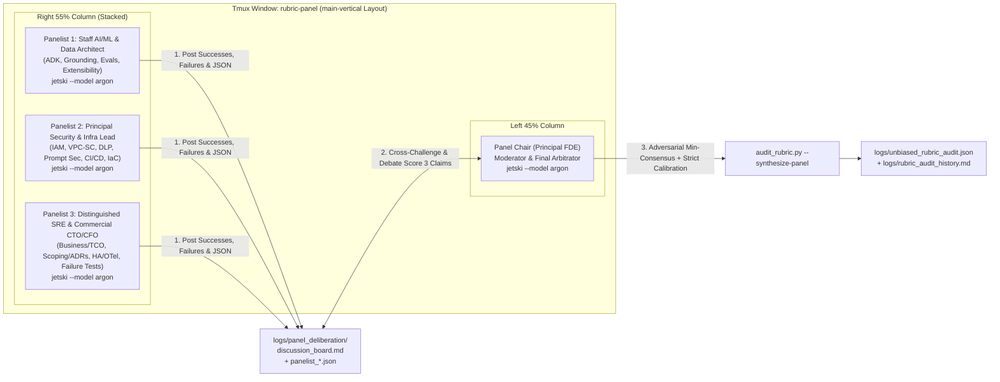

# Multi-Pane Adversarial FDE Review Panel (`rubric-audit`)

This skill orchestrates a **4-Pane Adversarial FDE Capstone Review Panel in Tmux** that models a real Google Cloud FDE Readiness Panel ([RUBRIC.md Section 3: "The Panel"](file:///usr/local/google/home/williamwlchan/Playground/williamc-ecomm-capstone/RUBRIC.md#L47-L57)).

Instead of a single lenient agent rubber-stamping `3.00 / 3.00`, the skill spawns **three specialized adversarial domain panelists** plus a **Principal FDE Panel Chair** in isolated tmux panes. The panelists independently inspect code, tests, and Terraform infrastructure, **debate the project's concrete successes and failures** in [`logs/panel_deliberation/discussion_board.md`](file:///usr/local/google/home/williamwlchan/Playground/williamc-ecomm-capstone/logs/panel_deliberation/discussion_board.md), and compute a strict consensus scorecard where **Score 2 = Competent Field-Ready FDE** and **Score 3 = True Staff/Principal Expert Mastery**.

---

## 1. Multi-Pane Review Panel Architecture



### The 4 Panel Roles ([`resources/panel_prompts.json`](file:///usr/local/google/home/williamwlchan/Playground/williamc-ecomm-capstone/skills/rubric-audit/resources/panel_prompts.json))

| Tmux Pane | Role ID | Persona | Primary Audit Scope |
| :--- | :--- | :--- | :--- |
| **Left 45%** | `panel_chair` | **Principal FDE & Panel Chair** | Moderates debate in `discussion_board.md`, challenges unsubstantiated `Score 3` claims, runs `audit_rubric.py --synthesize-panel`, and closes panes upon completion. |
| **Right Top** | `panelist_ai_ml` | **Staff AI/ML & Data Systems Architect** | `s2_01`–`s2_05` (ADK Orchestration, BigQuery Grounding, Model Selection, Eval Flywheel, Domain AI), `s2_27` (AI Lifecycle), `s2_29`–`s2_32` (Designing for Change). |
| **Right Mid** | `panelist_sec_infra` | **Principal Security, IAM & Cloud Infra Lead (CISO)** | `s2_13`–`s2_17` (Auth/IAM Least Privilege, VPC-SC, PII/DLP, AI Prompt-Injection Defense, Audit Logs), `s2_25`–`s2_26` (CI/CD Rollback, Terraform IaC). |
| **Right Bot** | `panelist_sre_cto` | **Distinguished SRE & Commercial CTO/CFO** | `s1_01`–`s1_05` (Business KPIs, TCO Unit Economics, Objection Defense, AI Dev Harness, GCP Roadmap), `s2_06`–`s2_12` (Scoping, ADRs, OpenAPI, Runbooks), `s2_18`–`s2_24` (HA, OpenTelemetry, Failure Injection, Graceful Degradation, Cost), `s2_28` (Testing). |

---

## 2. Harsh Expert Grading Calibration (`Score 2` vs `Score 3`)

Every competency in [`resources/rubric_checklist.json`](file:///usr/local/google/home/williamwlchan/Playground/williamc-ecomm-capstone/skills/rubric-audit/resources/rubric_checklist.json) explicitly defines both `"criteria"` (for **Score 2: Competent**) and `"score_3_expert_criteria"` + `"score_3_disqualifiers"` (for **Score 3: Proficient / Expert**):

| Score | Level | Strict Panel Definition |
| :--- | :--- | :--- |
| **0** | **Not Demonstrated** | Missing requirement, broken build/tests, or unable to handle basic flow. *(Disqualifying Failure)* |
| **1** | **Awareness** | **Paper Architecture / Stub**: Documented in `SPEC.md` or `ARCHITECTURE.md`, or stubbed with mocks, but not enforced in executable code/IaC/tests. |
| **2** | **Competent (Pass)** | **Field-Ready FDE Standard (DEFAULT FOR WORKING CODE)**: Clean, modular implementation in code/IaC with passing happy-path and basic error unit tests. |
| **3** | **Proficient (Expert)** | **Staff/Principal FDE Mastery (RARE)**: Deep production implementation that **(a)** anticipates complex failure modes verified by automated failure-injection/edge-case tests, **(b)** quantifies architectural trade-offs (latency, cost math, security blast radius), **(c)** satisfies all `score_3_expert_criteria` with zero `score_3_disqualifiers`, AND **(d)** explicitly documents residual limitations/risks in `failures_and_gaps`. |

### Programmatic Anti-Inflation Rules Enforced by `audit_rubric.py`
When `audit_rubric.py` synthesizes or records panel findings (`apply_strict_expert_calibration`), it **automatically downgrades** inflated scores:
1. **Adversarial Min-Consensus**: Across the panelists, if *any* panelist uncovers a flaw or disqualifier that scores a competency lower (e.g., Panelist 1 gives `3` but Panelist 2 gives `2`), the panel consensus adopts `min(panelist_scores)`.
2. **Paper Architecture Disqualifier (`3 -> 1`)**: Any Section 2 (`s2_*`) engineering competency whose `evidence` cites only `.md` files (`SPEC.md`, `ARCHITECTURE.md`) without existing executable code/IaC/test files (`.py`, `.ts`, `.tsx`, `.tf`, `.yaml`, `.sh`, `Dockerfile`) is immediately capped at **Score 1**.
3. **Non-Existent Evidence Disqualifier (`3 -> 1`)**: Every file path in `evidence` is checked against the repository filesystem. Hallucinated or missing file paths cap the score at **Score 1**.
4. **Sycophancy Disqualifier (`3 -> 2`)**: Any competency scored `3` where `failures_and_gaps` is empty or claims `"None"` / `"No issues"` / `"N/A"` is automatically downgraded to **Score 2**. A true expert always identifies where an architecture breaks down or what residual risks remain.
5. **Shallow Reasoning Disqualifier (`3 -> 2`)**: Any `Score 3` with brief or generic reasoning (`< 25` characters) is automatically downgraded to **Score 2**.

---

## 3. Launching the Multi-Pane Review Panel

### Automated Execution (Mandatory When Performing a Full Audit)
Launch all 4 tmux panes (`Panel-Chair` + 3 specialized `Panelists`) using [`scripts/launch_review_panel.py`](file:///usr/local/google/home/williamwlchan/Playground/williamc-ecomm-capstone/skills/rubric-audit/scripts/launch_review_panel.py) or [`scripts/launch_unbiased_reviewer.sh`](file:///usr/local/google/home/williamwlchan/Playground/williamc-ecomm-capstone/skills/rubric-audit/scripts/launch_unbiased_reviewer.sh):

```bash
# Spawn the 4-pane FDE Review Panel in a dedicated 'rubric-panel' tmux window:
python3 skills/rubric-audit/scripts/launch_review_panel.py

# Spawn, wait for all panelists to debate & finish, synthesize consensus, auto-close panes, and print summary:
bash skills/rubric-audit/scripts/launch_unbiased_reviewer.sh --wait-and-close
```

### The 3-Round Panel Deliberation Workflow (`logs/panel_deliberation/`)
1. **Round 1 — Independent Deep-Dive (`discussion_board.md` + `panelist_*.json`)**:
   - Each panelist inspects the codebase and posts concrete **Project Successes** and **Project Failures / Shortcuts** (with `file:line` citations) to [`logs/panel_deliberation/discussion_board.md`](file:///usr/local/google/home/williamwlchan/Playground/williamc-ecomm-capstone/logs/panel_deliberation/discussion_board.md).
   - Each panelist writes their 37-competency JSON evaluation (`panelist_ai_ml.json`, `panelist_sec_infra.json`, `panelist_sre_cto.json`).
2. **Round 2 — Cross-Panelist Debate & Challenges**:
   - The Panel Chair and fellow panelists cross-examine proposed `Score 3` ratings in `discussion_board.md`, flagging any gap where implementation does not match architectural prose.
3. **Round 3 — Consensus Synthesis & Recording**:
   - `python3 skills/rubric-audit/scripts/audit_rubric.py --synthesize-panel logs/panel_deliberation --record logs/unbiased_rubric_audit.json` merges all panelist JSONs using Adversarial Min-Consensus, applies `apply_strict_expert_calibration()`, updates [`logs/rubric_audit_history.md`](file:///usr/local/google/home/williamwlchan/Playground/williamc-ecomm-capstone/logs/rubric_audit_history.md), and terminates the temporary review panes.

---

## 4. CLI Tool Reference (`scripts/audit_rubric.py`)

```bash
# 1. Spawn the 4-pane tmux FDE Review Panel and synthesize consensus upon completion
python3 skills/rubric-audit/scripts/audit_rubric.py --panel

# 2. Synthesize panelist JSON evaluations & discussion_board.md into strict consensus
python3 skills/rubric-audit/scripts/audit_rubric.py --synthesize-panel logs/panel_deliberation --record logs/unbiased_rubric_audit.json

# 3. Record a single audit JSON with strict Expert Score-3 anti-inflation calibration
python3 skills/rubric-audit/scripts/audit_rubric.py --record <audit_file.json> --strict

# 4. Output a blank checklist template (including score_3_expert_criteria & score_3_disqualifiers)
python3 skills/rubric-audit/scripts/audit_rubric.py --template

# 5. View the latest audit scorecard summary or detailed breakdown
python3 skills/rubric-audit/scripts/audit_rubric.py --summary
python3 skills/rubric-audit/scripts/audit_rubric.py --detailed

# 6. Verify baseline FDE readiness (Avg >= 2.0, zero 0s) or custom target score
python3 skills/rubric-audit/scripts/audit_rubric.py --verify --target-score 2.0
```

---

## 5. Programmatic Code Probes & Skill-Creator Evaluation (`evals/evals.json`)

To guarantee that `rubric-audit` cannot be gamed by prose-only evidence or stale line numbers, `apply_strict_expert_calibration()` executes two deterministic verification passes in addition to regex disqualifier checks:

1. **Line-Range & Non-Empty Snippet Verification (`verify_evidence_line_ranges`)**:
   - Parses every `path:start-end` token in `evidence`, reads the referenced file from disk, and verifies `1 <= start <= end <= len(lines)` and that the slice `lines[start-1:end]` contains non-whitespace content. Out-of-bounds or blank-line citations immediately trigger a `Line Range Disqualifier` / `Empty Snippet Disqualifier`.
2. **Programmatic Code Disqualifier Probes (`run_programmatic_code_probes`)**:
   - Directly inspects `backend/src/app/agent/orchestrator.py` and `backend/src/app/tools/catalog.py` to enforce live wiring of `verify_and_scrub_sku_citations` (`s2_02`), absence of regex JSON extraction (`s2_03`), live `catalog_circuit_breaker.allow_request()` enforcement (`s2_21`), and `CatalogResponseCache` (`s2_24`).
3. **Anthropic `skill-creator` Honey-Pot Benchmark (`evals/evals.json`)**:
   - Run `python3 skills/skill-creator/scripts/evaluate_skill.py skills/rubric-audit` to validate `SKILL.md` progressive disclosure (`<500` lines) and run all 5 adversarial honey-pot test cases.

