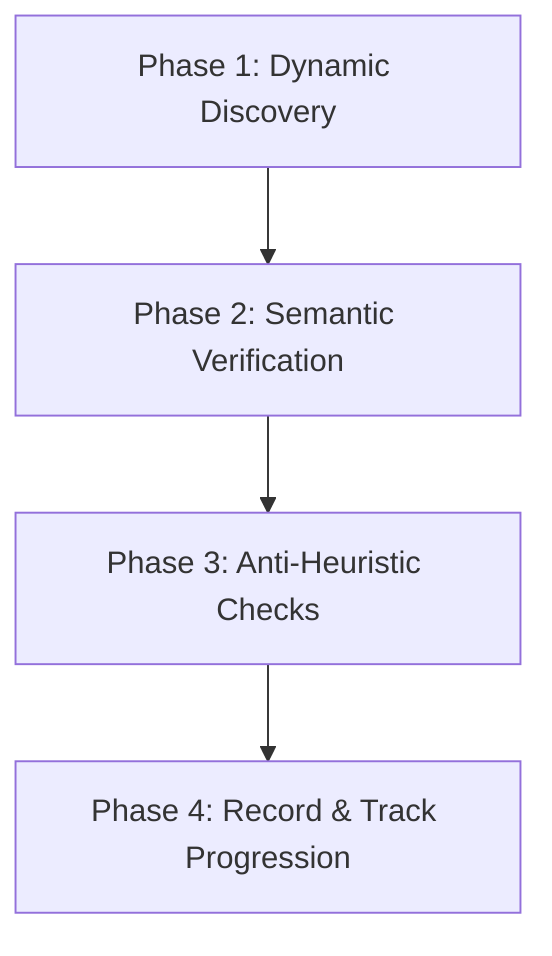

# Agent-Driven Capstone Rubric Audit Protocol

This skill provides an **Agent-Driven Rubric Audit Protocol** for an AI software engineer (Jetski or autonomous agent) to thoroughly, critically, and objectively audit any repository against all 37 competencies defined in [RUBRIC.md](file:///usr/local/google/home/williamwlchan/Playground/williamc-ecomm-capstone/RUBRIC.md).

---

## 1. Core Philosophy: Why the Agent is the Auditor

### The Flaw of Programmatic Regex Heuristics
Static regex scanners and keyword search scripts fail catastrophically at grading architecture and security:
- A regex looking for `ArrayQueryParameter` or `ScalarQueryParameter` falsely flags an application as having "Score 3: AI-Specific Security" simply because database queries are parameterized.
- In reality, database SQL parameterization **only protects against SQL injection**. It provides **zero defense** against LLM prompt injection, prompt leakage, adversarial jailbreaks, or model safety bypasses!
- Similarly, a regex looking for `try ... except` cannot distinguish between lazy, silent error suppression (`except: pass`) and true, production-grade graceful degradation with exponential backoffs and circuit breakers.

### The Solution: LLM Agent-as-Auditor
The LLM agent (you) conducts the review directly using deep engineering comprehension:
1. **Dynamic Exploration**: You use repository exploration tools (`find_by_name`, `code_search`, `view_file`, `list_dir`) to discover files without hardcoded path assumptions.
2. **Semantic Verification**: You evaluate the actual code, configuration, tests, and architecture against the qualitative definitions of Competent (Score 2) and Proficient (Score 3).
3. **Intellectual Honesty**: You award scores based solely on verified evidence. If a requirement is missing or shallow, you score it 0 or 1 and provide actionable remediation.
4. **Deterministic Recording**: The companion CLI (`scripts/audit_rubric.py`) handles schema validation, mathematical averaging, and chronological tracking in [`logs/rubric_audit_history.md`](file:///usr/local/google/home/williamwlchan/Playground/williamc-ecomm-capstone/logs/rubric_audit_history.md).

### 1.1 Unbiased Independent Review Pane (Clean-Context Protocol)
To ensure the audit is completely objective, rigorous, and devoid of prior conversation bias or hallucinated memory from implementation steps:
- **Mandatory Automated Execution (Do Not Just Advise — Execute!)**: Whenever performing or initiating a rubric audit or review, the agent **MUST NOT** merely suggest or document launching the review pane. The agent **MUST explicitly and automatically execute the launch command** via tool call:
  ```bash
  bash skills/rubric-audit/scripts/launch_unbiased_reviewer.sh
  ```
  Or directly via tmux:
  ```bash
  tmux split-window -h "/google/bin/releases/jetski-devs/tools/cli --model gemini-3.8-flash --effort high -i 'Review the codebase against RUBRIC.md using the rubric-audit skill with an unbiased perspective'"
  ```
- **Why `gemini-3.8-flash` on `high`**:
  1. **Clean Context**: Starts with empty conversation history and zero confirmation bias.
  2. **High Reasoning Effort**: Thoroughly traces code dependencies, verifies tests, audits Terraform perimeters, and detects architectural anti-patterns without cutting corners.
  3. **Adversarial Verification**: Validates that all 37 competencies genuinely earn Score 3 by inspecting repository files rather than trusting implementation claims.
  4. **Output Contract**: Writes the audit findings JSON to `logs/unbiased_rubric_audit.json` and records it via:
     ```bash
     python3 skills/rubric-audit/scripts/audit_rubric.py --record logs/unbiased_rubric_audit.json
     ```

---

## 2. Scoring Scale & Passing Standard

| Score | Level | Definition |
| :--- | :--- | :--- |
| **0** | **Not Demonstrated** | Missed the mark, ignored the requirement, or missing core implementation. *(Growth Opportunity)* |
| **1** | **Awareness** | Understands the concept but lacks practical implementation or misses critical edge cases. *(Needs Additional Coaching)* |
| **2** | **Competent** | Solid implementation, understands trade-offs, and meets expectations of a Field-Ready FDE. *(Pass)* |
| **3** | **Proficient** | Production-grade depth, anticipates complex failure modes, robust security, and deep optimization. *(Strong Pass)* |

### Passing Thresholds
1. **FDE Baseline Pass**:
   - Average score in Section 1 (Presentation & Advisory Rigor) $\ge 2.00$.
   - Average score in Section 2 (Engineering Excellence) $\ge 2.00$.
   - **Zero scores of 0**: Scoring a 0 on *any* competency is an automatic disqualifying failure.
2. **Production Merge Standard (Score 3 Gate)**:
   - Before architectural changes or feature branches merge to `main`, the audit must verify that competencies achieve **Score 3 (Proficient)**.

---

## 3. The 4-Phase Agent Audit Protocol



### Phase 1: Dynamic Repository Discovery (Zero Hardcoded Paths)
Do not assume fixed directory names. Dynamically discover the project structure using tools:
1. **Locate Architecture & Scoping Documents**:
   - Search for markdown files: `find_by_name(Pattern="*.md")`.
   - Read `README.md`, `ARCHITECTURE.md`, `SPEC.md`, and any ADR files.
2. **Locate Core Application Code**:
   - Search for backend and frontend source files (`find_by_name` for `*.py`, `*.ts`, `*.go`).
   - Identify frameworks (FastAPI, Flask, Next.js, React) and data client libraries (BigQuery, Spanner, Postgres).
3. **Locate Infrastructure as Code (IaC)**:
   - Search for Terraform or Pulumi configurations (`*.tf`, `*.hcl`).
   - Inspect service accounts, IAM role bindings, VPC Service Controls, and dataset resources.
4. **Locate CI/CD & Deployment Pipelines**:
   - Search for pipeline configs: `cloudbuild.yaml`, `.github/workflows/`, `Dockerfile`.
   - Inspect build steps, linting gates, test gates, and deployment scripts.
5. **Locate Test & Evaluation Suites**:
   - Search for test directories (`tests/`, `evals/`).
   - Inspect unit tests, integration tests, benchmark datasets, and evaluation runners.

---

### Phase 2: Systematic Competency Audit (All 37 Competencies)

Evaluate every single competency across Section 1 and Section 2:

#### Section 1: Presentation & Advisory Rigor (5 Competencies)
- **`s1_01`: Strategic Delivery & Value Articulation**: Does the project frame the problem around business KPIs (conversion rates, operational deflection)? Is there a quantified Total Cost of Ownership (TCO) model comparing architectural alternatives?
- **`s1_02`: Objection Handling & Technical Defense**: Does the architecture defensively preempt executive pushback (hallucinations, latency, data leakage) with data-backed rationale?
- **`s1_03`: Presentation Skills & Time Management**: Is there a customer-ready presentation outline (5-8 slides, ~10 mins) with clear scope boundaries?
- **`s1_04`: AI Driven Development Discussion**: Does the repository demonstrate an advanced AI harness (hierarchical `AGENTS.md`, outer-loop verification, lint/test loops)?
- **`s1_05`: Futures / Roadmap (GCP Value)**: Is there an actionable GCP expansion roadmap (e.g. Vertex AI Vector Search, Gemini Multimodal, BigQuery ML)?

#### Section 2: Engineering Excellence (32 Competencies across 7 Categories)
1. **AI/ML Engineering (`s2_01` - `s2_05`)**:
   - `s2_01`: Agentic & Multi-Agent Systems (Google ADK orchestration, structured tools, state management).
   - `s2_02`: Retrieval & Data Engineering for AI (grounding, zero hallucination, verified SKU citations).
   - `s2_03`: Model Selection, Tuning & Optimization (temperature determinism, token budgeting, structured JSON).
   - `s2_04`: LLM Ops and Evaluation (evaluation flywheel, multi-metric benchmarking, regression detection beyond simple judge).
   - `s2_05`: Domain-Applied AI/ML Expertise (vertical KPIs, domain attribute schema handling).
2. **Scoping & Documentation (`s2_06` - `s2_12`)**:
   - `s2_06`: Problem Definition (business problem, customer success unlocks).
   - `s2_07`: Technical Scope & Constraints (in-scope vs out-of-scope boundaries).
   - `s2_08`: Stakeholder Alignment & Success Criteria (phased roadmap, Definition of Done).
   - `s2_09`: System Design Artifacts (multi-layer Mermaid architecture, data flow, sequence diagrams).
   - `s2_10`: Decision Records (comprehensive Architecture Decision Records with trade-offs).
   - `s2_11`: API Documentation (OpenAPI specs, Pydantic contracts, Swagger UI).
   - `s2_12`: Operational Documentation (runbooks, agent skills, deployment guides).
3. **Security, Privacy & Compliance (`s2_13` - `s2_17`)**:
   - `s2_13`: Authentication & Authorization (IAM least privilege, dedicated service account).
   - `s2_14`: Infrastructure & Network Security (VPC-SC perimeter, private endpoints, ingress control).
   - `s2_15`: Data Protection & Privacy (TLS 1.3 in transit, encryption at rest, zero PII).
   - `s2_16`: AI-Specific Security (adversarial prompt injection sanitization, delimiter encapsulation, system prompt immutability, Vertex AI content safety settings).
   - `s2_17`: Compliance & Governance (Cloud Audit Logs, policy enforcement).
4. **Reliability & Resilience (`s2_18` - `s2_21`)**:
   - `s2_18`: Availability Design (Cloud Run multi-zone autoscaling, health probes, SLO definitions).
   - `s2_19`: Observability (OpenTelemetry distributed tracing to Cloud Trace, structured JSON logging to Cloud Logging).
   - `s2_20`: Failure & Recovery Testing (failure injection, timeouts, database disconnections, empty catalog).
   - `s2_21`: Graceful Degradation (fallback strategies, retry policies with backoff, partial-match envelopes).
5. **Performance & Cost Optimization (`s2_22` - `s2_24`)**:
   - `s2_22`: Scalability & Elasticity (horizontal autoscaling 0 to N instances, serverless compute).
   - `s2_23`: Resource Efficiency (lightweight container base images, sub-second cold starts).
   - `s2_24`: AI Cost Management (token optimization, query filtering to minimize bytes scanned).
6. **Operational Excellence (`s2_25` - `s2_28`)**:
   - `s2_25`: CI/CD & Deployment (automated Cloud Build pipeline, linting, test gates, rollback automation).
   - `s2_26`: Infrastructure as Code (declarative, modular Terraform HCL for all GCP resources).
   - `s2_27`: AI Lifecycle Management (version-controlled benchmark datasets and prompt iterations).
   - `s2_28`: Testing & Quality Engineering (unit, integration, e2e testing with coverage gate $\ge 80\%$).
7. **Designing for Change (`s2_29` - `s2_32`)**:
   - `s2_29`: Modularity & Abstraction (loose coupling, model swappability, tool abstraction).
   - `s2_30`: Configuration Management (externalized environment variables, Terraform variables).
   - `s2_31`: API Design & Versioning (contract-first Pydantic schemas, backward compatibility).
   - `s2_32`: Extensibility (modular agent skills architecture, plugin patterns).

---

### Phase 3: Critical Anti-Heuristic Verification Rules

When reviewing, you must enforce semantic truth over superficial keywords:

1. **AI Security != Database SQL Parameters (`s2_16`)**:
   - Parameterized queries (`ArrayQueryParameter`) protect BigQuery against SQL injection; they do **NOT** protect the LLM against prompt injection.
   - To earn a **Score of 3** in AI-Specific Security, the codebase **must** have:
     - Explicit prompt injection sanitization (neutralizing instruction overrides, jailbreak phrases).
     - XML delimiter encapsulation (`<user_query>...</user_query>`) with system instructions treating delimited content strictly as data.
     - Vertex AI content safety settings (`types.GenerateContentConfig.safety_settings`).
     - Structural output validation preventing data leakage upon adversarial input.
   - If only database SQL parameters exist without prompt injection defenses, **score no higher than 1 or 2** and flag the gap.

2. **Graceful Degradation != Silent Exception Suppression (`s2_21`)**:
   - An empty `try: ... except Exception: pass` is poor engineering, not graceful degradation.
   - Score 3 requires active fallback strategies, exponential backoff retries, and structured error responses that inform the user without leaking stack traces.

3. **Total Cost of Ownership != Qualitative Mention (`s1_01`, `s2_24`)**:
   - Merely writing "this solution is cheap" does not qualify as a TCO model.
   - Score 3 requires quantified architectural trade-offs (e.g., comparing serverless query costs against fixed provisioned VM/vector index clusters).

4. **Testing != Empty Mocks (`s2_28`)**:
   - Having test files with dummy `assert True` is a failure.
   - Score 3 requires verified test executions, branch/statement coverage $\ge 80\%$, and comprehensive edge-case failure assertions.

---

### Phase 4: Recording and Historical Progression Logging

Once you have reviewed the codebase and compiled the scores, evidence, and justifications:
1. Save your findings to a structured JSON file (or scratch file):
   ```json
   {
     "section_1_presentation_and_advisory": [
       {
         "id": "s1_01",
         "score": 3,
         "evidence": "SPEC.md:76-89; ARCHITECTURE.md Section 1",
         "reasoning": "Score 3 (Proficient) awarded because..."
       }
     ],
     "section_2_engineering_excellence": [
       {
         "id": "s2_01",
         "score": 3,
         "evidence": "backend/src/app/main.py:40-85; SPEC.md Part 2",
         "reasoning": "Score 3 (Proficient) awarded because..."
       }
     ]
   }
   ```
2. Use the companion CLI to validate the findings, compute the section averages, and append to the historical progression log:
   ```bash
   python3 skills/rubric-audit/scripts/audit_rubric.py --record /path/to/audit_findings.json
   ```
3. Verify that the audit meets the Score 3 target:
   ```bash
   python3 skills/rubric-audit/scripts/audit_rubric.py --verify --target-score 3
   ```

---

## 4. CLI Tool Reference (`scripts/audit_rubric.py`)

The companion Python script handles validation, math, and log updates:

```bash
# 1. Output a blank checklist template for all 37 competencies
python3 skills/rubric-audit/scripts/audit_rubric.py --template

# 2. Record an agent audit evaluation into logs/rubric_audit_history.md
python3 skills/rubric-audit/scripts/audit_rubric.py --record <audit_file.json>

# 3. View the latest audit scorecard summary
python3 skills/rubric-audit/scripts/audit_rubric.py --summary

# 4. View the detailed breakdown of the latest audit snapshot
python3 skills/rubric-audit/scripts/audit_rubric.py --detailed

# 5. Verify that the latest audit passes and meets target score (e.g. 3.0)
python3 skills/rubric-audit/scripts/audit_rubric.py --verify --target-score 3

# 6. Display the historical progression timeline table
python3 skills/rubric-audit/scripts/audit_rubric.py --history

# 7. Export standalone markdown report of the latest audit
python3 skills/rubric-audit/scripts/audit_rubric.py --output rubric_report.md
```
